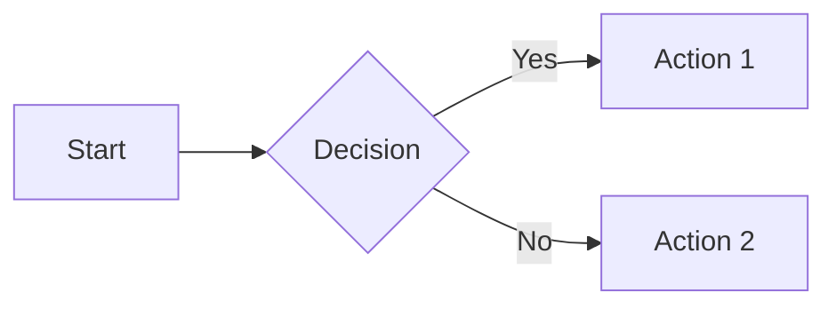
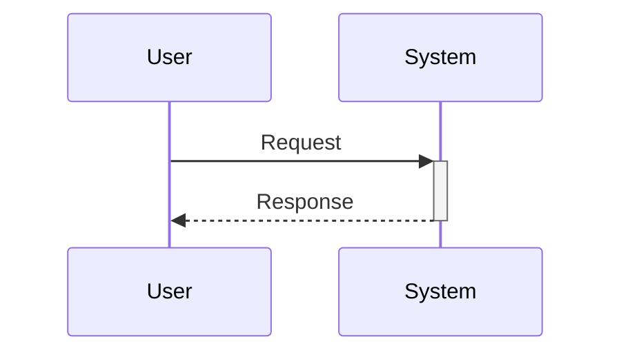
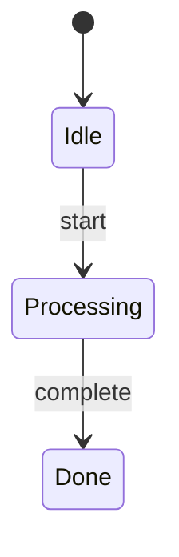
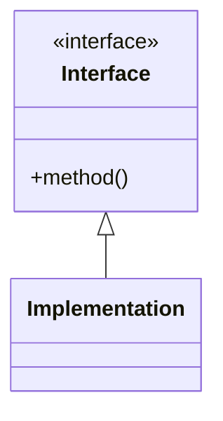
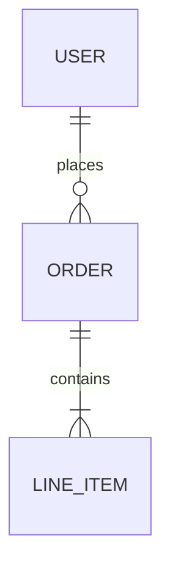

# Finalize Festina Lente Task

<purpose>
Run directive checks, update documentation, and complete the task. This skill consolidates the check and docs phases into a single streamlined command.
</purpose>

<context>
<note>
- **`.claude/skills/festina-*/`** — Installed festina skills — READ ONLY
- **`.festinalente/`** — Project data and config — READ/WRITE
- **`.festinalente/tasks/{id}/`** — Task folder containing `task.xml`, `spec.xml`, `plan.xml`
- **`.festinalente/quick/{id}/`** — Quick task folder containing `quick.xml` (for /festina-quick)
- **`.festinalente/scripts/`** — Helper scripts for festina operations
- **`.festinalente/templates/`** — Document templates
- **`.festinalente/workflow.yaml`** — Workflow config (columns, labels, transitions)
- **`.festinalente/directives/`** — User-defined directives (custom instructions for skills)
</note>

<note>Use these scripts to reliably find files:</note>

<command description="Find task by ID (returns JSON with path and metadata)">node .festinalente/scripts/festinalente.cjs find-task {id}</command>


<command description="Find plan by ID (returns JSON with path)">node .festinalente/scripts/festinalente.cjs find-plan {id}</command>


<command description="Get current date/time (returns JSON with iso and date formats)">node .festinalente/scripts/festinalente.cjs get-date-time</command>

<command description="Get skill configuration (returns JSON with directives)">node .festinalente/scripts/festinalente.cjs get-skill-config {skill}</command>
<example_code lang="json">
{
  "skill": "festina-check",
  "directives": [
    { "name": "code-review", "path": ".festinalente/directives/code-review.xml", "exists": true }
  ]
}
</example_code>


<note>Use these scripts to work with product documentation:</note>


<command description="Search product docs by keywords (returns JSON sorted by relevance)">node .festinalente/scripts/festinalente.cjs search-product keyword1 keyword2 ...</command>
<command description="With minimum score threshold">node .festinalente/scripts/festinalente.cjs search-product password reset --min-score=0.3</command>
<note>Score interpretation: ≥0.5 = strong match | 0.3-0.5 = possible match | &lt;0.3 = weak match | No results = likely new feature</note>

<command description="Check if product docs exist by ID">node .festinalente/scripts/festinalente.cjs check-product auth/login auth/mfa billing/invoices</command>

<note>Path rule: ID `auth/login` → Path `.festinalente/product/auth/login.md`</note>

<note>Use these scripts to work with engineering documentation:</note>


<command description="Search engineering docs by keywords (returns JSON sorted by relevance)">node .festinalente/scripts/festinalente.cjs search-engineering keyword1 keyword2 ...</command>
<command description="With minimum score threshold">node .festinalente/scripts/festinalente.cjs search-engineering middleware pattern --min-score=0.3</command>
<note>Score interpretation: ≥0.5 = strong match | 0.3-0.5 = possible match | &lt;0.3 = weak match | No results = likely new pattern/system</note>

<command description="Check if engineering docs exist by ID">node .festinalente/scripts/festinalente.cjs check-engineering systems/auth patterns/middleware</command>

<note>Path rules:
- `overview` → `.festinalente/engineering/overview.md`
- `systems/auth` → `.festinalente/engineering/systems/auth/_index.md`
- `systems/auth/validator` → `.festinalente/engineering/systems/auth/validator.md`
- `patterns/acyclic-arch` → `.festinalente/engineering/patterns/acyclic-arch.md`
- `conventions/file-naming` → `.festinalente/engineering/conventions/file-naming.md`
</note>

<note>**`.festinalente/product/`** - Product documentation files organized by domain</note>

<note>**`.festinalente/engineering/`** - Engineering documentation files (systems, patterns, conventions)</note>

<note>**Diagram Guidelines:**</note>

<note>**When to include Mermaid diagrams:**</note>
- Workflows with 3+ steps or branching logic → `flowchart`
- User/system interactions → `sequenceDiagram`
- State transitions → `stateDiagram-v2`
- System architecture with 3+ components → `flowchart`
- Pattern relationships → `classDiagram`
- Database/data models → `erDiagram`

<note>**When to include ASCII mockups:**</note>
- UI elements (dialogs, forms, panels)
- Tree structures (file trees, hierarchies)
- Sidebar/panel layouts

<note>**Mermaid Syntax Quick Reference:**</note>

<example_code lang="markdown">
## Flowchart


## Sequence Diagram


## State Diagram


## Class Diagram


## Entity Relationship Diagram

</example_code>

<note>**ASCII Conventions:**</note>

<example_code lang="text">
## Window/Dialog
┌─────────────────────────────────┐
│  Title                    [X]  │
├─────────────────────────────────┤
│  Content                        │
│      [ Cancel ]  [ OK ]         │
└─────────────────────────────────┘

## Form Elements
Label:     [________________]     ← Text input
Dropdown:  [Option v]             ← Select
Radio:     (*) Selected  ( ) Not  ← Radio
Checkbox:  [x] Checked  [ ] Not   ← Checkbox
Button:    [ Submit ]             ← Button

## Tree View
├── Parent
│   ├── Child 1
│   └── Child 2
└── Sibling

## Sidebar
HEADER                    [+] [↻]
├── ▼ Expanded (2)
│   ├── Item 1
│   └── Item 2
└── ▶ Collapsed (3)
</example_code>

<note>**Smart Context:** `node .festinalente/scripts/festinalente.cjs select-context {taskId} --tier=standard` - Load similar docs for reference</note>

<note>**Quality Check:** `node .festinalente/scripts/festinalente.cjs validate-docs {path}` - Validate doc meets quality standards</note>

<note>**Glossary:** `.festinalente/glossary.yaml` - Project terminology (update when introducing new terms)</note>

<note>Column transition: finalize → awaiting-completion</note>
<note>See `.festinalente/workflow.yaml` for column definitions and valid transitions</note>

<note>
**This skill is an orchestrator with three phases:**
- **Phase 1 (Validate):** Run directive checks, auto-fix if needed
- **Phase 2 (Document):** Update product/engineering docs based on task's affects/engineering fields
- **Phase 3 (Complete):** Move task to awaiting-completion
</note>

## Reference Files

Load these as needed during each phase:

- **[checks.md](checks.md)** - Load in Phase 1: Contains plan verification, check execution by type, and auto-fix loop with iteration logging
- **[docs-product.md](docs-product.md)** - Load in Phase 2 if product docs needed: Contains impact analysis, smart context loading, doc update/complete/create flows, domain index updates, glossary updates, and validation
- **[docs-engineering.md](docs-engineering.md)** - Load in Phase 2 if engineering docs needed: Contains impact analysis, smart context loading, type-specific sections (system/pattern/convention), and engineering index updates
</context>

<prohibited>
- Do not proceed if directive checks fail without user approval
- Do not skip documentation analysis
- Do not auto-fix without asking the user first
- Do not update docs for features NOT touched by this task
</prohibited>

<process>
  <step name="load_workflow">
    <action>Read `.festinalente/workflow.yaml` for column definitions, labels, priorities, and transitions</action>
    <note>Use these values throughout this skill</note>
  </step>

  <step name="get_task_id" outputs="taskId">
    <branch condition="$ARGUMENTS provided">
      <action>Use $ARGUMENTS as taskId</action>
    </branch>
    <branch condition="$ARGUMENTS not provided">
      <action>List tasks in `finalize` status from `.festinalente/tasks/`</action>
      <action>Use AskUserQuestion tool with:
        - header: "Task"
        - question: "Which task would you like to finalize?"
        - options: Build from task list (up to 4 tasks in finalize status), each with:
          - label: "{taskId}: {short title}" (truncate title if needed)
          - description: "Ready for finalization"
        - multiSelect: false
      </action>
      <note>User can select "Other" to type a task ID directly</note>
    </branch>
  </step>

  <step name="read_task_file" outputs="taskPath, title, labels, affects, engineering">
    <command>node .festinalente/scripts/festinalente.cjs find-task {taskId}</command>
    <action>Read the file at the `path` from JSON output</action>
    <action>Parse XML</action>
    <validate>Verify status is `finalize`</validate>
    <branch condition="status is not finalize">
      <action>Use AskUserQuestion tool with:
        - header: "Continue?"
        - question: "Task is in {status} status. Expected: finalize. Continue anyway?"
        - options:
          - label: "Yes", description: "Proceed despite unexpected status"
          - label: "No", description: "Cancel and check task status first"
        - multiSelect: false
      </action>
    </branch>
    <action>Extract title, labels, affects, engineering, and acceptance-criteria for later use</action>
    <branch condition="task not found">
      <output>Error: Task not found</output>
      <action>Exit</action>
    </branch>
  </step>

  <step name="load_directives">
    <command>node .festinalente/scripts/festinalente.cjs get-skill-config festina-finalize</command>
    <action>Parse the JSON output</action>
    
    <branch condition="directives.length > 0">
      <warning>Directives are MANDATORY. You MUST follow them.</warning>
      <action>For EACH directive where `exists` is `true`:</action>
      <action>Read the directive XML file at `path`</action>
      <action>Parse and apply:</action>
      <action>- `<context>` principles: Maintain as ongoing mindset</action>
      <action>- `<process>` rules where phase contains "finalize" (phase may be comma-separated, e.g. phase="plan,implement" applies to both): Follow as requirements</action>
      <action>- `<override>` sections where phase="finalize": Apply step replacements</action>
      <action>- `<verification>` commands: Note for use in task `<verify>` elements</action>
    
      <branch condition="directive has <override> section for phase=finalize">
        <output>
    **DIRECTIVE OVERRIDE ACTIVE: {directive.name}**
    
    The following skill steps are REPLACED by this directive:
    
    {For each &lt;skip&gt; element:}
    **SKIP STEP: `{step}`** - Do NOT execute this step when you reach it in the skill process.
    
    **REPLACEMENT:** Execute directive rules {override.instead.rules} instead.
    
    **Reason:** {override.reason}
    
    **CRITICAL:** When you encounter any skipped step in the skill's &lt;process&gt;,
    you MUST skip it entirely and follow the directive's replacement rules instead.
        </output>
      </branch>
      <note>`<validation>` checks will run in directive_compliance step</note>
      <note>`<examples>` will be shown if violations are found</note>
    </branch>
    
    <example_code lang="json">
    {
      "skill": "festina-finalize",
      "directives": [
        { "name": "architecture", "path": ".festinalente/directives/architecture.xml", "exists": true }
      ]
    }
    </example_code>
  </step>

  <step name="detect_resume_state" outputs="resumeFrom">
    <note>Check what's already been done for resumability</note>
    <action>Check task XML status and completed attribute</action>
    <branch condition="task status is done and has completed attribute">
      <output>Task already complete!</output>
      <action>Exit</action>
    </branch>
    <branch condition="else">
      <action>Set resumeFrom = "phase1"</action>
      <note>Phases are idempotent — re-running from phase1 is safe even if partially complete.</note>
    </branch>
  </step>

  <!-- ═══════════════════════════════════════════════════════════════════════════
       PHASE 1: VALIDATE
       Reference: checks.md
       ═══════════════════════════════════════════════════════════════════════════ -->

  <step name="phase1_validate" when="resumeFrom is phase1">
    <output>
━━━━━━━━━━━━━━━━━━━━━━━━━━━━━━━━━━━━━━━━━━━━━━━━━━━━━━━━━━━━
PHASE 1: VALIDATE
━━━━━━━━━━━━━━━━━━━━━━━━━━━━━━━━━━━━━━━━━━━━━━━━━━━━━━━━━━━━
    </output>
    <action>Read checks.md for detailed guidance on this phase</action>
  </step>

  <step name="verify_plan_completion" when="resumeFrom is phase1">
    <command>node .festinalente/scripts/festinalente.cjs find-plan {taskId}</command>
    <action>Read the plan at the `path` from JSON output</action>
    <validate>Verify all implementation tasks have completed="true"</validate>
    <branch condition="any uncompleted tasks">
      <action>Use AskUserQuestion tool with:
        - header: "Incomplete"
        - question: "Plan has incomplete tasks. Run checks anyway?"
        - options:
          - label: "Yes", description: "Proceed despite incomplete plan tasks"
          - label: "No", description: "Cancel and complete remaining tasks first"
        - multiSelect: false
      </action>
    </branch>
  </step>

  <step name="run_checks" when="resumeFrom is phase1">
    <action>Read checks.md for check execution guidance</action>
    <note>
**For each check directive, determine type and execute:**

```
for each directive in checkDirectives:
    Print: "Running check: {directive name}..."

    # Determine check type from directive XML
    if directive contains type="command":
        Execute the command from <run> element
        if exit code == 0:
            Print "PASS: {directive name}"
            continue to next directive
        else:
            issues = command error output

    else if directive contains type="pattern":
        Scan files matching glob for forbidden/required patterns
        if no violations:
            Print "PASS: {directive name}"
            continue to next directive
        else:
            issues = list of pattern violations

    else if directive contains type="checklist":
        Review code against checklist items
        if all items satisfied:
            Print "PASS: {directive name}"
            continue to next directive
        else:
            issues = unsatisfied items

    # Handle failure
    Print "FAIL: {directive name}"
    Print issues

    Use AskUserQuestion tool with:
        - header: "Fix?"
        - question: "Check failed. How should I proceed?"
        - options:
          - label: "Fix (Recommended)", description: "Attempt to fix the issues automatically"
          - label: "Skip", description: "Continue to next check"
          - label: "Abort", description: "Exit and fix manually"
        - multiSelect: false

    if user selects Fix:
        Analyze the issues
        Make code changes to fix

        # Log attempt to plan
        Add to <iterations> section:
            <iteration phase="finalize" date="{YYYY-MM-DD}">
              <fix directive="{name}">{description of fix}</fix>
            </iteration>

        # Restart all checks from beginning
        break and restart loop

    if user selects Skip:
        continue to next directive

    if user selects Abort:
        Print: "Exiting. Fix issues manually and re-run /festina-finalize {taskId}"
        Exit

# If we get here, all checks passed
Print "All automated checks passed!"
```
    </note>
  </step>

  <step name="spec_compliance_review" when="resumeFrom is phase1">
    <output>
Running spec compliance review...
    </output>

    <note>
**Independent Spec Compliance Review**

This step spawns a read-only Explore agent to verify the implementation against the spec
from a fresh context — separate from the implementer. The reviewer reports findings but
never modifies code.
    </note>

    <action>Read spec.xml:</action>
    <command>node .festinalente/scripts/festinalente.cjs find-spec {taskId}</command>
    <action>Read the spec file at the returned path</action>
    <action>Extract the list of files from spec's `&lt;files&gt;` section</action>
    <action>Read plan.xml (already loaded from verify_plan_completion step)</action>
    <action>Read task.xml (already loaded from read_task_file step)</action>

    <action>Spawn an Explore subagent for the review:</action>

    <agent name="Spec Compliance Reviewer" subagent_type="Explore">
      <description>Independent spec compliance review — verifies implementation against spec</description>
      <prompt>
You are an independent spec compliance reviewer. Your job is to verify that the implementation
matches the spec. You are in a SEPARATE context from the implementer — provide a fresh perspective.

**Read these files first:**
- Spec: {specPath}
- Plan: {planPath}
- Task: {taskPath}
- Every file listed in spec's `&lt;files&gt;` section

Then perform these checks:

**1. REQUIREMENTS CHECK**
For each `&lt;requirement&gt;` in spec, search the implementation files for evidence.
Report each as:
- MET: with file:line reference showing the implementation
- UNMET: with explanation of what's missing

**2. SCOPE CREEP CHECK**
Identify significant code additions not traceable to any spec requirement.
Do NOT flag minor supporting code (imports, type definitions, helper utilities
directly serving a requirement) — only flag substantial additions beyond scope.

**3. SPEC DRIFT CHECK**
Compare actual implementation approach to what the spec described.
Flag deviations in approach, files used, or patterns followed.

**4. FILE COVERAGE CHECK**
For each file in spec's `&lt;files&gt;` section:
- action="create": verify file exists
- action="modify": verify file was changed (check content matches spec description)
- action="delete": verify file no longer exists
Also check for orphaned files — files created but not imported/wired into the codebase.
If spec has no `&lt;files&gt;` section, report FILE COVERAGE as N/A.

**5. ACCEPTANCE CRITERIA CHECK**
Read acceptance criteria from task.xml's `&lt;acceptance-criteria&gt;` element.
Assess each criterion's satisfaction status.
If no acceptance criteria exist, report as N/A.

**Output this exact format:**

## Requirements
- FR1: MET | {file:line evidence}
- FR2: UNMET | {explanation}

## Scope Creep
- None found | OR list of additions

## Spec Drift
- None found | OR list of deviations

## File Coverage
- path/file.ts (create): EXISTS | MISSING
- path/file.ts (modify): CHANGED | UNCHANGED
- path/file.ts (delete): REMOVED | STILL EXISTS
- Orphaned: None | OR list

## Acceptance Criteria
- Criterion 1: SATISFIED | {explanation}
- Criterion 2: NOT SATISFIED | {explanation}

## Verdict: PASS | PASS WITH NOTES | FAIL

**Verdict logic:**
- PASS: All requirements MET, no scope creep, no drift, full file coverage, all criteria satisfied
- PASS WITH NOTES: All requirements MET but minor notes (acceptable scope additions, minor drift)
- FAIL: Any requirement UNMET, significant scope creep, missing files, or criteria not satisfied
      </prompt>
    </agent>

    <action>Wait for agent to complete</action>
    <action>Parse the verdict from the agent's output (look for "## Verdict:" line)</action>

    <branch condition="agent fails to complete (error or timeout)">
      <output>Warning: Spec compliance reviewer failed to complete.</output>
      <action>Use AskUserQuestion tool with:
        - header: "Review"
        - question: "Spec compliance reviewer failed. How should I proceed?"
        - options:
          - label: "Retry", description: "Spawn the reviewer agent again"
          - label: "Skip", description: "Continue to Phase 2 without review"
        - multiSelect: false
      </action>
      <branch condition="user selects Retry">
        <action>Re-spawn the reviewer agent</action>
      </branch>
      <branch condition="user selects Skip">
        <output>Skipping spec compliance review.</output>
        <action>Continue to Phase 2</action>
      </branch>
    </branch>

    <branch condition="verdict is PASS">
      <output>Spec compliance review: **PASS**</output>
      <action>Continue to Phase 2</action>
    </branch>

    <branch condition="verdict is PASS WITH NOTES">
      <output>Spec compliance review: **PASS WITH NOTES**</output>
      <output>{Display the full review report from the agent}</output>
      <action>Use AskUserQuestion tool with:
        - header: "Review"
        - question: "Spec review passed with notes. How would you like to proceed?"
        - options:
          - label: "Acknowledge (Recommended)", description: "Notes are acceptable, continue to Phase 2"
          - label: "Fix", description: "Address the noted issues before continuing"
          - label: "Rework", description: "Send back to implementation via /festina-rework"
        - multiSelect: false
      </action>
      <branch condition="user selects Acknowledge">
        <action>Continue to Phase 2</action>
      </branch>
      <branch condition="user selects Fix">
        <action>Make code changes to address the noted issues</action>
        <action>Log fix to plan.xml iterations:
          &lt;iteration phase="finalize" date="{YYYY-MM-DD}"&gt;
            &lt;fix directive="spec-review"&gt;{description of fix}&lt;/fix&gt;
          &lt;/iteration&gt;
        </action>
        <action>Restart from run_checks step</action>
      </branch>
      <branch condition="user selects Rework">
        <output>Exiting. Run `/festina-rework {taskId}` to capture issues and return to implementation.</output>
        <action>Exit</action>
      </branch>
    </branch>

    <branch condition="verdict is FAIL">
      <output>Spec compliance review: **FAIL**</output>
      <output>{Display the full review report from the agent}</output>
      <action>Use AskUserQuestion tool with:
        - header: "Review"
        - question: "Spec compliance review failed. How would you like to proceed?"
        - options:
          - label: "Fix (Recommended)", description: "Address unmet requirements now"
          - label: "Acknowledge", description: "Issues are acceptable, continue anyway"
          - label: "Rework", description: "Send back to implementation via /festina-rework"
        - multiSelect: false
      </action>
      <branch condition="user selects Fix">
        <action>Make code changes to address unmet requirements</action>
        <action>Log fix to plan.xml iterations:
          &lt;iteration phase="finalize" date="{YYYY-MM-DD}"&gt;
            &lt;fix directive="spec-review"&gt;{description of fix}&lt;/fix&gt;
          &lt;/iteration&gt;
        </action>
        <action>Restart from run_checks step</action>
      </branch>
      <branch condition="user selects Acknowledge">
        <action>Continue to Phase 2</action>
      </branch>
      <branch condition="user selects Rework">
        <output>Exiting. Run `/festina-rework {taskId}` to capture issues and return to implementation.</output>
        <action>Exit</action>
      </branch>
    </branch>
  </step>

  <!-- ═══════════════════════════════════════════════════════════════════════════
       PHASE 2: DOCUMENTATION
       Reference: docs-product.md, docs-engineering.md
       ═══════════════════════════════════════════════════════════════════════════ -->

  <step name="phase2_document" when="resumeFrom is phase1 or phase2">
    <output>
━━━━━━━━━━━━━━━━━━━━━━━━━━━━━━━━━━━━━━━━━━━━━━━━━━━━━━━━━━━━
PHASE 2: DOCUMENTATION
━━━━━━━━━━━━━━━━━━━━━━━━━━━━━━━━━━━━━━━━━━━━━━━━━━━━━━━━━━━━
    </output>
  </step>

  <step name="analyze_doc_impact" when="resumeFrom is phase1 or phase2" outputs="needsProductDocs, needsEngineeringDocs, productContext, engineeringContext, currentProductDocs, currentEngineeringDocs, stubDocs, existingDocs, missingDocs, engStubDocs, engExistingDocs, engMissingDocs">
    <action>Check task's `affects` element for product docs</action>
    <action>Check task's `engineering` element for engineering docs</action>
    <branch condition="affects is empty AND engineering is empty AND labels include [bug, refactor, chore]">
      <output>No documentation updates needed (internal change)</output>
      <action>Set needsProductDocs = false, needsEngineeringDocs = false</action>
    </branch>
    <branch condition="affects has values">
      <action>Set needsProductDocs = true</action>
    </branch>
    <branch condition="engineering has values">
      <action>Set needsEngineeringDocs = true</action>
    </branch>

    <note>**Pre-load context and categorize docs ONCE before spawning agents**</note>

    <branch condition="needsProductDocs is true">
      <action>Pre-load smart context for product docs:</action>
      <command>node .festinalente/scripts/festinalente.cjs select-context {taskId} --tier=standard --max=3 --type=product</command>
      <action>Store result in productContext</action>

      <action>Pre-fetch current doc content for each doc ID in affects:</action>
      <action>Read `.festinalente/product/{path}.md` for each affected doc</action>
      <action>Store in currentProductDocs</action>

      <action>Categorize product docs:</action>
      <command>node .festinalente/scripts/festinalente.cjs check-product {affects IDs}</command>
      <action>Parse output into: stubDocs (need completing), existingDocs (need updating), missingDocs (need creating)</action>
    </branch>

    <branch condition="needsEngineeringDocs is true">
      <action>Pre-load smart context for engineering docs:</action>
      <command>node .festinalente/scripts/festinalente.cjs select-context {taskId} --tier=standard --max=3 --type=engineering</command>
      <action>Store result in engineeringContext</action>

      <action>Pre-fetch current doc content for each doc ID in engineering:</action>
      <action>Read `.festinalente/engineering/{path}.md` for each engineering doc (using ID→path rules)</action>
      <action>Store in currentEngineeringDocs</action>

      <action>Categorize engineering docs:</action>
      <command>node .festinalente/scripts/festinalente.cjs check-engineering {engineering IDs}</command>
      <action>Parse output into: engStubDocs, engExistingDocs, engMissingDocs</action>
    </branch>

    <note>**Show combined analysis and single checkpoint before spawning agents**</note>
    <branch condition="needsProductDocs OR needsEngineeringDocs">
      <output>
Documentation Analysis for Task {taskId}:
      </output>

      <branch condition="needsProductDocs">
        <output>
**Product Docs:**
Will COMPLETE (stub exists): {stubDocs}
Will UPDATE (doc exists): {existingDocs}
Will CREATE (new doc needed): {missingDocs}
        </output>
      </branch>
      <branch condition="NOT needsProductDocs">
        <output>
**Product Docs:** No updates needed
        </output>
      </branch>

      <branch condition="needsEngineeringDocs">
        <output>
**Engineering Docs:**
Will COMPLETE (stub exists): {engStubDocs}
Will UPDATE (doc exists): {engExistingDocs}
Will CREATE (new doc needed): {engMissingDocs}
        </output>
      </branch>
      <branch condition="NOT needsEngineeringDocs">
        <output>
**Engineering Docs:** No updates needed
        </output>
      </branch>

      <action>Use AskUserQuestion tool with:
        - header: "Docs"
        - question: "Proceed with documentation updates as analyzed?"
        - options:
          - label: "Yes (Recommended)", description: "Spawn agents to update/create docs as shown"
          - label: "No", description: "Skip all documentation updates"
        - multiSelect: false
      </action>

      <branch condition="user selects No">
        <output>Documentation updates skipped.</output>
        <action>Set needsProductDocs = false, needsEngineeringDocs = false</action>
      </branch>
    </branch>
  </step>

  <step name="spawn_doc_agents" when="needsProductDocs OR needsEngineeringDocs" outputs="productAgentResult, engineeringAgentResult">
    <note>**CRITICAL: Spawn agents in parallel using Task tool**</note>
    <note>Use Task tool invocations in a SINGLE message to achieve parallelism</note>
    <note>Agents return structured summaries, not full file diffs, to reduce context overhead</note>

    <output>Spawning documentation agents...</output>

    <parallel>
      <agent name="Product Docs Agent" subagent_type="general-purpose" when="needsProductDocs is true">
        <description>Update product documentation based on task changes</description>
        <prompt>
You are a Product Documentation Agent. Your job is to update product documentation for a completed task.

**Task Context:**
- Task ID: {taskId}
- Title: {title}
- Affects: {affects field}
- Acceptance Criteria: {acceptanceCriteria}

**Documentation Categories (from analysis):**
- COMPLETE (stub exists): {stubDocs}
- UPDATE (doc exists): {existingDocs}
- CREATE (new doc needed): {missingDocs}

**Current Doc Content:**
{currentProductDocs - include full content of each doc being modified}

**Smart Context (similar docs for reference):**
{productContext}

**Reference Guidance:**
Read docs-product.md for detailed guidance on:
- Doc structure and frontmatter requirements
- Update vs complete vs create flows
- Quality standards and validation

**Your Instructions:**
1. For stub docs: Remove stub:true, fill ALL frontmatter fields, fill ALL content sections
2. For existing docs: Make minimal focused updates
3. For new docs: Create using templates, fill ALL fields, keep scope focused
4. Write all doc changes to disk using Write tool
5. Do NOT update domain _index.md or glossary.yaml (orchestrator handles these)

**Output Format:**
Return a structured summary:
```json
{
  "filesChanged": [
    {"path": ".festinalente/product/domain/doc.md", "action": "updated|created|completed"}
  ],
  "summary": "Brief description of changes made",
  "newTerms": ["term1", "term2"],
  "validationErrors": []
}
```

If you encounter errors, return:
```json
{
  "filesChanged": [],
  "summary": "",
  "validationErrors": [{"file": "path", "error": "description"}]
}
```
        </prompt>
      </agent>

      <agent name="Engineering Docs Agent" subagent_type="general-purpose" when="needsEngineeringDocs is true">
        <description>Update engineering documentation based on task changes</description>
        <prompt>
You are an Engineering Documentation Agent. Your job is to update engineering documentation for a completed task.

**Task Context:**
- Task ID: {taskId}
- Title: {title}
- Engineering: {engineering field}
- Acceptance Criteria: {acceptanceCriteria}

**Documentation Categories (from analysis):**
- COMPLETE (stub exists): {engStubDocs}
- UPDATE (doc exists): {engExistingDocs}
- CREATE (new doc needed): {engMissingDocs}

**Current Doc Content:**
{currentEngineeringDocs - include full content of each doc being modified}

**Smart Context (similar docs for reference):**
{engineeringContext}

**Reference Guidance:**
Read docs-engineering.md for detailed guidance on:
- Type-specific sections (system/pattern/convention)
- Engineering doc structure and requirements
- Quality standards

**Your Instructions:**
1. For stub docs: Remove stub:true, fill ALL fields, use type-specific sections
2. For existing docs: Make minimal focused updates
3. For new docs: Determine type (system/pattern/convention), use correct template
4. Write all doc changes to disk using Write tool
5. Do NOT update engineering _index.md (orchestrator handles this)

**Output Format:**
Return a structured summary:
```json
{
  "filesChanged": [
    {"path": ".festinalente/engineering/type/doc.md", "action": "updated|created|completed"}
  ],
  "summary": "Brief description of changes made",
  "validationErrors": []
}
```

If you encounter errors, return:
```json
{
  "filesChanged": [],
  "summary": "",
  "validationErrors": [{"file": "path", "error": "description"}]
}
```
        </prompt>
      </agent>
    </parallel>

    <output>
Spawning documentation agents in parallel...
- Product Docs Agent: {if needsProductDocs: "Processing {count} docs" else: "Skipped (not needed)"}
- Engineering Docs Agent: {if needsEngineeringDocs: "Processing {count} docs" else: "Skipped (not needed)"}
    </output>

    <action>Wait for agents to complete and collect results</action>

    <output>
Waiting for agents to complete...
    </output>
  </step>

  <step name="validate_agent_outputs" when="needsProductDocs OR needsEngineeringDocs" outputs="allFilesChanged, combinedSummary, newTermsFound">
    <note>**Validate all agent outputs before writing anything permanent**</note>
    <note>Follow Result Synthesis pattern from festina-scope</note>

    <action>Collect results from both agents (if spawned)</action>

    <branch condition="productAgentResult is not empty">
      <output>✓ Product Docs Agent completed: {productAgentResult.filesChanged.length} files</output>
    </branch>
    <branch condition="engineeringAgentResult is not empty">
      <output>✓ Engineering Docs Agent completed: {engineeringAgentResult.filesChanged.length} files</output>
    </branch>

    <action>Check each agent result for errors</action>

    <branch condition="any agent returned validationErrors array with items OR agent failed to complete">
      <output>
Agent Error Details:
      </output>

      <branch condition="productAgentResult has errors">
        <output>Product Docs Agent: {productAgentResult.validationErrors}</output>
      </branch>
      <branch condition="engineeringAgentResult has errors">
        <output>Engineering Docs Agent: {engineeringAgentResult.validationErrors}</output>
      </branch>

      <action>Use AskUserQuestion tool with:
        - header: "Agent Error"
        - question: "Documentation agent encountered an error. How should I proceed?"
        - options:
          - label: "Retry", description: "Re-run the failed agent(s)"
          - label: "Skip", description: "Continue without that agent's documentation"
          - label: "Abort", description: "Cancel Phase 2 documentation"
        - multiSelect: false
      </action>

      <branch condition="user selects Retry">
        <note>Only re-spawn the failed agent(s), not both</note>
        <branch condition="productAgentResult has errors AND needsProductDocs">
          <action>Re-spawn Product Docs Agent only</action>
        </branch>
        <branch condition="engineeringAgentResult has errors AND needsEngineeringDocs">
          <action>Re-spawn Engineering Docs Agent only</action>
        </branch>
        <action>Return to validate_agent_outputs step</action>
      </branch>

      <branch condition="user selects Skip">
        <output>Skipping failed agent's documentation.</output>
        <action>Remove failed agent's results from processing</action>
        <action>Continue with successful agent results only</action>
      </branch>

      <branch condition="user selects Abort">
        <output>Phase 2 documentation aborted.</output>
        <action>Set needsProductDocs = false, needsEngineeringDocs = false</action>
        <action>Skip to Phase 3</action>
      </branch>
    </branch>

    <branch condition="all agents completed successfully">
      <output>
Validating outputs...
All validations passed
      </output>

      <action>Combine filesChanged lists from both agents</action>
      <action>Store combined list in allFilesChanged</action>

      <action>Combine summaries from both agents</action>
      <action>Store in combinedSummary</action>

      <branch condition="productAgentResult.newTerms has items">
        <action>Store new terms in newTermsFound</action>
      </branch>
    </branch>
  </step>

  <step name="check_referencing_docs" when="allFilesChanged has items">
    <note>Check if other docs reference the updated docs</note>
    <action>For each doc in allFilesChanged, run reverse-lookup:</action>
    <command>node .festinalente/scripts/festinalente.cjs reverse-lookup {docId}</command>
    <branch condition="referencedBy or usedBy has entries">
      <output>These docs reference the updated doc - consider if they need updates:</output>
      <output>- {id}: {tldr}</output>
      <action>Use AskUserQuestion tool with:
        - header: "Related"
        - question: "Review these referencing docs for updates?"
        - options:
          - label: "Skip (Recommended)", description: "No updates needed - references are still accurate"
          - label: "Review", description: "Check these docs for potential updates"
        - multiSelect: false
      </action>
      <branch condition="user selects Review">
        <action>Read each referencing doc and check if references are still accurate</action>
        <action>If updates needed, add to allFilesChanged</action>
      </branch>
    </branch>
  </step>


  <step name="phase3_complete">
    <output>
━━━━━━━━━━━━━━━━━━━━━━━━━━━━━━━━━━━━━━━━━━━━━━━━━━━━━━━━━━━━
PHASE 3: COMPLETE
━━━━━━━━━━━━━━━━━━━━━━━━━━━━━━━━━━━━━━━━━━━━━━━━━━━━━━━━━━━━
    </output>
  </step>

  <step name="directive_compliance">
    <note>Verify compliance with all loaded directives</note>
  
    <action>For each directive loaded in load_directives step:</action>
    <action>Re-read the directive XML file</action>
  
    <action>Run each `<validation>` check:</action>
  
    <branch condition="check type=command">
      <command>{content of <run> element}</command>
      <validate>{content of <expect> element}</validate>
    </branch>
  
    <branch condition="check type=pattern">
      <action>For each file matching `files` glob that was modified:</action>
      <action>Check content against `<forbidden>` or `<required>` regex</action>
    </branch>
  
    <branch condition="check type=checklist">
      <action>Self-assess each `<item>` as Y/N</action>
    </branch>
  
    <branch condition="any check fails">
      <output>Directive violation: {check id} - {reason}</output>
      <action>Find `<example>` elements where ref matches failed check</action>
      <action>Show violation examples to illustrate the problem</action>
      <action>Show correct examples to illustrate the fix</action>
      <action>Use AskUserQuestion tool with:
        - header: "Violation"
        - question: "Directive check failed. How would you like to proceed?"
        - options:
          - label: "Fix now", description: "Address the violation before continuing"
          - label: "Continue anyway", description: "Acknowledge and proceed despite violation"
        - multiSelect: false
      </action>
    </branch>
  </step>

  <step name="output_result">
    <output>
━━━━━━━━━━━━━━━━━━━━━━━━━━━━━━━━━━━━━━━━━━━━━━━━━━━━━━━━━━━━
Task {taskId} moved to Awaiting Completion!
━━━━━━━━━━━━━━━━━━━━━━━━━━━━━━━━━━━━━━━━━━━━━━━━━━━━━━━━━━━━

- Status: awaiting-completion
- Updated: {date}

Task has passed validation and documentation. Ready for completion.

**Next: Complete the task**
```
/clear
/festina-complete {taskId}
```
    </output>
    ## Final Validation
    
    Before completing, validate all task XML:
    
    <command description="Validate XML in task files">node .festinalente/scripts/festinalente.cjs validate-xml {taskId}</command>
    
    If validation fails, fix the reported errors before completing.
    
    <output>[FESTINA_COMPLETE]</output>
  </step>
</process>

<success_criteria>
- Task file exists at `.festinalente/tasks/{taskId}/task.xml`
- Task XML has `status="awaiting-completion"`
- All directive checks passed (or skipped with user approval)
- Documentation updated (or skipped for internal changes)
- Next steps shown to user directing to /festina-complete
</success_criteria>

<example>
**Full Finalization Flow:**

User: `/festina-finalize 001`

```
Finalizing task 001 "Add user authentication"...

━━━━━━━━━━━━━━━━━━━━━━━━━━━━━━━━━━━━━━━━━━━━━━━━━━━━━━━━━━━━
PHASE 1: VALIDATE
━━━━━━━━━━━━━━━━━━━━━━━━━━━━━━━━━━━━━━━━━━━━━━━━━━━━━━━━━━━━

Loading directives from config.yaml...
- coding

Running check: TypeScript...
PASS: TypeScript

Running check: Tests...
PASS: Tests

All automated checks passed!

━━━━━━━━━━━━━━━━━━━━━━━━━━━━━━━━━━━━━━━━━━━━━━━━━━━━━━━━━━━━
PHASE 2: DOCUMENTATION
━━━━━━━━━━━━━━━━━━━━━━━━━━━━━━━━━━━━━━━━━━━━━━━━━━━━━━━━━━━━

Documentation Analysis for Task 001:

**Product Docs:**
Will COMPLETE (stub exists): auth/login

**Engineering Docs:** No updates needed

[User selects "Yes (Recommended)"]

Spawning documentation agents in parallel...
- Product Docs Agent: Processing 1 doc
- Engineering Docs Agent: Skipped (not needed)

Waiting for agents to complete...
✓ Product Docs Agent completed: 1 file updated

Validating outputs...
All validations passed

Updating glossary... Added term "JWT"
Running final validation... Quality check passed

━━━━━━━━━━━━━━━━━━━━━━━━━━━━━━━━━━━━━━━━━━━━━━━━━━━━━━━━━━━━
PHASE 3: COMPLETE
━━━━━━━━━━━━━━━━━━━━━━━━━━━━━━━━━━━━━━━━━━━━━━━━━━━━━━━━━━━━

[User confirms merge]

━━━━━━━━━━━━━━━━━━━━━━━━━━━━━━━━━━━━━━━━━━━━━━━━━━━━━━━━━━━━
Task 001 moved to Awaiting Completion!
━━━━━━━━━━━━━━━━━━━━━━━━━━━━━━━━━━━━━━━━━━━━━━━━━━━━━━━━━━━━

- Status: awaiting-completion
- Updated: 2026-02-27

Task has passed validation and documentation. Ready for completion.

Next: Complete the task
/clear
/festina-complete 001
```
</example>

<example>
**Check Fails, User Fixes:**

User: `/festina-finalize 001`

```
━━━━━━━━━━━━━━━━━━━━━━━━━━━━━━━━━━━━━━━━━━━━━━━━━━━━━━━━━━━━
PHASE 1: VALIDATE
━━━━━━━━━━━━━━━━━━━━━━━━━━━━━━━━━━━━━━━━━━━━━━━━━━━━━━━━━━━━

Running check: TypeScript...
FAIL: TypeScript

Error output:
  src/routes/auth.ts:45:10 - error TS2345: Argument of type 'string' is not assignable

[User selects "Fix (Recommended)"]

Analyzing failure...
Found issue: Type mismatch in auth handler
Fixing: Adding type assertion in src/routes/auth.ts:45

Logging fix to plan.xml iterations...

Restarting checks...

Running check: TypeScript...
PASS: TypeScript

Running check: Tests...
PASS: Tests

All automated checks passed!

[Continues to remaining phases...]
```
</example>

<example>
**Internal Change (No Docs Needed):**

User: `/festina-finalize 003`

```
Finalizing task 003 "Refactor database queries"...

━━━━━━━━━━━━━━━━━━━━━━━━━━━━━━━━━━━━━━━━━━━━━━━━━━━━━━━━━━━━
PHASE 1: VALIDATE
━━━━━━━━━━━━━━━━━━━━━━━━━━━━━━━━━━━━━━━━━━━━━━━━━━━━━━━━━━━━

Running check: TypeScript...
PASS: TypeScript

All automated checks passed!

━━━━━━━━━━━━━━━━━━━━━━━━━━━━━━━━━━━━━━━━━━━━━━━━━━━━━━━━━━━━
PHASE 2: DOCUMENTATION
━━━━━━━━━━━━━━━━━━━━━━━━━━━━━━━━━━━━━━━━━━━━━━━━━━━━━━━━━━━━

No documentation updates needed (internal change)

━━━━━━━━━━━━━━━━━━━━━━━━━━━━━━━━━━━━━━━━━━━━━━━━━━━━━━━━━━━━
PHASE 3: COMPLETE
━━━━━━━━━━━━━━━━━━━━━━━━━━━━━━━━━━━━━━━━━━━━━━━━━━━━━━━━━━━━

[Completion flow continues...]

Task 003 moved to Awaiting Completion!
```
</example>

<next_steps>
Task has passed validation and documentation. Complete it:
```
/clear
/festina-complete {taskId}
```
</next_steps>
