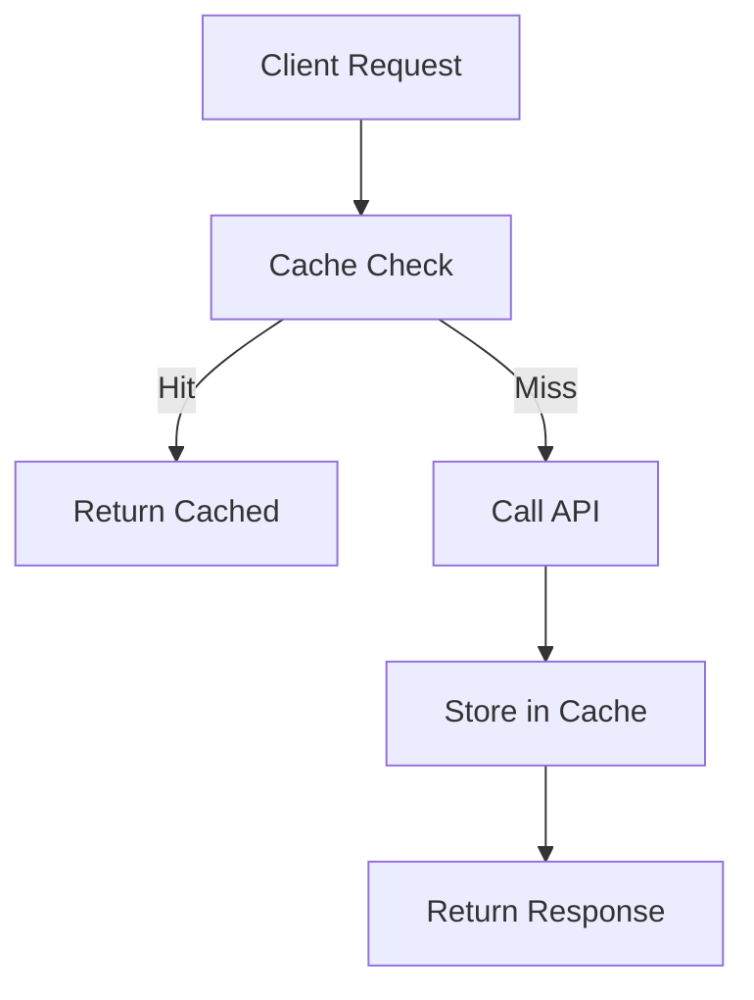
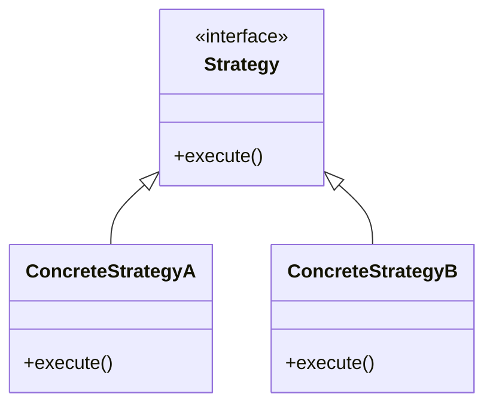

# Phase 2: Engineering Documentation Reference

This file contains detailed guidance for updating engineering documentation during `/festina-finalize`.

## 1. Analyze Engineering Doc Impact

Determine which engineering docs need attention:

```
1. Read task's <engineering> element from task.xml
2. If engineering has IDs:
   - Run: node .festinalente/scripts/festinalente.cjs check-engineering {engineering IDs}
   - Parse the JSON output
3. For each doc ID in engineering:
   - Read the doc file if it exists
   - Check frontmatter for `stub: true`
   - Categorize into:
     - engStubDocs: Have `stub: true` (need completing)
     - engExistingDocs: Exist without stub (need updating)
     - engMissingDocs: Don't exist (need creating)
```

### Search for Unlisted Impacts

```
1. Read task description, spec, and implementation context
2. Run: node .festinalente/scripts/festinalente.cjs search-engineering {technical keywords}
3. Parse results
4. If high-scoring docs NOT in engineering:
   - Output: "Suggest adding to engineering: {doc IDs}"
```

### Present Analysis to User

```
Output:
Engineering Doc Analysis for Task {taskId}:
Will COMPLETE (stub exists): {id} - stub created during /festina-create
Will UPDATE (doc exists): {id} - {summary}
Will CREATE (new doc needed): {id}
Unaffected (internal change): {reason if applicable}

Use AskUserQuestion:
  - header: "Eng docs"
  - question: "Proceed with engineering documentation updates?"
  - options:
    - label: "Yes (Recommended)", description: "Update/create engineering docs as analyzed"
    - label: "No", description: "Skip engineering documentation updates"
  - multiSelect: false
```

## 2. Load Smart Context

Before writing docs, load similar docs for quality reference:

```
1. Run: node .festinalente/scripts/festinalente.cjs select-context {taskId} --tier=standard --max=3 --type=engineering
2. Parse JSON output
3. For each doc returned:
   - Note engineering doc structure patterns
   - Use as reference when writing new docs
```

## 3. Complete Stub Engineering Docs

For docs with `stub: true` that need completing:

### Remove Stub Markers

```
1. Remove `stub: true` from frontmatter
2. Remove `task: {taskId}` from frontmatter
```

### Required Frontmatter Fields

Fill ALL of these (same as product docs):

| Field | Description | Example |
|-------|-------------|---------|
| `tldr` | Single sentence, max 100 chars | "Redis-backed cache layer for API responses" |
| `summary` | One sentence for LLM discovery | "Caching system that reduces external API calls" |
| `keywords` | 3-5 technical terms | [cache, redis, api, ttl, performance] |
| `aliases` | Alternative names | [api cache, response cache, redis cache] |
| `boundary` | What this does NOT cover | "Does not handle database query caching" |
| `updated` | Current date | 2026-02-27 |
| `verified` | Current date | 2026-02-27 |
| `code_refs` | Files touched by this task | [src/cache/api-cache.ts] |

### Required Content Sections by Type

Every completed doc needs:

1. **TL;DR blockquote** at top
2. **Overview** section with summary

Then type-specific sections:

#### For Systems

```markdown
## Architecture
- High-level design
- Component relationships
- Technology choices

## Components
- Key parts and their responsibilities
- Interfaces between components

## Data Flow
- How data moves through the system
- Input → Processing → Output

## Integration
- How to use from other code
- API surface
- Configuration options

## Boundaries
- What this system does NOT do
- Limitations
- Related systems

## Extension Points
- How to add new components
- Template files to copy
- Registration checklists
- Common pitfalls
```

#### Extension Points (Systems Only)

When documenting systems, identify extension points - component types that can be added:

**How to identify extension points:**
1. Look for component directories (e.g., capabilities/, computers/, orchestrators/)
2. Check for repeated patterns (multiple files with same structure)
3. Note registration points (entry file imports, config files)

**How to document each extension point:**
1. **Template:** Find a representative existing file to use as template
2. **Checklist:** Trace the registration flow from component to entry point
3. **Pitfalls:** Review PRs or code comments for common issues

**Example:**
```markdown
### Adding a new Capability

**Template:** Copy `capabilities/tasks-view.capability.ts`

**Checklist:**
- [ ] Create `{name}.capability.ts` in `src/capabilities/`
- [ ] Add factory function with dependencies parameter
- [ ] Wire into domain orchestrator that owns this concern
- [ ] Add TreeView contribution to package.json if TreeView capability

**Pitfalls:**
- Don't import other capabilities (lateral dependency forbidden)
- Don't put policy logic (ensure*, getOrCreate*) in capabilities
```

#### For Patterns

```markdown
## Problem
- What problem does this pattern solve
- When does this problem occur

## Solution
- The pattern approach
- Core concept

## When to Use
- Applicable scenarios
- Indicators that this pattern fits

## Implementation
- Step-by-step how to implement
- Key considerations

## Examples
- Code examples from THIS task
- Before/after comparisons

## Boundaries
- When NOT to use this pattern
- Anti-patterns to avoid
```

#### For Conventions

```markdown
## Rule
- The convention stated clearly
- The specific standard to follow

## Rationale
- Why this convention exists
- Benefits it provides

## Examples
- Correct usage examples
- From actual codebase

## Exceptions
- When to deviate
- How to document exceptions

## Boundaries
- What this convention doesn't cover
- Related conventions
```

### Diagram Completion by Type

#### For Systems

```
1. Generate Architecture diagram:
   - Show component relationships
   - Use graph or flowchart

2. Generate Data Flow diagram:
   - Show how data moves
   - Include transformations
```

Example:


#### For Patterns

```
1. Generate Structure diagram (classDiagram):
   - Show pattern components
   - Show relationships
```

Example:


#### For Conventions

```
1. If structure-related:
   - Generate ASCII diagrams showing correct vs incorrect
```

Example:
```
CORRECT:
src/
  components/
    Button/
      Button.tsx
      Button.test.tsx
      index.ts

INCORRECT:
src/
  components/
    Button.tsx
    ButtonTest.tsx
```

## 4. Update Engineering Docs

For docs that already exist and need updating:

```
1. Read current doc (use ID→path rules from check-engineering)
2. Identify sections needing changes based on implementation
3. Make MINIMAL, focused updates
4. SCOPE RESTRICTION: Only update what THIS task implemented
```

## 5. Create New Engineering Docs

For docs that don't exist and aren't stubs:

### Determine Doc Type

```
1. Analyze what was implemented:
   - New subsystem/service → type: system
   - Recurring solution approach → type: pattern
   - Team standard/rule → type: convention

2. If unclear, use AskUserQuestion:
   - header: "Doc type"
   - question: "What type of engineering doc should this be?"
   - options:
     - label: "System", description: "Documents a subsystem or service"
     - label: "Pattern", description: "Documents a recurring solution"
     - label: "Convention", description: "Documents a team standard"
   - multiSelect: false
```

### Setup

```
1. Create folder if needed: .festinalente/engineering/{type}s/
2. Run: node .festinalente/scripts/festinalente.cjs get-date-time
3. Choose template based on type:
   - System: .festinalente/templates/engineering-system.md
   - Pattern: .festinalente/templates/engineering-pattern.md
   - Convention: .festinalente/templates/engineering-convention.md
```

### Fill Doc

1. Fill ALL frontmatter fields:
   - `id: {type}s/{name}`
   - `type: {system|pattern|convention}`
   - `title: {Human-readable title}`
   - All other fields from frontmatter table above

2. Fill type-specific sections (see above)

3. Keep scope focused on THIS system/pattern/convention only

## 6. Update Engineering Index

When new docs are created in a type folder:

```
1. Check if .festinalente/engineering/{type}s/_index.md exists

2. If exists:
   - Read the _index.md file
   - Add new doc to appropriate section
   - Add one-line description matching the doc's tldr

3. If doesn't exist:
   - Consider creating one if multiple docs now exist in type folder
```

### Example _index.md Entry

```markdown
## Systems

- **[api-cache](api-cache.md)** - Redis-backed cache layer for API responses
- **[auth](auth.md)** - Authentication and session management system
```

## Summary Flow

```
1. Check engineering field in task
   └─ If empty: skip engineering docs

2. Categorize docs: stub / existing / missing

3. Search for unlisted impacts

4. Present analysis, get user approval

5. Load smart context for reference

6. For each doc:
   ├─ Existing: minimal updates
   ├─ Stub: complete with type-specific sections
   └─ Missing: determine type, create from template

7. Update type _index.md

8. Proceed to commit docs (handled in main skill)
```

## Doc Type Quick Reference

| Type | Purpose | Key Sections | Example |
|------|---------|--------------|---------|
| System | Document a subsystem/service | Architecture, Components, Data Flow, Integration | api-cache, auth, database |
| Pattern | Document a recurring solution | Problem, Solution, When to Use, Implementation | error-handling, state-management |
| Convention | Document a team standard | Rule, Rationale, Examples, Exceptions | naming, file-structure, testing |
