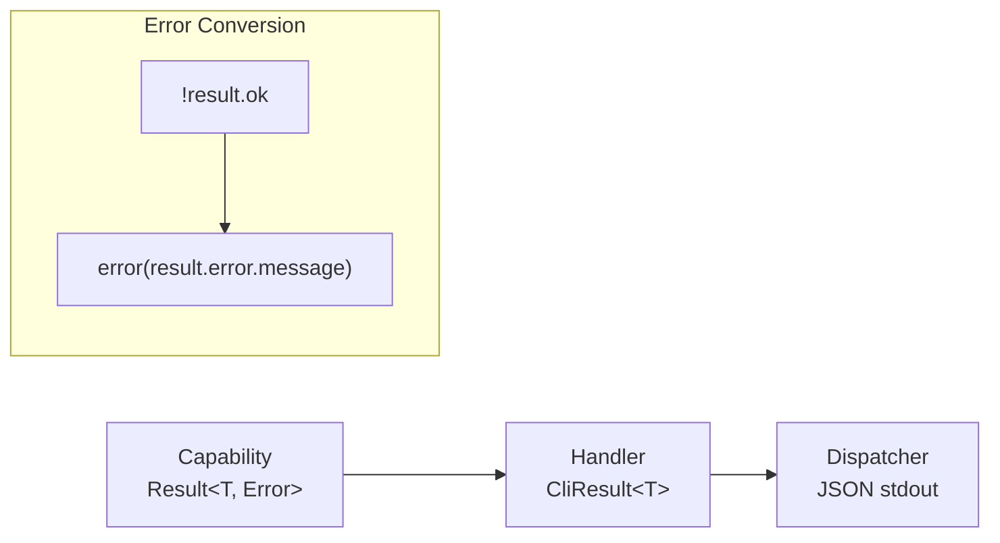

# Error Handling Convention

> **TL;DR:** Return Result<T,E> from capabilities, CliResult<T> from handlers, never throw

## Overview

<!-- Each section must be self-contained: open with a context sentence, no back-references -->

Consistent error handling using tagged union Result types across all CLI layers.

<!-- Tier 2 boundary: content above this line is loaded at standard tier -->

## Rule

| Layer | Return Type | Error Helper |
|-------|-------------|--------------|
| Capability | `Result<T, Error>` | `err(error)` |
| Computer | Pure output or `Result<T, E>` | `err(error)` |
| Handler | `CliResult<T>` | `error(message)` |

**Never throw expected errors.** Return them as values.

## Rationale

1. **Type Safety**: TypeScript enforces error handling
2. **Predictability**: Callers know functions can fail
3. **JSON Output**: CliResult serializes cleanly to stdout
4. **No Silent Failures**: Must check before using value

**Summary:** Errors are values, not exceptions.

## Examples

### Correct

```typescript
// Capability: Returns Result<T, Error>
function readFile(filePath: string): Result<string, Error> {
  try {
    const content = fs.readFileSync(filePath, 'utf8');
    return ok(content);
  } catch (e) {
    return err(e instanceof Error ? e : new Error(String(e)));
  }
}

// Handler: Returns CliResult<T>, converts Result errors
function findTask(args: string[]): CliResult<TaskInfo> {
  const { positional } = parseArgs(args);
  const id = positional[0];

  if (!id) {
    return error('Task ID required');  // ✅ Return error, don't throw
  }

  const readResult = fs.readFile(`tasks/${id}/task.xml`);
  if (!readResult.ok) {
    return error(`Failed to read task: ${readResult.error.message}`);  // ✅ Convert
  }

  const task = parser.parseTaskXml(readResult.value);
  return success(task);  // ✅ Return success
}

// Dispatcher: Handles CliResult
const result = handler.findTask(args);
if (isError(result)) {
  console.log(JSON.stringify(result));  // { "error": true, "message": "..." }
  process.exit(1);
}
console.log(JSON.stringify(result.data));  // Clean JSON output
```

### Incorrect

```typescript
// ❌ Throwing in handler
function findTask(args: string[]): TaskInfo {
  const id = args[0];
  if (!id) {
    throw new Error('Task ID required');  // ❌ Caller doesn't know this throws
  }
  const content = fs.readFileSync(`tasks/${id}/task.xml`);  // ❌ Throws on failure
  return parser.parseTaskXml(content);
}

// ❌ Inconsistent return types
function findTask(args: string[]): TaskInfo | null {  // ❌ null is not descriptive
  // ...
  return null;  // What went wrong?
}

// ❌ Swallowing errors
function findTask(args: string[]): CliResult<TaskInfo> {
  try {
    const content = fs.readFile(path);
    return success(parser.parse(content));
  } catch (e) {
    console.error(e);  // ❌ Logs but doesn't inform caller
    return success(defaultTask);  // ❌ Pretends success
  }
}
```

**Summary:** Return typed errors, don't throw or swallow.

## Error Flow



## Boundaries

When this convention does NOT apply:

- **Invariant violations**: Bugs that should never happen can throw
- **Startup errors**: Extension activation failures may throw
- **Type assertions**: Invalid runtime types can throw

## Enforcement

- **Code review**: Check all handlers return CliResult
- **TypeScript**: Return types enforce Result/CliResult usage
- **grep**: Search for `throw new Error` in handlers (should be rare)

```bash
# Find potential violations
grep -r "throw new Error" apps/*/src/cli/handlers/
```
