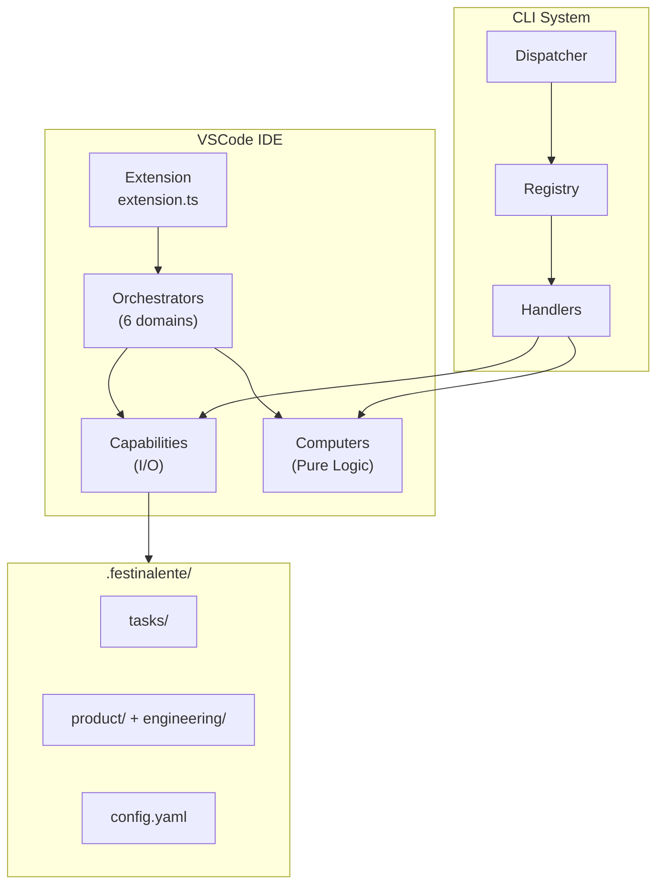
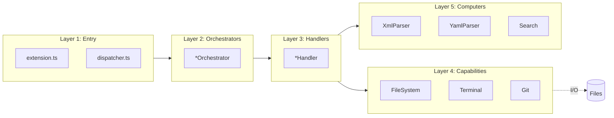

# Festina Lente Engineering Overview

> **TL;DR:** Spec-driven AI development framework with DAG architecture (orchestrators → capabilities → computers)

## Tech Stack

| Category | Technology |
|----------|------------|
| Language | TypeScript 5.9.3, Node.js 18+ |
| Framework | VSCode Extension API 1.85+ |
| Templating | Handlebars 4.7.8 |
| Parsing | fast-xml-parser 5.3.6, js-yaml 4.1.1, zod 3.25 |
| Search | fuse.js 7.1.0 (fuzzy search) |
| Build | pnpm 9.15+, Turbo, esbuild, tsdown |
| Database | None (file-based: XML, YAML, Markdown) |
| Testing | None configured (type safety as verification) |

**Summary:** TypeScript monorepo with file-based persistence, no database layer.

## Architecture Summary

Festina Lente uses a **Directed Acyclic Graph (DAG)** architecture where orchestrators compose capabilities (I/O) and computers (pure logic) without circular dependencies. This enables testability, clear separation of concerns, and predictable data flow.

**Why it exists:** AI agents need structured task workflows. The DAG ensures side effects are isolated in capabilities while business logic remains pure and testable in computers.

**Summary:** DAG architecture with orchestrator → capability → computer layering.

## System Architecture



## DAG Dependency Flow



**Key Rule:** Dependencies flow downward only. No layer may import from a higher layer.

## Directory Structure

```
claudeban/
├── apps/
│   ├── festinalente/           # CLI package
│   │   ├── src/cli/
│   │   │   ├── capabilities/   # I/O abstractions
│   │   │   ├── computers/      # Pure logic
│   │   │   ├── handlers/       # Command implementations
│   │   │   ├── orchestrator.ts # Wires everything
│   │   │   ├── registry.ts     # Command registry
│   │   │   └── dispatcher.ts   # Entry point
│   │   ├── src/content/        # Skill templates
│   │   └── tools/              # Build scripts
│   └── vscode/                 # VSCode extension
│       └── src/
│           ├── capabilities/   # VSCode I/O
│           ├── computers/      # Parsing logic
│           ├── orchestrators/  # Domain coordinators
│           └── extension.ts    # Entry point
├── .festinalente/              # Project data (user workspace)
│   ├── tasks/{id}/             # task.xml, spec.xml, plan.xml
│   ├── quick/{id}/             # quick.xml
│   ├── product/docs/           # Product documentation
│   ├── engineering/            # This documentation
│   ├── directives/             # LLM instruction sets
│   ├── config.yaml             # Project settings
│   └── workflow.yaml           # Workflow definitions
└── .claude/ + .opencode/       # Runtime skill definitions
```

**Summary:** Monorepo with CLI and VSCode extension, file-based data in `.festinalente/`.

## Boundaries

What this overview does NOT cover:

- **Does NOT:** Detail individual system implementations → See [systems/](systems/)
- **Does NOT:** Explain specific patterns → See [patterns/](patterns/)
- **Does NOT:** Document coding rules → See [conventions/](conventions/)

## Key Patterns

- [dag-architecture](patterns/dag-architecture.md) - Acyclic dependency graph with orchestrator → capability → computer layers
- [factory-di](patterns/factory-di.md) - Factory functions with dependency injection
- [tagged-union-errors](patterns/tagged-union-errors.md) - Result<T,E> discriminated unions for error handling
- [command-registry](patterns/command-registry.md) - Central registry for CLI command dispatch

## Systems

- [cli](systems/cli/_index.md) - Command-line dispatcher with handlers
- [vscode-extension](systems/vscode-extension/_index.md) - IDE integration with tree views
- [content-build](systems/content-build/_index.md) - Handlebars skill compilation
- [data-model](systems/data-model/_index.md) - File-based storage schemas
- [distribution](systems/distribution/_index.md) - NPM package publishing

## Conventions

- [file-naming](conventions/file-naming.md) - kebab-case with .capability/.computer/.handler suffixes
- [folder-structure](conventions/folder-structure.md) - Domain-driven capability/computer/handler folders
- [error-handling](conventions/error-handling.md) - Tagged union Result types
