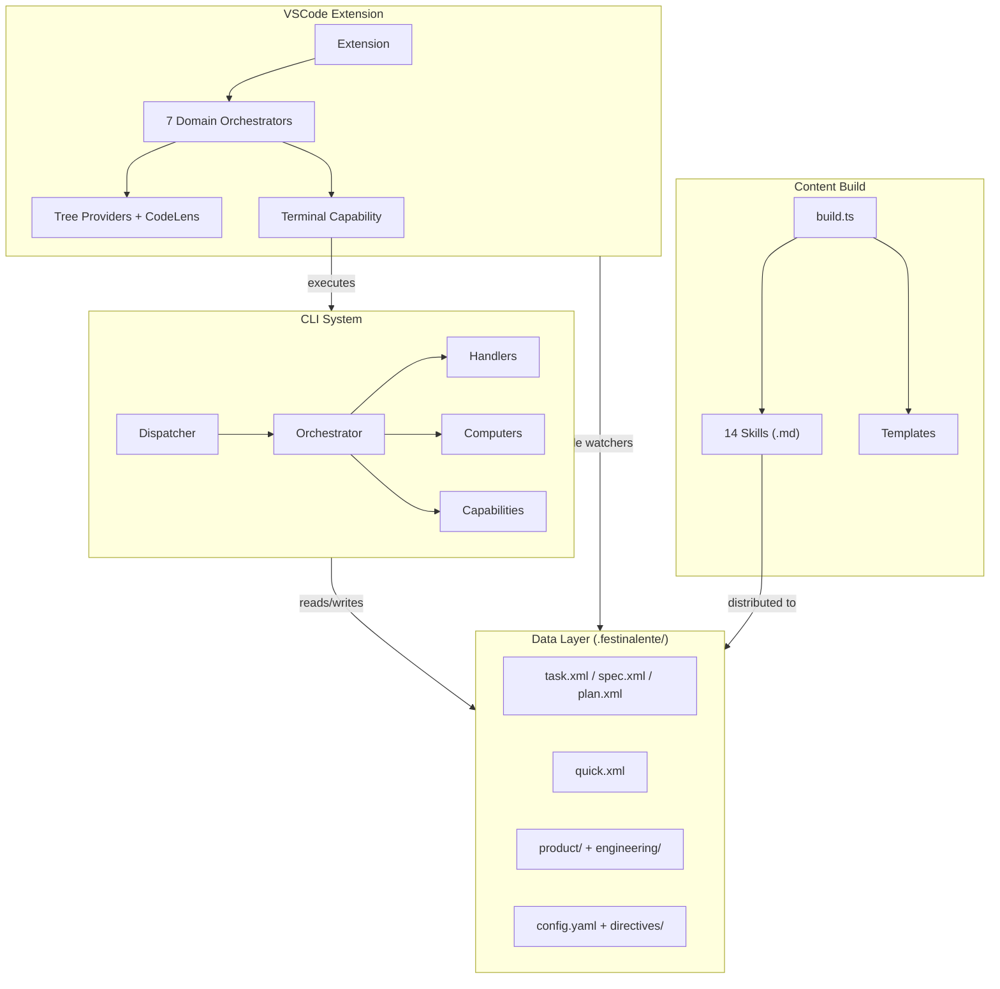

# Festina Lente Engineering Overview

> **TL;DR:** Spec-driven dev system: CLI + VSCode extension enforcing structured task workflows via file-based persistence

## Tech Stack

| Category | Technology |
|----------|------------|
| Language | TypeScript 5.3–5.7, Node.js >= 18 |
| Runtime | Node.js CLI + VSCode Extension API 1.85+ |
| Build Tools | Turbo 2.4 (monorepo), tsdown 0.11 (CLI), esbuild 0.27 (VSCode) |
| Package Manager | pnpm 9.15 |
| Linting | Oxlint 1.51 + Oxfmt 0.36 |
| Testing | None configured |
| Database | None (file-based: XML, YAML, Markdown) |

**Key Dependencies:**
- `fast-xml-parser` — XML parsing/serialization for task artifacts
- `gray-matter` — YAML frontmatter extraction from Markdown docs
- `js-yaml` — YAML parsing for config and glossary
- `minisearch` — BM25+ full-text search indexing
- `zod` — Schema validation and type inference
- `slugify` — URL-friendly ID generation

**Summary:** TypeScript monorepo with two distributable packages — a bundled CLI (CJS) and a VSCode extension (VSIX). No runtime database; all state persists as XML/YAML/Markdown files in `.festinalente/`.

<!-- Tier 2 boundary: content above this line is loaded at standard tier -->

## Architecture Summary

Festina Lente is a **spec-driven development system** for Claude Code agents. It enforces structured workflows where each phase (create -> scope -> plan -> implement -> finalize -> complete) reads and writes files on disk, surviving context windows and enabling persistent task management.

The architecture follows a **layered DAG pattern**: Orchestrators wire together Handlers (business logic), Computers (pure functions), and Capabilities (I/O). Dependencies flow strictly downward with no cycles.

**Why it exists:** AI agents lose context between conversations. File-based persistence with structured phases ensures no work is lost and each phase builds on verified artifacts from the previous one.

**Summary:** Layered architecture with strict dependency direction, file-based persistence, and directive-driven enforcement.

## System Architecture



## Directory Structure

```
festinalente/
├── apps/
│   ├── festinalente/          # CLI package (@mattfletcher94/festinalente)
│   │   ├── src/cli/           # Core: dispatcher, orchestrator, handlers, computers, capabilities
│   │   ├── src/content/       # Skill templates + partials (Handlebars)
│   │   ├── tools/             # Build scripts (build.ts)
│   │   ├── bin/               # Install scripts
│   │   └── dist/              # Bundled output (CJS + skills)
│   └── vscode/                # VSCode extension (@mattfletcher94/festinalente-vscode)
│       ├── src/               # Extension: orchestrators, capabilities, computers
│       ├── scripts/           # Packaging scripts
│       └── dist/              # esbuild bundle
├── .festinalente/             # Project data (committed to git)
│   ├── tasks/{id}/            # task.xml, spec.xml, plan.xml
│   ├── quick/{id}/            # quick.xml
│   ├── projects/{id}/         # project.xml
│   ├── product/               # Product documentation (Markdown + YAML)
│   ├── engineering/           # Engineering documentation (this directory)
│   ├── directives/            # Enforcement rules (XML)
│   ├── templates/             # Doc templates
│   ├── scripts/               # Helper scripts
│   └── config.yaml            # Directive-to-skill mappings
├── turbo.json                 # Monorepo task orchestration
├── pnpm-workspace.yaml        # Workspace declaration
└── .oxlintrc.json             # Linting rules
```

**Summary:** Monorepo with two apps (CLI + VSCode), project data in `.festinalente/`, and Turbo for build orchestration.

## Boundaries

What this overview does NOT cover:

- **Does NOT:** detail individual system internals → See [systems/](systems/)
- **Does NOT:** explain pattern rationale or usage rules → See [patterns/](patterns/)
- **Does NOT:** specify naming or structural conventions → See [conventions/](conventions/)

## Key Patterns

- [DAG Architecture](patterns/dag-architecture.md) - Layered dependency graph ensuring no cycles
- [Factory DI](patterns/factory-di.md) - Factory functions with explicit Deps interfaces for composition
- [Tagged Union Errors](patterns/tagged-union-errors.md) - Result types instead of exceptions
- [Command Registry](patterns/command-registry.md) - Self-registering commands for dynamic dispatch

## Systems

- [CLI](systems/cli/_index.md) - Core engine: command dispatch, task lifecycle, search, validation
- [VSCode Extension](systems/vscode-extension/_index.md) - UI layer: sidebar views, tree providers, terminal integration
- [Content Build](systems/content-build/_index.md) - Handlebars template compilation for distributable skills
- [Data Model](systems/data-model/_index.md) - File-based persistence: XML tasks, YAML config, Markdown docs
- [Validation](systems/validation/_index.md) - Schema validation, quality checks, reference integrity
- [Search & Discovery](systems/search/_index.md) - BM25+ full-text search with graph expansion
- [Distribution](systems/distribution/_index.md) - Build, publish, install for CLI and VSCode packages

## Conventions

- [File Naming](conventions/file-naming.md) - Suffixed names indicate architectural layer
- [Folder Structure](conventions/folder-structure.md) - Code organized by architectural layer
- [Error Handling](conventions/error-handling.md) - Tagged unions for predictable failure modes
- [Oxlint](conventions/oxlint.md) - Fast linting with correctness errors and import warnings
