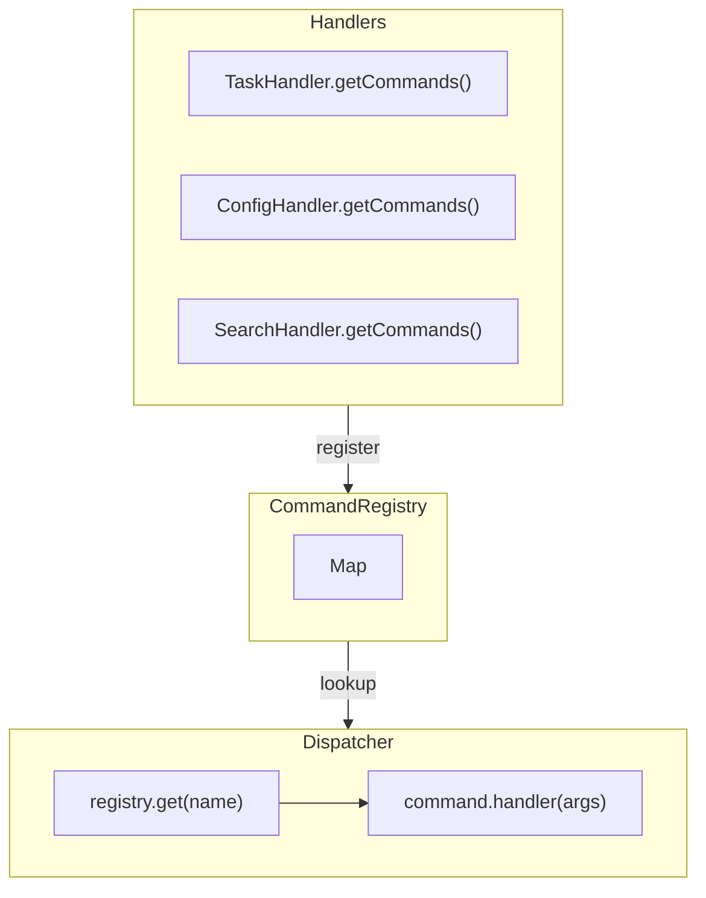

# Command Registry Pattern

> **TL;DR:** Central registry mapping command names to handler functions

## Problem

CLI tools need to dispatch commands to appropriate handlers. Hard-coded switch statements become unwieldy. Adding new commands requires modifying the dispatcher.

## Solution

Create a **central registry** that maps command names to handler functions. Handlers self-register via `getCommands()` method. The dispatcher looks up and executes commands dynamically.

```typescript
interface CliCommand {
  name: string;
  description: string;
  usage: string;
  handler: (args: string[]) => CliResult<unknown>;
}

interface CommandRegistry {
  register: (command: CliCommand) => void;
  get: (name: string) => CliCommand | undefined;
  list: () => readonly CliCommand[];
}
```

**Summary:** Register commands, look up by name, execute handler.

## Structure



## When to Use

- CLI tools with multiple commands
- Plugin architectures
- Any system with dynamic command dispatch
- When you need auto-generated help

## When NOT to Use

- Single-command CLI → No registry needed
- Fixed set of commands with no extensibility needs
- When command set is tiny (2-3 commands)

## Quick Reference

### CliCommand Interface

```typescript
interface CliCommand {
  readonly name: string;        // e.g., "find-task"
  readonly description: string; // e.g., "Find a task by ID"
  readonly usage: string;       // e.g., "find-task <id>"
  readonly handler: (args: string[]) => CliResult<unknown>;
}
```

### Registry Interface

```typescript
interface CommandRegistry {
  readonly register: (command: CliCommand) => void;
  readonly get: (name: string) => CliCommand | undefined;
  readonly list: () => readonly CliCommand[];
  readonly has: (name: string) => boolean;
}
```

### Helper Function

```typescript
function defineCommand(
  name: string,
  description: string,
  usage: string,
  handler: (args: string[]) => CliResult<unknown>
): CliCommand {
  return { name, description, usage, handler };
}
```

## Validation Checklist

- [ ] Each handler implements `getCommands(): CliCommand[]`
- [ ] Commands use consistent naming (kebab-case)
- [ ] Orchestrator registers all handler commands
- [ ] Dispatcher handles unknown commands gracefully
- [ ] Help command lists all registered commands

**Summary:** Self-registration, consistent naming, graceful fallbacks.

## Examples

### Correct Example

```typescript
// apps/festinalente/src/cli/registry.ts
export function createCommandRegistry(): CommandRegistry {
  const commands = new Map<string, CliCommand>();

  function register(command: CliCommand): void {
    if (commands.has(command.name)) {
      throw new Error(`Command "${command.name}" already registered`);
    }
    commands.set(command.name, command);
  }

  function get(name: string): CliCommand | undefined {
    return commands.get(name);
  }

  function list(): readonly CliCommand[] {
    return Array.from(commands.values()).sort((a, b) => a.name.localeCompare(b.name));
  }

  function has(name: string): boolean {
    return commands.has(name);
  }

  return { register, get, list, has };
}

// Handler self-registration
export function createTaskHandler(deps: TaskHandlerDeps): TaskHandler {
  function findTask(args: string[]): CliResult<TaskInfo> { /* ... */ }
  function listTasks(args: string[]): CliResult<ListTasksResult> { /* ... */ }

  function getCommands(): readonly CliCommand[] {
    return [
      defineCommand('find-task', 'Find task by ID', 'find-task <id>', findTask),
      defineCommand('list-tasks', 'List all tasks', 'list-tasks [--status=<status>]', listTasks),
    ];
  }

  return { findTask, listTasks, getCommands };
}

// Orchestrator wiring
export function createCliOrchestrator(): CliOrchestrator {
  const registry = createCommandRegistry();
  const taskHandler = createTaskHandler({ fs, xmlParser });

  for (const command of taskHandler.getCommands()) {
    registry.register(command);
  }

  return { registry };
}
```

### Incorrect Example

```typescript
// DON'T do this
function dispatch(commandName: string, args: string[]) {
  // ❌ Hard-coded switch statement
  switch (commandName) {
    case 'find-task':
      return findTask(args);
    case 'list-tasks':
      return listTasks(args);
    case 'delete-task':
      return deleteTask(args);
    // ... many more cases
    default:
      return error(`Unknown command: ${commandName}`);
  }
}
// Because: Adding commands requires modifying dispatcher. No auto-help.
```

**Summary:** Use registry, not switch statements.

## Help Generation

```typescript
function generateHelp(registry: CommandRegistry): string {
  const commands = registry.list();
  return commands
    .map(cmd => `  ${cmd.name.padEnd(20)} ${cmd.description}`)
    .join('\n');
}

// Output:
// Available commands:
//   find-task            Find task by ID
//   list-tasks           List all tasks
//   delete-task          Delete a task
```

## Boundaries

What this pattern does NOT apply to:

- **Does NOT:** Define handler implementation → See [factory-di](factory-di.md)
- **Does NOT:** Handle errors → See [tagged-union-errors](tagged-union-errors.md)
- **Does NOT:** Parse arguments → Handlers parse their own args

## Systems Using This Pattern

- [cli](../systems/cli/_index.md) - Central registry for all CLI commands (TaskHandler, ProjectHandler, SearchHandler, ConfigHandler, etc.)

## How to Add a New Command

Two scenarios: adding a command to an existing handler, or creating a new handler with commands.

### Adding a Command to an Existing Handler

```typescript
// BEFORE: TaskHandler has find-task and list-tasks
function getCommands(): readonly CliCommand[] {
  return [
    defineCommand('find-task', 'Find task by ID', 'find-task <id>', findTask),
    defineCommand('list-tasks', 'List all tasks', 'list-tasks [--status=<status>]', listTasks),
  ];
}
```

```typescript
// AFTER: Add delete-task to the same handler
function deleteTask(args: string[]): CliResult<DeleteResult> {
  const id = args[0];
  if (!id) return error('Task ID required');
  // ... implementation
  return success({ deleted: id });
}

function getCommands(): readonly CliCommand[] {
  return [
    defineCommand('find-task', 'Find task by ID', 'find-task <id>', findTask),
    defineCommand('list-tasks', 'List all tasks', 'list-tasks [--status=<status>]', listTasks),
    defineCommand('delete-task', 'Delete a task', 'delete-task <id>', deleteTask),  // NEW
  ];
}
```

No orchestrator changes needed — the command auto-registers through `getCommands()`.

### Creating a New Handler with Commands

```typescript
// Step 1: Create handler with getCommands()
export function createStatsHandler(deps: StatsHandlerDeps): StatsHandler {
  function getTaskStats(args: string[]): CliResult<StatsResult> { /* ... */ }

  function getCommands(): readonly CliCommand[] {
    return [
      defineCommand('task-stats', 'Show task statistics', 'task-stats', getTaskStats),
    ];
  }

  return { getTaskStats, getCommands };
}

// Step 2: Wire in orchestrator
const statsHandler = createStatsHandler({ fs, xmlParser });
for (const command of statsHandler.getCommands()) {
  registry.register(command);
}
```

### Command Naming Checklist

- [ ] Use `kebab-case` (e.g., `find-task`, not `findTask`)
- [ ] Verb-noun format (e.g., `list-tasks`, `validate-docs`)
- [ ] Include usage with argument placeholders (e.g., `find-task <id>`)
- [ ] Description is a short imperative phrase (e.g., "Find task by ID")
- [ ] Verify no duplicate names via `registry.has(name)` at registration

## Common Violations

| Violation | Fix |
|-----------|-----|
| Hard-coded dispatch | Use registry pattern |
| Missing getCommands() | Each handler must implement it |
| Inconsistent command names | Use kebab-case consistently |
| No unknown command handling | Return helpful error message |
| Duplicate command names | Check before registering |
