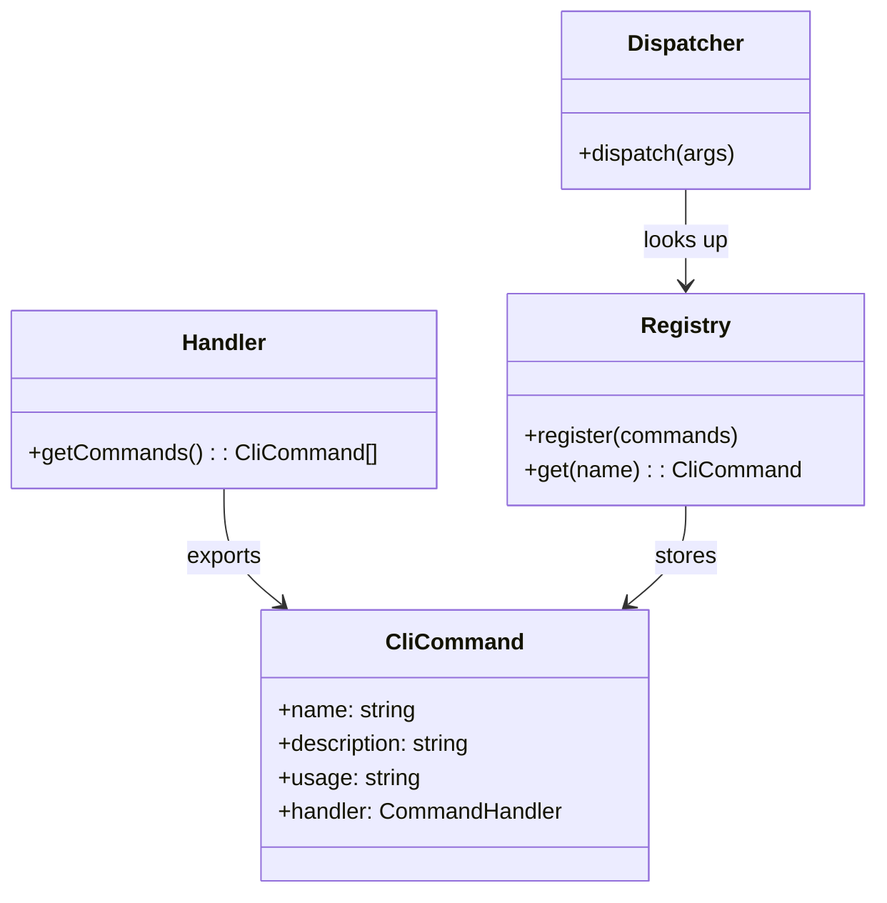

# Command Registry Pattern

> **TL;DR:** Commands self-register via getCommands() for dynamic dispatch and help generation

## Problem

Adding new CLI commands requires modifying a central routing file, which creates merge conflicts and makes it easy to forget registration. Help text gets out of sync with actual commands.

## Solution

Each handler exports a `getCommands()` function returning command metadata (name, description, usage) and handler functions. The orchestrator collects all commands and registers them in a central registry. The dispatcher looks up commands by name.

**Summary:** Commands are defined where they're implemented, collected automatically, and dispatched centrally.

<!-- Tier 2 boundary: content above this line is loaded at standard tier -->

## Structure



## When to Use

- Every new command in the CLI system
- When adding operations to an existing handler

## When NOT to Use

- VSCode extension commands — use VS Code's `registerCommand` API
- Build scripts or tooling commands

## Quick Reference

```typescript
// In handler: define commands
export function getCommands(): readonly CliCommand[] {
  return [
    defineCommand('find-task', 'Find task by ID', 'find-task <id>', findTask),
    defineCommand('list-tasks', 'List all tasks', 'list-tasks [--status=X]', listTasks),
  ];
}

// In orchestrator: collect and register
const registry = createRegistry();
registry.register(taskHandler.getCommands());
registry.register(searchHandler.getCommands());

// In dispatcher: dispatch
const command = registry.get(commandName);
return command.handler(args);
```

## Validation Checklist

- [ ] Handler exports `getCommands()` returning `readonly CliCommand[]`
- [ ] Each command has name, description, usage, and handler
- [ ] Commands registered in orchestrator
- [ ] Command names are unique across all handlers

**Summary:** Define at handler, register at orchestrator, dispatch at entry.

## Examples

### Correct Example

```typescript
// apps/festinalente/src/cli/handlers/task.handler.ts
export function getCommands(): readonly CliCommand[] {
  return [
    defineCommand('find-task', 'Find a task by ID', 'find-task <id>', findTask),
    defineCommand('list-tasks', 'List all tasks', 'list-tasks [--status=X]', listTasks),
    defineCommand('delete-task', 'Delete a task', 'delete-task <id>', deleteTask),
  ];
}
```

### Incorrect Example

```typescript
// DON'T do this — hardcoded routing in dispatcher
function dispatch(command: string, args: string[]) {
  if (command === 'find-task') return taskHandler.findTask(args);
  if (command === 'list-tasks') return taskHandler.listTasks(args);
  // Because: Adding commands requires modifying the dispatcher
}
```

**Summary:** Self-registration eliminates hardcoded routing.

## Boundaries

What this pattern does NOT apply to:

- **Does NOT:** apply to VSCode extension → uses VS Code's `registerCommand`
- **Does NOT:** define how commands parse arguments → that's handler-internal

## Systems Using This Pattern

- [CLI](../systems/cli/_index.md)

## Common Violations

- Adding commands directly in the dispatcher instead of via `getCommands()`
- Forgetting to register a handler's commands in the orchestrator
- Duplicate command names across handlers
