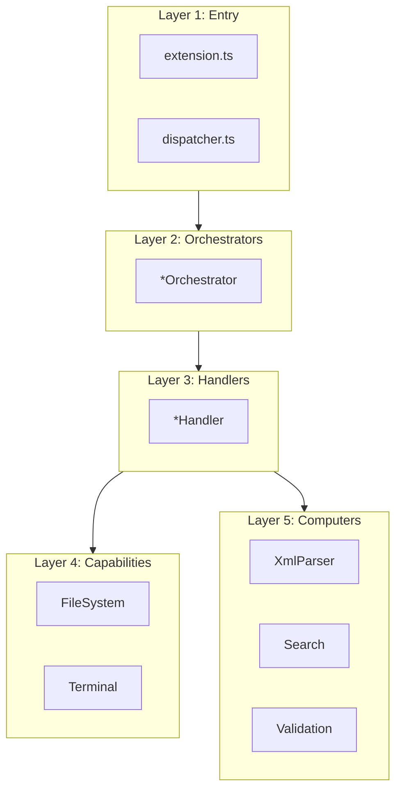

# DAG Architecture Pattern

> **TL;DR:** Dependencies flow downward only — orchestrators > handlers > computers/capabilities

## Problem

Without dependency constraints, modules can import freely from each other, creating circular dependencies that make testing, refactoring, and reasoning about data flow difficult. AI-generated code is especially prone to tangled imports.

## Solution

Organize code into strict layers where dependencies flow in one direction only. Higher layers compose lower layers but never the reverse.

**Layer Order (top to bottom):**
1. **Entry Points** — `dispatcher.ts`, `extension.ts`
2. **Orchestrators** — Wire dependencies, create instances
3. **Handlers** — Business logic, command implementation
4. **Computers** — Pure functions (no I/O, no side effects)
5. **Capabilities** — I/O abstractions (file system, terminal, UI)

**Summary:** No layer may import from a layer above it. Computers and capabilities sit at the bottom, independent of each other.

<!-- Tier 2 boundary: content above this line is loaded at standard tier -->

## Structure



## When to Use

- Any new module in `apps/festinalente/src/cli/` or `apps/vscode/src/`
- When adding new functionality to either application
- When refactoring existing code

## When NOT to Use

- Build scripts and tooling (`tools/`, `bin/`) — these are one-off scripts, not layered architecture
- Test files (when added) — tests may import from any layer

## Quick Reference

| Layer | Suffix | Can Import From | Cannot Import From |
|-------|--------|----------------|-------------------|
| Entry | none | Orchestrators | — |
| Orchestrator | `.orchestrator.ts` | Handlers, Computers, Capabilities | Entry |
| Handler | `.handler.ts` | Computers, Capabilities | Entry, Orchestrators, other Handlers |
| Computer | `.computer.ts` | Nothing (pure) | Everything above |
| Capability | `.capability.ts` | Nothing (I/O leaf) | Everything above |

## Validation Checklist

- [ ] No upward imports (computer importing from handler, etc.)
- [ ] No cross-layer peer imports (handler importing from handler)
- [ ] Computers have zero I/O — accept data, return data
- [ ] Capabilities are thin I/O wrappers — no business logic

**Summary:** Check import direction in every new file.

## Examples

### Correct Example

```typescript
// apps/festinalente/src/cli/handlers/task.handler.ts
// Handler imports from computers and capabilities (lower layers) ✓
import type { FileSystemCapability } from '../capabilities/file-system.capability';
import type { XmlParserComputer } from '../computers/xml-parser.computer';
import type { TaskResolverComputer } from '../computers/task-resolver.computer';

export interface TaskHandlerDeps {
  readonly fs: FileSystemCapability;
  readonly xmlParser: XmlParserComputer;
  readonly taskResolver: TaskResolverComputer;
}
```

### Incorrect Example

```typescript
// DON'T do this
// apps/festinalente/src/cli/computers/search.computer.ts
import { createTaskHandler } from '../handlers/task.handler';
// Because: Computer importing from Handler violates DAG — upward dependency
```

**Summary:** Always import downward. Computers and capabilities are leaves.

## Boundaries

What this pattern does NOT apply to:

- **Does NOT:** apply to build scripts or tooling
- **Does NOT:** prescribe folder names within a layer — that's the folder structure convention

## Systems Using This Pattern

- [CLI](../systems/cli/_index.md)
- [VSCode Extension](../systems/vscode-extension/_index.md)

## Common Violations

- Handlers importing from other handlers (peer dependency)
- Computers performing file I/O directly instead of receiving data as arguments
- Orchestrators containing business logic instead of delegating to handlers
