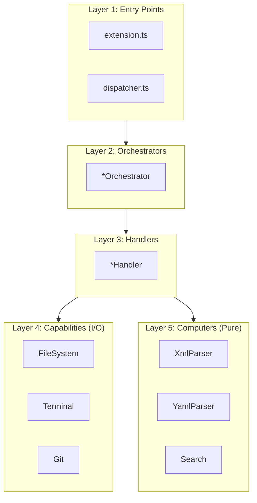

# DAG Architecture Pattern

> **TL;DR:** Acyclic dependency graph: orchestrators → capabilities → computers

## Problem

Complex applications tend to develop circular dependencies over time, making code hard to test, maintain, and reason about. When I/O operations are mixed with business logic, testing requires mocking entire subsystems.

## Solution

Organize code into a **Directed Acyclic Graph (DAG)** with clear layers:

1. **Entry Points** - `extension.ts`, `dispatcher.ts` (top)
2. **Orchestrators** - Coordinate and compose lower layers
3. **Handlers** - Implement specific commands/features
4. **Capabilities** - I/O and side effects (file system, terminal, git)
5. **Computers** - Pure functions, no side effects (bottom)

Dependencies flow **downward only**. No layer imports from a layer above it.

**Summary:** Layered architecture with strict downward dependencies.

## Structure



**Key Rule:** Arrows only point down. No cycles allowed.

## Layer Definitions

| Layer | Purpose | Side Effects | Examples |
|-------|---------|--------------|----------|
| Entry | Composition root | Yes (startup) | `extension.ts`, `dispatcher.ts` |
| Orchestrators | Coordinate layers | Minimal | `*Orchestrator.ts` |
| Handlers | Feature implementation | Via capabilities | `*Handler.ts` |
| Capabilities | I/O abstractions | Yes | `file-system.capability.ts` |
| Computers | Pure logic | None | `*-parser.computer.ts` |

## When to Use

- Building CLI tools with multiple commands
- VSCode extensions with multiple views
- Any application needing testable business logic
- Separating I/O from pure computation

## When NOT to Use

- Simple scripts with no complexity
- Single-file utilities → Just write procedural code
- Prototypes → Add structure later

## Quick Reference

### Naming Conventions

| Layer | File Suffix | Factory Name |
|-------|-------------|--------------|
| Orchestrator | `.orchestrator.ts` | `create*Orchestrator()` |
| Handler | `.handler.ts` | `create*Handler()` |
| Capability | `.capability.ts` | `create*Capability()` |
| Computer | `.computer.ts` | `create*Computer()` |

### Dependency Rules

```
✅ Orchestrator → Handler
✅ Orchestrator → Capability
✅ Orchestrator → Computer
✅ Handler → Capability
✅ Handler → Computer
✅ Capability → (nothing or external APIs)
✅ Computer → (nothing)

❌ Handler → Orchestrator
❌ Capability → Handler
❌ Computer → Capability
❌ Any circular import
```

## Validation Checklist

- [ ] Entry point only creates orchestrator(s)
- [ ] Orchestrators compose handlers/capabilities/computers
- [ ] Handlers receive capabilities/computers via constructor (DI)
- [ ] Capabilities handle all I/O (file, network, terminal)
- [ ] Computers are pure functions (no I/O, no side effects)
- [ ] No imports from higher layers

**Summary:** Check each file only imports from same or lower layers.

## Examples

### Correct Example

```typescript
// apps/festinalente/src/cli/orchestrator.ts
export function createCliOrchestrator(): CliOrchestrator {
  // Layer 4: Create capabilities (I/O)
  const fs = createFileSystemCapability();
  const git = createGitCapability();

  // Layer 5: Create computers (pure logic)
  const xmlParser = createXmlParserComputer();
  const yamlParser = createYamlParserComputer();

  // Layer 3: Create handlers with injected deps
  const taskHandler = createTaskHandler({ fs, xmlParser });
  const specHandler = createSpecHandler({ fs, xmlParser });

  // Layer 2: Register and compose
  const registry = createCommandRegistry();
  for (const command of taskHandler.getCommands()) {
    registry.register(command);
  }

  return { registry };
}
```

### Incorrect Example

```typescript
// DON'T do this
// computers/task-parser.computer.ts
import { createFileSystemCapability } from '../capabilities/file-system.capability';

export function createTaskParserComputer() {
  const fs = createFileSystemCapability(); // ❌ Computer importing Capability!

  function parseTask(id: string) {
    const content = fs.readFile(`tasks/${id}/task.xml`); // ❌ I/O in Computer!
    return parse(content);
  }

  return { parseTask };
}
// Because: Computers must be pure. Pass content as argument instead.
```

**Summary:** Orchestrator wires everything; computers stay pure.

## Boundaries

What this pattern does NOT apply to:

- **Does NOT:** Define how to structure capabilities → That's implementation detail
- **Does NOT:** Prescribe testing strategy → Use [factory-di](factory-di.md) for testability
- **Does NOT:** Cover UI architecture → VSCode has its own patterns (TreeDataProvider)

## Systems Using This Pattern

- [cli](../systems/cli/_index.md) - Orchestrator → Registry → Handlers → Capabilities/Computers
- [vscode-extension](../systems/vscode-extension/_index.md) - Extension → Orchestrators → Capabilities/Computers

## Common Violations

| Violation | Fix |
|-----------|-----|
| Computer reading files | Pass content as argument |
| Handler creating capability | Inject via constructor |
| Circular import | Move shared code to lower layer |
| Orchestrator doing business logic | Move to handler or computer |
| Capability containing logic | Extract to computer |
