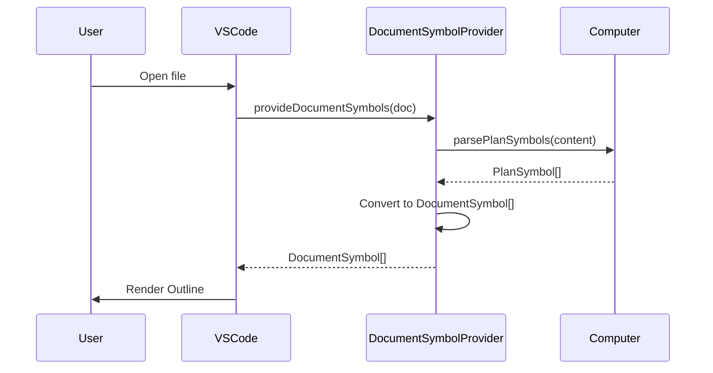
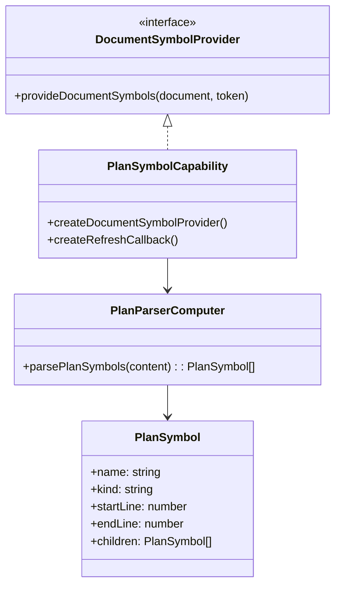

# Document Symbol Provider Pattern

> **TL;DR:** Provide hierarchical symbols for VSCode Outline panel navigation

## Overview

The Document Symbol Provider pattern enables hierarchical navigation in VSCode for custom file formats. By implementing `DocumentSymbolProvider`, you get Outline panel support, breadcrumb navigation, and `Ctrl+Shift+O` quick symbol search automatically.

**Summary:** Register a symbol provider to enable VSCode's built-in navigation features.

## Problem

When working with custom file formats (e.g., XML task files), users lack quick navigation:
- No Outline panel view
- No breadcrumb navigation
- No `Ctrl+Shift+O` symbol search
- Must manually scroll to find sections

## Solution

Implement a `DocumentSymbolProvider` that:
1. Parses file content into hierarchical symbols
2. Maps each symbol to line ranges for navigation
3. Registers with VSCode for specific file patterns

VSCode automatically provides Outline, breadcrumbs, and Go to Symbol once the provider is registered.



**Summary:** Parse content to symbols, let VSCode handle UI.

## Structure



**Key components:**

| Component | Responsibility | Layer |
|-----------|---------------|-------|
| `PlanSymbol` | Data structure for parsed symbols | Computer |
| `parsePlanSymbols()` | Pure function to parse XML to symbols | Computer |
| `createDocumentSymbolProvider()` | VSCode API wrapper | Capability |
| Registration in `extension.ts` | Wire provider to glob pattern | Orchestrator |

## When to Use

- Custom file formats needing navigation (XML, YAML schemas)
- Structured documents with logical sections
- Files where users benefit from outline navigation
- When breadcrumb context would help users

## When NOT to Use

- Standard files (JSON, Markdown) - VSCode has built-in support
- Binary files
- Small files where scrolling is sufficient
- Files without logical structure

## Quick Reference

| VSCode API | Purpose |
|------------|---------|
| `DocumentSymbol` | Represents a symbol with range and children |
| `SymbolKind` | Type of symbol (Class, Method, Property, etc.) |
| `Range` | Start/end positions for navigation |
| `registerDocumentSymbolProvider()` | Registers provider for file pattern |

**SymbolKind mapping for plan.xml:**

| Plan Element | SymbolKind |
|-------------|------------|
| plan (root) | Class |
| section (tasks, testing) | Module |
| task item | Method |
| sub-item | Property |

## Validation Checklist

- [ ] Provider implements `provideDocumentSymbols(document, token)`
- [ ] Returns `DocumentSymbol[]` with correct hierarchy
- [ ] Each symbol has valid `range` and `selectionRange`
- [ ] `selectionRange` is within `range`
- [ ] Registered with specific glob pattern (not too broad)
- [ ] Handles parse errors gracefully (returns empty array)
- [ ] Pure parsing logic in Computer, VSCode API in Capability

**Summary:** Check interface compliance, error handling, and layer separation.

## Examples

### Correct Example - Capability

```typescript
// apps/vscode/src/capabilities/plan-symbol.capability.ts

export function createPlanSymbolCapability(
  deps: PlanSymbolCapabilityDeps
): CreatePlanSymbolCapabilityReturn {
  function mapKindToSymbolKind(kind: PlanSymbol['kind']): vscode.SymbolKind {
    switch (kind) {
      case 'plan': return vscode.SymbolKind.Class;
      case 'section': return vscode.SymbolKind.Module;
      case 'task': return vscode.SymbolKind.Method;
      case 'item': return vscode.SymbolKind.Property;
    }
  }

  function convertToDocumentSymbol(
    symbol: PlanSymbol,
    document: vscode.TextDocument
  ): vscode.DocumentSymbol {
    const range = new vscode.Range(
      symbol.startLine, 0,
      symbol.endLine, document.lineAt(symbol.endLine).text.length
    );
    const selectionRange = new vscode.Range(
      symbol.startLine, 0,
      symbol.startLine, document.lineAt(symbol.startLine).text.length
    );

    const docSymbol = new vscode.DocumentSymbol(
      symbol.name,
      symbol.detail ?? '',
      mapKindToSymbolKind(symbol.kind),
      range,
      selectionRange
    );

    docSymbol.children = symbol.children.map(child =>
      convertToDocumentSymbol(child, document)
    );

    return docSymbol;
  }

  function createDocumentSymbolProvider(): vscode.DocumentSymbolProvider {
    return {
      provideDocumentSymbols(document, _token): vscode.DocumentSymbol[] {
        const content = document.getText();
        const symbols = deps.parsePlanSymbols(content);
        return symbols.map(s => convertToDocumentSymbol(s, document));
      },
    };
  }

  return { createDocumentSymbolProvider, createRefreshCallback };
}
```

### Correct Example - Computer

```typescript
// apps/vscode/src/computers/plan-parser.computer.ts

export interface PlanSymbol {
  readonly name: string;
  readonly kind: 'plan' | 'section' | 'task' | 'item';
  readonly startLine: number;
  readonly endLine: number;
  readonly children: PlanSymbol[];
  readonly detail?: string;
}

export function createPlanParserComputer(): CreatePlanParserComputerReturn {
  function parsePlanSymbols(content: string): PlanSymbol[] {
    try {
      const lineMap = buildLineMap(content);
      const parsed = parser.parse(content);
      // Build symbol hierarchy from parsed XML
      return [/* root symbol with children */];
    } catch (err) {
      console.warn('Failed to parse plan.xml:', err);
      return []; // Graceful fallback
    }
  }

  return { parsePlanSymbols };
}
```

### Correct Example - Registration

```typescript
// apps/vscode/src/extension.ts

context.subscriptions.push(
  vscode.languages.registerDocumentSymbolProvider(
    { pattern: '**/.kanban/tasks/*/plan.xml' },
    tasksOrch.planSymbolProvider
  )
);
```

### Incorrect Example

```typescript
// DON'T do this - parsing in the capability
function createDocumentSymbolProvider(): vscode.DocumentSymbolProvider {
  return {
    provideDocumentSymbols(document, _token): vscode.DocumentSymbol[] {
      const content = document.getText();
      // BAD: XML parsing directly in capability
      const parser = new XMLParser({ ignoreAttributes: false });
      const parsed = parser.parse(content);
      // ... build symbols ...
    }
  };
}
// Because: Violates capability/computer separation, not testable
```

**Summary:** Pure parsing in Computer, VSCode API wrapping in Capability.

## Boundaries

What this pattern does NOT apply to:

- **Does NOT:** Apply to CodeLens providers → Use CodeLens pattern
- **Does NOT:** Apply to Hover providers → Different API
- **Does NOT:** Handle editing → Navigation only
- **Does NOT:** Provide TreeView → See TreeDataProvider pattern

## Systems Using This Pattern

- Plan Outline Navigation in VSCode extension

## Common Violations

1. **Parsing in capability:** XML/JSON parsing should be in Computer
2. **Missing error handling:** Must return empty array on parse failure
3. **Invalid ranges:** `selectionRange` must be within `range`
4. **Too broad glob:** Using `**/plan.xml` instead of specific path
5. **Line indexing errors:** VSCode uses 0-based line numbers
