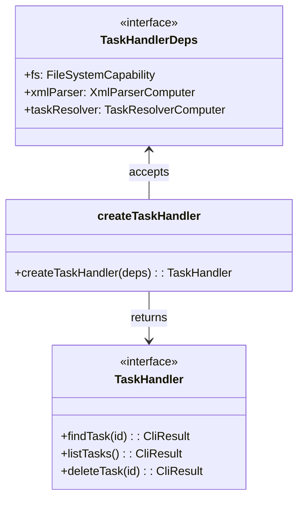

# Factory Function Dependency Injection

> **TL;DR:** Factory functions accept a Deps interface, enabling composition without a DI container

## Problem

Components need dependencies (parsers, file system, other services) but importing them directly creates tight coupling, makes testing difficult, and violates the DAG architecture.

## Solution

Each component defines a `*Deps` interface listing required dependencies, exposes a `create*()` factory function that accepts those deps, and returns a narrowly-scoped interface. Orchestrators compose everything by creating instances and passing them down.

**Summary:** Explicit deps interface + factory function + narrow return type = testable, composable components.

<!-- Tier 2 boundary: content above this line is loaded at standard tier -->

## Structure



## When to Use

- Every handler, computer, and capability in both CLI and VSCode apps
- Any component that needs external dependencies
- When adding new functionality to the system

## When NOT to Use

- Pure utility functions with no dependencies (just export the function directly)
- One-off scripts in `tools/` or `bin/`

## Quick Reference

| Element | Naming | Purpose |
|---------|--------|---------|
| Deps interface | `{Name}Deps` | Lists required dependencies |
| Factory function | `create{Name}()` | Accepts deps, returns interface |
| Return interface | `{Name}` | Narrow public API |

## Validation Checklist

- [ ] Component has a `*Deps` interface with `readonly` fields
- [ ] Factory function is the only export for instantiation
- [ ] Return type is a narrow interface (not the full implementation)
- [ ] Deps are destructured at the top of the factory function

**Summary:** Three pieces: Deps interface, factory function, return interface.

## Examples

### Correct Example

```typescript
// apps/festinalente/src/cli/handlers/task.handler.ts
export interface TaskHandlerDeps {
  readonly fs: FileSystemCapability;
  readonly xmlParser: XmlParserComputer;
  readonly taskResolver: TaskResolverComputer;
}

export function createTaskHandler(deps: TaskHandlerDeps): TaskHandler {
  const { fs, xmlParser, taskResolver } = deps;

  function findTask(id: string): CliResult<TaskInfo> {
    // uses fs, xmlParser, taskResolver from closure
  }

  return { findTask, listTasks, deleteTask /* ... */ };
}
```

### Incorrect Example

```typescript
// DON'T do this
import { createFileSystemCapability } from '../capabilities/file-system.capability';

export function createTaskHandler(): TaskHandler {
  const fs = createFileSystemCapability(); // Creating own dependency
  // Because: Dependencies are hidden, not injectable, not testable
}
```

**Summary:** Dependencies are always injected, never self-created.

## Boundaries

What this pattern does NOT apply to:

- **Does NOT:** apply to orchestrators — they are the composition root that creates dependencies
- **Does NOT:** require a DI container — plain function calls in the orchestrator

## Systems Using This Pattern

- [CLI](../systems/cli/_index.md)
- [VSCode Extension](../systems/vscode-extension/_index.md)

## Common Violations

- Creating dependencies inside the factory instead of accepting them
- Exporting the implementation class/object instead of a narrow interface
- Missing `readonly` on Deps interface fields
