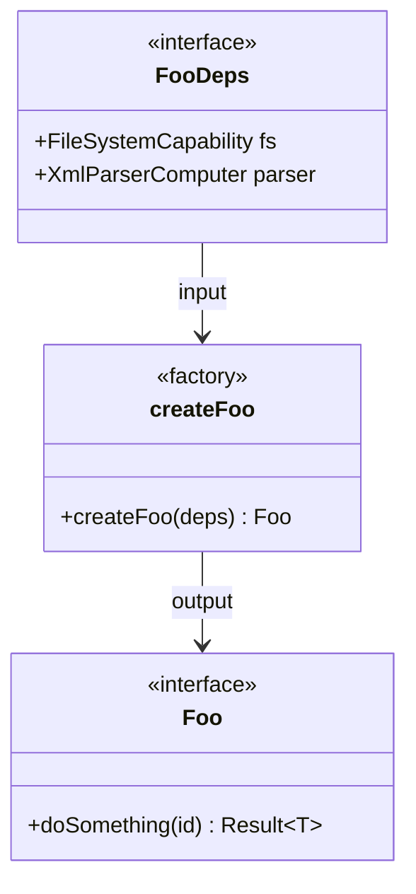

# Factory Function Dependency Injection

> **TL;DR:** Dependencies injected through create*() factory functions with Deps interface

## Problem

How do you compose layers in the DAG architecture while maintaining testability? Classes with `new` create tight coupling. Global imports make mocking difficult.

## Solution

Use **factory functions** that accept a `Deps` interface containing all required dependencies. The factory returns an interface exposing only public methods.

```typescript
interface FooDeps {
  readonly fs: FileSystemCapability;
  readonly parser: XmlParserComputer;
}

interface Foo {
  readonly doSomething: (id: string) => Result<T>;
}

function createFoo(deps: FooDeps): Foo {
  const { fs, parser } = deps;
  // ... implementation
  return { doSomething };
}
```

**Summary:** Factory function + Deps interface + Return interface

## Structure



## When to Use

- Any component in the DAG architecture
- Handlers, capabilities, computers
- Anything requiring testability
- When composing multiple dependencies

## When NOT to Use

- Simple pure functions with no dependencies
- One-off scripts → Use direct imports
- Performance-critical hot paths → Factory overhead may matter

## Quick Reference

### Pattern Structure

```typescript
// 1. Define deps interface (what you need)
export interface {Name}Deps {
  readonly dep1: Type1;
  readonly dep2: Type2;
}

// 2. Define return interface (what you expose)
export interface {Name} {
  readonly method1: (args) => Result;
  readonly method2: (args) => Result;
}

// 3. Factory function
export function create{Name}(deps: {Name}Deps): {Name} {
  const { dep1, dep2 } = deps;

  function method1(args) { /* ... */ }
  function method2(args) { /* ... */ }

  return { method1, method2 };
}
```

### Naming Conventions

| Element | Convention | Example |
|---------|------------|---------|
| Deps interface | `{Name}Deps` | `TaskHandlerDeps` |
| Return interface | `{Name}` | `TaskHandler` |
| Factory function | `create{Name}` | `createTaskHandler` |
| File name | `{name}.{layer}.ts` | `task.handler.ts` |

## Validation Checklist

- [ ] Deps interface uses `readonly` for all properties
- [ ] Return interface uses `readonly` for all methods
- [ ] Factory function destructures deps immediately
- [ ] All dependencies come from deps (no imports of implementations)
- [ ] Return object only exposes public API

**Summary:** Readonly interfaces, destructured deps, clean return.

## Examples

### Correct Example

```typescript
// apps/festinalente/src/cli/handlers/config.handler.ts
export interface ConfigHandlerDeps {
  readonly fs: FileSystemCapability;
  readonly yamlParser: YamlParserComputer;
}

export interface ConfigHandler {
  readonly getSkillConfig: (args: string[]) => CliResult<SkillConfigResult>;
  readonly getDateTime: (args: string[]) => CliResult<DateTimeResult>;
  readonly getCommands: () => readonly CliCommand[];
}

export function createConfigHandler(deps: ConfigHandlerDeps): ConfigHandler {
  const { fs, yamlParser } = deps;

  function getSkillConfig(args: string[]): CliResult<SkillConfigResult> {
    const configResult = fs.readFile('.festinalente/config.yaml');
    if (!configResult.ok) return error(configResult.error.message);

    const config = yamlParser.parseYaml(configResult.value);
    // ... implementation
    return success(result);
  }

  function getDateTime(args: string[]): CliResult<DateTimeResult> {
    // ... implementation
  }

  function getCommands(): readonly CliCommand[] {
    return [
      defineCommand('get-skill-config', '...', '...', getSkillConfig),
      defineCommand('get-date-time', '...', '...', getDateTime),
    ];
  }

  return { getSkillConfig, getDateTime, getCommands };
}
```

### Incorrect Example

```typescript
// DON'T do this
import { createFileSystemCapability } from '../capabilities/file-system.capability';

export function createConfigHandler(): ConfigHandler {
  // ❌ Creating dependency inside factory
  const fs = createFileSystemCapability();

  function getSkillConfig(args: string[]) {
    // ... uses fs
  }

  return { getSkillConfig };
}
// Because: Dependencies are hidden, not injectable, not testable.
```

**Summary:** Inject dependencies, don't create them inside the factory.

## Testing with Factory DI

```typescript
// test/config.handler.test.ts
import { createConfigHandler } from './config.handler';

describe('ConfigHandler', () => {
  it('returns skill config', () => {
    // Create mock dependencies
    const mockFs = {
      readFile: jest.fn().mockReturnValue({
        ok: true,
        value: 'directives:\n  festina-create: [design]'
      }),
    };
    const mockYamlParser = {
      parseYaml: jest.fn().mockReturnValue({
        directives: { 'festina-create': ['design'] }
      }),
    };

    // Inject mocks
    const handler = createConfigHandler({
      fs: mockFs,
      yamlParser: mockYamlParser
    });

    // Test
    const result = handler.getSkillConfig(['festina-create']);
    expect(result.success).toBe(true);
  });
});
```

## Boundaries

What this pattern does NOT apply to:

- **Does NOT:** Replace pure functions → No deps = no factory needed
- **Does NOT:** Use DI containers → Plain functions, no framework
- **Does NOT:** Apply to types only → Types don't need factories

## Systems Using This Pattern

- [cli](../systems/cli/_index.md) - All handlers use factory DI
- [vscode-extension](../systems/vscode-extension/_index.md) - All orchestrators use factory DI

## Common Violations

| Violation | Fix |
|-----------|-----|
| Creating deps inside factory | Accept via Deps interface |
| Mutable deps interface | Add `readonly` to all properties |
| Exposing implementation details | Return only public interface |
| Importing implementations directly | Pass through deps |
| Class-based DI | Use factory functions instead |
