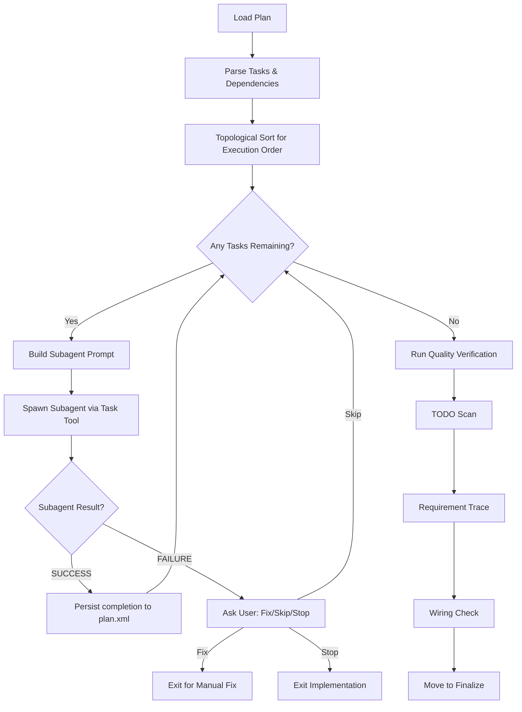

# Subagent Orchestration Pattern

> **TL;DR:** Spawn fresh subagents for each task to keep orchestrator context lean and enable unlimited plan sizes

## Problem

When executing multi-task plans in AI agent systems:
- **Context exhaustion:** Executing multiple tasks inline accumulates context until the agent hits limits
- **Manual intervention required:** Users must run `/clear` between tasks to reset context
- **Unpredictable failures:** Tasks late in a plan fail due to context accumulated from earlier tasks
- **Embedded content bloat:** Passing code snippets in prompts wastes context on stale information
- **Lost progress:** Context exhaustion can lose work completed before the failure

## Solution

Create an **Orchestrator** that spawns a fresh **Subagent** for each task:

1. **Parse plan tasks** and determine execution order from dependencies
2. **Build lean prompts** with file references (not embedded content)
3. **Spawn subagent** using Task tool with `subagent_type: "general-purpose"`
4. **Wait for result** (SUCCESS or FAILURE with summary)
5. **Persist completion immediately** to plan.xml before next task
6. **Run quality checks** in orchestrator after all tasks complete

```
┌─────────────────────────────────────────────────────────────┐
│                     ORCHESTRATOR                             │
│  - Loads plan and determines execution order                 │
│  - Builds prompts with file references                       │
│  - Spawns subagents sequentially                            │
│  - Persists completion after each task                       │
│  - Runs quality verification after all tasks                 │
│  - Stays at ~15% context usage                              │
└─────────────────────────────────────────────────────────────┘
        │           │           │           │
        ▼           ▼           ▼           ▼
    ┌───────┐   ┌───────┐   ┌───────┐   ┌───────┐
    │Task 1 │   │Task 2 │   │Task 3 │   │Task N │
    │Subagent│   │Subagent│   │Subagent│   │Subagent│
    │(fresh) │   │(fresh) │   │(fresh) │   │(fresh) │
    └───────┘   └───────┘   └───────┘   └───────┘
       100%        100%        100%        100%
     context     context     context     context
```

## When to Use

- **Multi-task plans:** More than 2-3 tasks that would accumulate significant context
- **Complex implementations:** Tasks involving multiple file reads and modifications
- **Long-running workflows:** Plans that would otherwise require manual `/clear` commands
- **Resilient execution:** When progress must be preserved against context failures

## When NOT to Use

- **Single-task operations:** Subagent overhead not justified for quick inline execution
- **Discovery phases:** When exploring/scoping, inline execution is faster and sufficient
- **Context-light tasks:** Tasks that only modify one file without needing much context

## How It Works

### Subagent Prompt Template

Each subagent receives a minimal, focused prompt:

```
Execute task {id}: "{name}"

**Read these files first:**
- path/to/context/file1.ts
- path/to/context/file2.ts

**Pattern to follow:**
path/to/pattern/reference.ts (if specified)

**Action:**
{content of action element from plan}

**Verify:** {content of verify element}

**Done criteria:** {content of done element}

**Spec reference:** .festinalente/tasks/{taskId}/spec.xml
(Read if you need functional requirements or additional context)

When complete, report:
- SUCCESS: {summary of what was done}
- FAILURE: {what failed and why}
```

### Orchestrator Flow



### Context Element in Plans

Plans include a `<context>` element in each task specifying which files the subagent should read:

```xml
<task id="3" type="auto">
  <name>Add authentication middleware</name>
  <files>src/middleware/auth.ts (create)</files>
  <requirements>FR1, FR2</requirements>
  <pattern>src/middleware/logging.ts:15-45</pattern>
  <context>
    <file>src/middleware/logging.ts</file>
    <file>src/types/auth.ts</file>
    <file>src/config/security.ts</file>
  </context>
  <action>Create auth middleware following logging pattern...</action>
  <verify>pnpm tsc --noEmit</verify>
  <done>Auth middleware exists and compiles</done>
</task>
```

**What goes in context:**
- Existing files being modified (not files being created)
- Pattern reference files
- Files containing required types/interfaces
- Files that import the target (to understand usage)

**What does NOT go in context:**
- Files being created (subagent creates them fresh)
- Embedded code snippets (subagent reads files directly)
- Spec file (always available at standard path)

## Implementation Details

### Orchestrator Responsibilities

| Responsibility | Why in Orchestrator |
|---------------|---------------------|
| Load directives | Policy decisions apply to all tasks |
| Load smart context | Engineering docs provide constraints |
| Parse plan tasks | Coordination requires full plan visibility |
| Build subagent prompts | Orchestrator knows task dependencies |
| Persist task completion | Must survive subagent context exhaustion |
| Quality verification | Examines full codebase after all changes |
| Directive compliance | Runs project-specific checks |

### Subagent Responsibilities

| Responsibility | Why in Subagent |
|---------------|-----------------|
| Read context files | Fresh read ensures current content |
| Execute action | Implementation work |
| Run verification | Confirm task completion |
| Report SUCCESS/FAILURE | Structured response for orchestrator |

### Critical Design Decisions

1. **All tasks use subagents** - No complexity threshold; fresh context for every task ensures predictable behavior

2. **File references only** - Prompts contain paths, never embedded code; subagent reads fresh content

3. **Sequential execution** - Respects task dependencies via `depends` attribute

4. **Immediate persistence** - Write `completed="true"` to plan.xml after each task succeeds

5. **Quality checks in orchestrator** - TODO scan, requirement trace, and wiring verification need full codebase context

## Trade-offs

| Advantage | Disadvantage |
|-----------|--------------|
| Unlimited plan size | Slightly higher latency (subagent spawn overhead) |
| Fresh context per task | Cannot share state between tasks |
| Predictable context usage | More verbose plan files (context elements) |
| Resume from any point | Subagents cannot spawn subagents |
| No manual /clear needed | Requires structured SUCCESS/FAILURE reporting |

## Examples

### Correct - Orchestrator with Subagent Spawning

```xml
<step name="execute_tasks">
  <note>Spawn a subagent for each task to keep orchestrator lean.</note>

  <action>For each task in executionOrder where completed != "true":</action>

  <substep name="build_subagent_prompt">
    <action>Extract task elements: id, name, context, pattern, action, verify, done</action>
    <action>Build prompt from template with file references only</action>
  </substep>

  <substep name="spawn_subagent">
    <action>Use Task tool with:
      - description: "Execute task {task.id}: {task.name}"
      - prompt: {subagentPrompt}
      - subagent_type: "general-purpose"
    </action>
    <action>Wait for completion</action>
    <action>Parse SUCCESS/FAILURE from response</action>
  </substep>

  <substep name="persist_completion">
    <branch condition="SUCCESS">
      <action>Add completed="true" completed_at="{timestamp}" to task</action>
      <action>Write updated plan.xml immediately</action>
    </branch>
  </substep>
</step>
```

### Correct - Context Block in Plan

```xml
<task id="2" type="auto" depends="1">
  <name>Update API router to use new handler</name>
  <files>src/api/router.ts (modify)</files>
  <context>
    <!-- Files subagent needs to read -->
    <file>src/api/router.ts</file>
    <file>src/handlers/new-handler.ts</file>
    <file>src/types/routes.ts</file>
  </context>
  <action>Import new handler and add route...</action>
  <verify>pnpm tsc --noEmit</verify>
  <done>Router imports and uses new handler</done>
</task>
```

### Incorrect - Embedded Content in Prompt

```
<!-- DON'T do this -->
Execute task 2: "Update API router"

**Here's the current router content:**
```typescript
// 200 lines of embedded code that wastes context
// and may be stale by the time subagent executes
```

**Here's the new handler:**
```typescript
// More embedded code
```

<!-- Because: Subagent should read files fresh -->
```

### Incorrect - Missing Immediate Persistence

```xml
<!-- DON'T do this -->
<step name="execute_tasks">
  <action>For each task:</action>
  <action>Spawn subagent</action>
  <action>If success, add to completedList</action>
  <!-- Missing immediate write! -->
</step>

<step name="update_plan">
  <!-- Writing all at once risks losing progress -->
  <action>Write all completed tasks to plan.xml</action>
</step>

<!-- Because: Context exhaustion before final write loses all progress -->
```

## Boundaries

What this pattern does NOT cover:

- **Does NOT:** Prescribe how subagents should structure their execution internally
- **Does NOT:** Handle parallel task execution (sequential only due to dependency ordering)
- **Does NOT:** Apply to discovery/scoping phases where inline execution is appropriate
- **Does NOT:** Provide inter-subagent communication mechanisms

## Systems Using This Pattern

- festina-implement skill - Primary implementation for task execution
- festina-scope skill - Uses similar subagent spawning for spec review

## Common Violations

1. **Embedded code in prompts:** Passing code snippets instead of file paths
2. **Delayed persistence:** Writing completions in batches instead of immediately
3. **Quality checks in subagents:** Running TODO scan per-task instead of after all tasks
4. **Missing context element:** Not specifying which files subagent should read
5. **Policy in subagent:** Subagent making orchestrator-level decisions (when to skip, what to load)

## Validation Checklist

- [ ] Each task spawns a fresh subagent (no inline execution for multi-task plans)
- [ ] Prompts contain file paths, not embedded content
- [ ] Completion persisted to plan.xml immediately after each task
- [ ] Quality verification runs in orchestrator after all tasks complete
- [ ] Directive loading stays in orchestrator (not passed to subagents)
- [ ] Tasks include `<context>` element specifying files to read
- [ ] Subagent reports structured SUCCESS/FAILURE response
