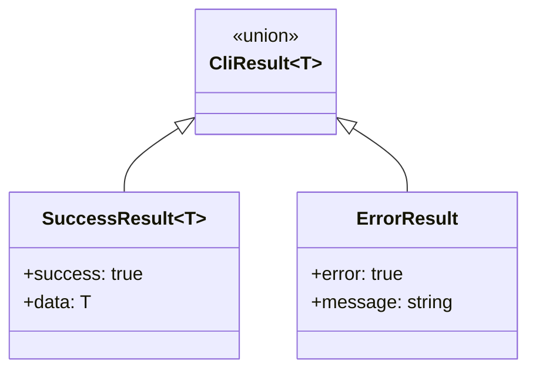

# Tagged Union Error Handling

> **TL;DR:** All operations return tagged unions instead of throwing — check before accessing

## Problem

Thrown exceptions are invisible in function signatures. Callers don't know what can fail, and uncaught exceptions crash the process. AI-generated code frequently forgets try-catch blocks.

## Solution

All operations return a discriminated union type: `CliResult<T> = SuccessResult<T> | ErrorResult`. Callers must check the discriminant (`success` or `error`) before accessing data. Guard functions (`isError()`) enable safe narrowing.

**Summary:** Return errors as values, not exceptions. The type system forces callers to handle both paths.

<!-- Tier 2 boundary: content above this line is loaded at standard tier -->

## Structure



## When to Use

- Every handler function in the CLI system
- Every capability function that can fail (file reads, parsing)
- Any function where the caller needs to know about failure

## When NOT to Use

- Pure computer functions that cannot fail (always return a value)
- Internal helper functions within a handler where the error is handled locally

## Quick Reference

| Type | Discriminant | Fields |
|------|-------------|--------|
| `SuccessResult<T>` | `success: true` | `data: T` |
| `ErrorResult` | `error: true` | `message: string` |
| `Result<T, E>` | `ok: true/false` | `value: T` or `error: E` |

| Helper | Purpose |
|--------|---------|
| `isError(result)` | Type guard for ErrorResult |
| `success(data)` | Create SuccessResult |
| `error(message)` | Create ErrorResult |
| `ok(value)` | Create Result success |
| `err(error)` | Create Result failure |

## Validation Checklist

- [ ] Handler functions return `CliResult<T>`, never throw
- [ ] Callers check `isError()` before accessing `.data`
- [ ] Error messages are descriptive (include file path, what was expected)
- [ ] Capability functions return `Result<T, E>` for I/O operations

**Summary:** Return, don't throw. Check, then access.

## Examples

### Correct Example

```typescript
// apps/festinalente/src/cli/types.ts
export type CliResult<T> = SuccessResult<T> | ErrorResult;

export interface SuccessResult<T> {
  readonly success: true;
  readonly data: T;
}

export interface ErrorResult {
  readonly error: true;
  readonly message: string;
}

// Handler returning result
function findTask(id: string): CliResult<TaskInfo> {
  const readResult = fs.readFile(filePath);
  if (!readResult.ok) {
    return error(`Failed to read task: ${readResult.error.message}`);
  }
  return success(parsed);
}

// Caller checking result
const result = findTask('023');
if (isError(result)) {
  console.error(result.message);
  return;
}
const task = result.data; // TypeScript knows this is TaskInfo
```

### Incorrect Example

```typescript
// DON'T do this
function findTask(id: string): TaskInfo {
  const content = fs.readFileSync(filePath); // Throws on missing file
  return parseTask(content); // Throws on bad XML
  // Because: Callers have no type-level indication that this can fail
}
```

**Summary:** Tagged unions make failure visible in the type system.

## Boundaries

What this pattern does NOT apply to:

- **Does NOT:** apply to VSCode extension computers (they use simpler return types)
- **Does NOT:** replace validation — validation checks content, this handles operation failure

## Systems Using This Pattern

- [CLI](../systems/cli/_index.md)

## Common Violations

- Throwing exceptions instead of returning error results
- Accessing `.data` without checking `isError()` first
- Using `try-catch` around result-returning functions (unnecessary)
