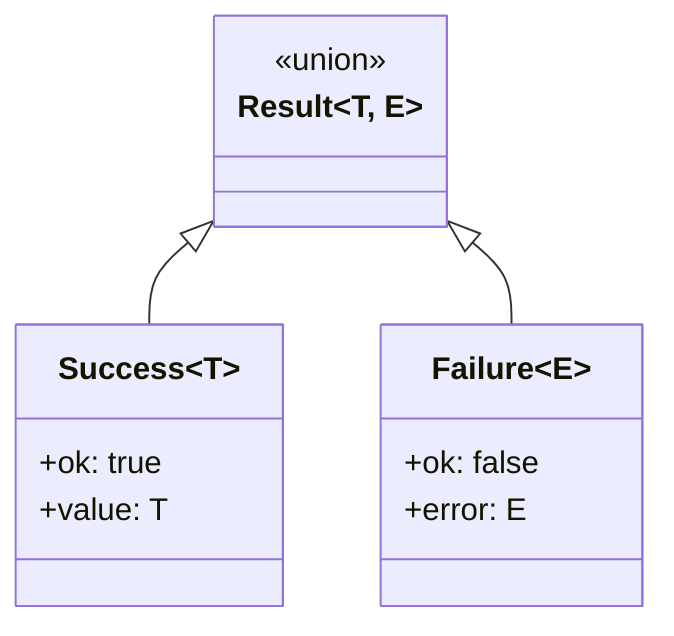

# Tagged Union Error Handling

> **TL;DR:** Result<T,E> discriminated unions with ok/error tags for type-safe error handling

## Problem

Exceptions are invisible in TypeScript types. A function signature `parseTask(id: string): Task` doesn't indicate it can fail. Callers forget to handle errors, leading to runtime crashes.

## Solution

Return **discriminated unions** (tagged unions) where success and error are explicit variants:

```typescript
type Result<T, E = Error> =
  | { readonly ok: true; readonly value: T }
  | { readonly ok: false; readonly error: E };
```

The `ok` property serves as the discriminant tag, enabling TypeScript to narrow types.

**Summary:** Return Result<T,E> instead of throwing. Compiler enforces handling.

## Structure



## Two Result Types

### 1. Result<T, E> - For Capabilities

Used in capabilities for low-level I/O operations:

```typescript
// file-system.capability.ts
export type Result<T, E = Error> =
  | { readonly ok: true; readonly value: T }
  | { readonly ok: false; readonly error: E };

export function ok<T>(value: T): Result<T, never> {
  return { ok: true, value };
}

export function err<E>(error: E): Result<never, E> {
  return { ok: false, error };
}
```

### 2. CliResult<T> - For Handlers

Used in handlers for command results (JSON output):

```typescript
// types.ts
export interface SuccessResult<T> {
  readonly success: true;
  readonly data: T;
}

export interface ErrorResult {
  readonly error: true;
  readonly message: string;
}

export type CliResult<T> = SuccessResult<T> | ErrorResult;

export function success<T>(data: T): CliResult<T> {
  return { success: true, data };
}

export function error(message: string): CliResult<never> {
  return { error: true, message };
}
```

## When to Use

- File system operations that may fail
- Parsing that may encounter invalid input
- Any operation with expected failure modes
- CLI commands returning JSON to stdout

## When NOT to Use

- Truly unexpected errors (bugs) → Let them crash
- Performance-critical loops → Check overhead
- Simple scripts with no error recovery needs

## Quick Reference

### Type Guards

```typescript
export function isError<T>(result: CliResult<T>): result is ErrorResult {
  return 'error' in result && result.error === true;
}
```

### Pattern Matching

```typescript
const result = handler.findTask(['001']);

if (isError(result)) {
  console.error(result.message);
  process.exit(1);
}

// TypeScript knows result.success === true here
console.log(result.data);
```

### Early Return Pattern

```typescript
function processTask(id: string): CliResult<ProcessedTask> {
  const readResult = fs.readFile(`tasks/${id}/task.xml`);
  if (!readResult.ok) {
    return error(`Failed to read task: ${readResult.error.message}`);
  }

  const parseResult = parser.parseTaskXml(readResult.value);
  if (!parseResult.ok) {
    return error(`Failed to parse task: ${parseResult.error.message}`);
  }

  // TypeScript knows both succeeded here
  return success(transform(parseResult.value));
}
```

## Validation Checklist

- [ ] All capabilities return `Result<T, E>`
- [ ] All handlers return `CliResult<T>`
- [ ] Helper functions `ok`, `err`, `success`, `error` used consistently
- [ ] Type guards used for narrowing
- [ ] No unchecked `.value` or `.data` access

**Summary:** Use helper functions, check before accessing value.

## Examples

### Correct Example

```typescript
// apps/festinalente/src/cli/capabilities/file-system.capability.ts
function readFile(filePath: string): Result<string, Error> {
  try {
    const content = fs.readFileSync(filePath, 'utf8');
    return ok(content);
  } catch (e) {
    return err(e instanceof Error ? e : new Error(String(e)));
  }
}

// Usage in handler
function findTask(args: string[]): CliResult<TaskInfo> {
  const readResult = fs.readFile(taskPath);
  if (!readResult.ok) {
    return error(`Failed to read task: ${readResult.error.message}`);
  }

  // Safe to use .value - TypeScript knows it's Success
  const task = parser.parseTaskXml(readResult.value);
  return success(task);
}
```

### Incorrect Example

```typescript
// DON'T do this
function readFile(filePath: string): string {
  return fs.readFileSync(filePath, 'utf8'); // ❌ Throws on error!
}

function findTask(args: string[]): TaskInfo {
  const content = readFile(taskPath); // ❌ Might throw, caller doesn't know
  return parser.parseTaskXml(content);
}
// Because: Caller has no indication this can fail. Errors are hidden.
```

**Summary:** Wrap potential failures in Result types.

## Boundaries

What this pattern does NOT apply to:

- **Does NOT:** Handle unexpected bugs → Those should crash
- **Does NOT:** Replace all try-catch → Use at layer boundaries
- **Does NOT:** Apply to async errors → Consider similar async patterns

## Systems Using This Pattern

- [cli](../systems/cli/_index.md) - All handlers return CliResult<T>
- Capabilities use Result<T, Error>

## Common Violations

| Violation | Fix |
|-----------|-----|
| Accessing `.value` without check | Check `.ok` first |
| Throwing in handlers | Return `error()` instead |
| Inconsistent error types | Standardize on Result or CliResult |
| Silent swallowing | Always propagate or handle |
| Missing try-catch in capabilities | Wrap all I/O in try-catch |
