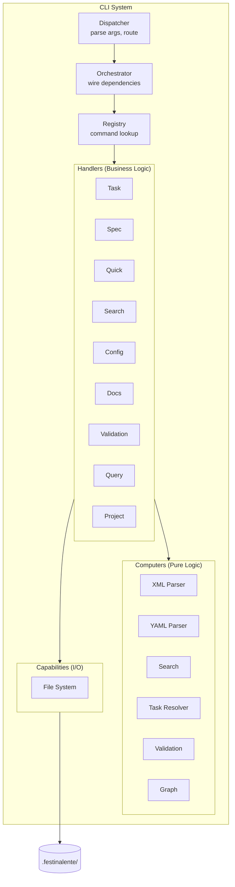
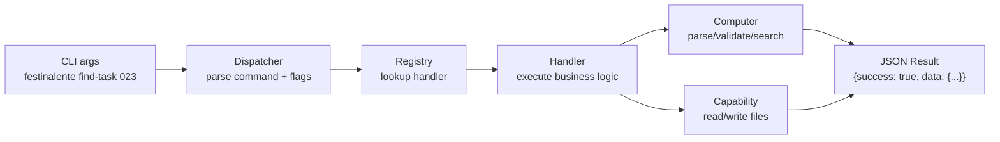

# CLI System

> **TL;DR:** Single-entry-point CLI dispatching commands to handlers via registry for all task lifecycle operations

## Overview

The CLI system is the core engine of Festina Lente. It provides a Node.js command-line interface that accepts commands, dispatches them through a registry to typed handlers, and returns JSON results. All business logic lives here — the VSCode extension delegates to it via terminal execution.

**Why it exists:** Skills running in Claude Code need a reliable, context-window-safe way to read and write task artifacts. A CLI with JSON output provides a stable interface that survives agent restarts.

**Summary:** Stateless CLI that reads/writes `.festinalente/` artifacts and returns structured JSON.

<!-- Tier 2 boundary: content above this line is loaded at standard tier -->

## Components

| Component | Purpose | File |
|-----------|---------|------|
| Dispatcher | Parses CLI args, routes to registry | `dispatcher.ts` |
| Orchestrator | Wires all dependencies (handlers, computers, capabilities) | `orchestrator.ts` |
| Registry | Maps command names to handler functions | `registry.ts` |
| Task Handler | Task CRUD, status, plan extraction | `handlers/task.handler.ts` |
| Spec Handler | Spec reading and requirement extraction | `handlers/spec.handler.ts` |
| Quick Handler | Quick task management | `handlers/quick.handler.ts` |
| Search Handler | Full-text search with graph expansion | `handlers/search.handler.ts` |
| Config Handler | Skill config, date/time, glossary expansion | `handlers/config.handler.ts` |
| Docs Handler | Documentation inventory and existence checks | `handlers/docs.handler.ts` |
| Validation Handler | XML/YAML validation, quality checks, broken refs | `handlers/validation.handler.ts` |
| Query Handler | Raw file content retrieval | `handlers/query.handler.ts` |
| Project Handler | Multi-task project grouping | `handlers/project.handler.ts` |
| XML Parser Computer | Parse task/spec/plan/project/directive XML | `computers/xml-parser.computer.ts` |
| YAML Parser Computer | Parse config, frontmatter, directives | `computers/yaml-parser.computer.ts` |
| Search Computer | BM25+ index creation and querying | `computers/search.computer.ts` |
| Task Resolver Computer | 3-tier task ID resolution (exact -> prefix -> null) | `computers/task-resolver.computer.ts` |
| Validation Computer | Schema validation and quality checks | `computers/validation.computer.ts` |
| Graph Computer | Adjacency list from doc relationships | `computers/graph.computer.ts` |
| File System Capability | File I/O abstraction | `capabilities/file-system.capability.ts` |

**Summary:** 1 dispatcher, 1 orchestrator, 1 registry, 9 handlers, 6 computers, 1 capability.

## Key Patterns

This system follows these patterns from `patterns/`:

- [DAG Architecture](../patterns/dag-architecture.md) - Strict layering: dispatcher -> orchestrator -> handlers -> computers/capabilities
- [Factory DI](../patterns/factory-di.md) - Each component created via `create*()` with explicit `*Deps` interface
- [Tagged Union Errors](../patterns/tagged-union-errors.md) - All operations return `CliResult<T>` (success/error discriminated union)
- [Command Registry](../patterns/command-registry.md) - Handlers export `getCommands()` for self-registration

## Architecture

The orchestrator creates all components once at startup and passes them as dependencies to handlers via their `*Deps` interfaces.

## Data Flow

All commands follow the same flow: parse args -> lookup handler -> execute -> return JSON. Handlers compose computers for logic and capabilities for I/O.

## Interactions

| System | Relationship | Notes |
|--------|--------------|-------|
| [VSCode Extension](../systems/vscode-extension/_index.md) | VSCode executes CLI commands via terminal | JSON output parsed by extension |
| [Data Model](../systems/data-model/_index.md) | Reads/writes all task artifacts | XML, YAML, Markdown files |
| [Validation](../systems/validation/_index.md) | Validation handler delegates to validation computer | Quality checks, schema validation |
| [Search](../systems/search/_index.md) | Search handler delegates to search + graph computers | BM25+ indexing, graph expansion |

**Summary:** CLI is the core engine; VSCode extension and skills consume it via terminal execution.

## Boundaries

What this system does NOT handle:

- **Does NOT:** render UI or interact with users → See [VSCode Extension](../systems/vscode-extension/_index.md)
- **Does NOT:** perform git operations → handled by directives in skills
- **Does NOT:** compile or distribute packages → See [Distribution](../systems/distribution/_index.md)
- **Does NOT:** compile skill templates → See [Content Build](../systems/content-build/_index.md)

## Extension Points

### Adding a new Handler

**Template:** Copy any existing handler (e.g., `task.handler.ts`) as starting point.

**Checklist:**
- [ ] Create `handlers/{name}.handler.ts` with `*Deps` interface and `create*Handler()` factory
- [ ] Export `getCommands()` returning `CliCommand[]`
- [ ] Wire in `orchestrator.ts` — create instance, pass to registry
- [ ] Add barrel exports to `index.ts`

**Pitfalls:**
- Handlers must not import from other handlers (DAG violation)
- All return types must be `CliResult<T>`, never throw

### Adding a new Computer

**Checklist:**
- [ ] Create `computers/{name}.computer.ts` with pure functions only
- [ ] No file I/O — accept data as arguments, return results
- [ ] Wire in `orchestrator.ts` and inject into handlers that need it

### Adding a new Command

**Checklist:**
- [ ] Add to the appropriate handler's `getCommands()` array
- [ ] Define command metadata (name, description, usage)
- [ ] Implement handler function accepting `string[]` args
