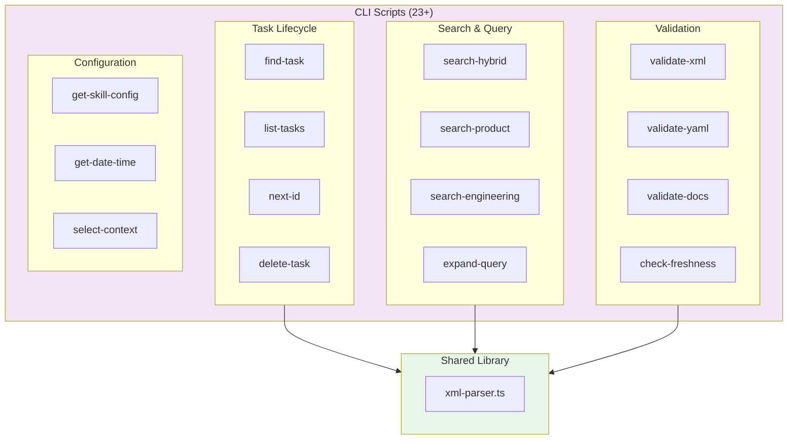
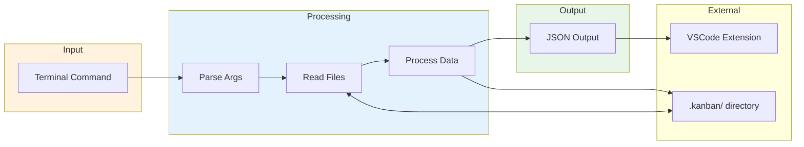

# CLI Script Engine

> **TL;DR:** 23+ Node.js scripts for task management, search, and validation

## Overview

The CLI Script Engine is a collection of Node.js scripts that power the kanban system. Scripts are invoked via terminal commands (often triggered by the VSCode extension) and return JSON results. Each script follows a consistent pattern: parse args, read files, process data, output JSON.

**Why it exists:** Provides a clean separation between data operations and UI rendering. Scripts can be used standalone or integrated with Claude Code AI assistant.

**Summary:** JSON-in/JSON-out CLI utilities for file-based task management.

## Architecture



## Components

### Task Lifecycle Scripts

| Component | Purpose | File |
|-----------|---------|------|
| find-task | Locate task by ID (supports numeric or slug format), return metadata | `apps/festinalente/src/scripts/find-task.ts` |
| list-tasks | List tasks with filtering (--status, --label, --priority) | `apps/festinalente/src/scripts/list-tasks.ts` |
| next-id | Generate next slug-based task ID (e.g., 022-add-feature) | `apps/festinalente/src/scripts/next-id.ts` |
| delete-task | Remove task from system | `apps/kanban/src/scripts/delete-task.ts` |

### Search & Query Scripts

| Component | Purpose | File |
|-----------|---------|------|
| search-hybrid | Advanced search with fuzzy + exact matching | `apps/kanban/src/scripts/search-hybrid.ts` |
| search-product | Search product documentation | `apps/kanban/src/scripts/search-product.ts` |
| search-engineering | Search engineering documentation | `apps/kanban/src/scripts/search-engineering.ts` |
| expand-query | Expand query using glossary aliases | `apps/kanban/src/scripts/expand-query.ts` |

### Validation Scripts

| Component | Purpose | File |
|-----------|---------|------|
| validate-xml | Validate task XML structure (supports task ID for targeted validation) | `apps/kanban/src/scripts/validate-xml.ts` |
| validate-yaml | Validate YAML frontmatter | `apps/kanban/src/scripts/validate-yaml.ts` |
| validate-docs | Check documentation quality | `apps/kanban/src/scripts/validate-docs.ts` |
| check-freshness | Check if docs are stale | `apps/kanban/src/scripts/check-freshness.ts` |

### Configuration Scripts

| Component | Purpose | File |
|-----------|---------|------|
| get-skill-config | Retrieve skill directives from config.yaml | `apps/kanban/src/scripts/get-skill-config.ts` |
| get-date-time | Get current timestamp | `apps/kanban/src/scripts/get-date-time.ts` |
| select-context | Context selection utility | `apps/kanban/src/scripts/select-context.ts` |

**Summary:** Scripts organized by function: task lifecycle, search/query, validation, and configuration.

## Key Patterns

This system follows these patterns:

- [tagged-union-errors](../patterns/tagged-union-errors.md) - All scripts return `{ error: true, message }` or `{ success: true, data }`
- [factory-di](../patterns/factory-di.md) - Shared lib uses factory functions for dependency injection

## Data Flow



```
Terminal Command → Parse Args → Read Files → Process → JSON Output
     ↓                              ↓
  VSCode Extension              .kanban/ directory
```

## Interactions

| System | Relationship | Notes |
|--------|--------------|-------|
| [vscode-extension](../vscode-extension/_index.md) | Called via terminal | Extension sends commands, receives JSON |
| [storage](../storage/_index.md) | Reads/writes files | Task XML, config YAML, docs MD |
| [search](../search/_index.md) | Provides search logic | search-* scripts implement hybrid algorithm |

**Summary:** Scripts are invoked by VSCode extension via terminal, reading from and writing to the storage system.

## Boundaries

What this system does NOT handle:

- **Does NOT:** Render UI or handle user input → See [vscode-extension](../vscode-extension/_index.md)
- **Does NOT:** Manage file watching or change detection → See [vscode-extension](../vscode-extension/_index.md)
- **Does NOT:** Define file formats → See [storage](../storage/_index.md)

## Configuration

| Setting | Description | Default |
|---------|-------------|---------|
| `.kanban/config.yaml` | Skill directives mapping | N/A |
| `.kanban/glossary.yaml` | Term aliases for query expansion | N/A |

## Known Issues

| Severity | Issue | Location |
|----------|-------|----------|
| HIGH | Missing error handling on file I/O | Multiple scripts |
| HIGH | Command injection risk | `check-freshness.ts:79-82` |
| MEDIUM | Hardcoded directory paths | All scripts |
| MEDIUM | Code duplication in search scripts | search-*.ts |
| MEDIUM | No input validation on CLI args | Multiple scripts |
| LOW | Unsafe regex in YAML parsing | `next-id.ts:22` |
