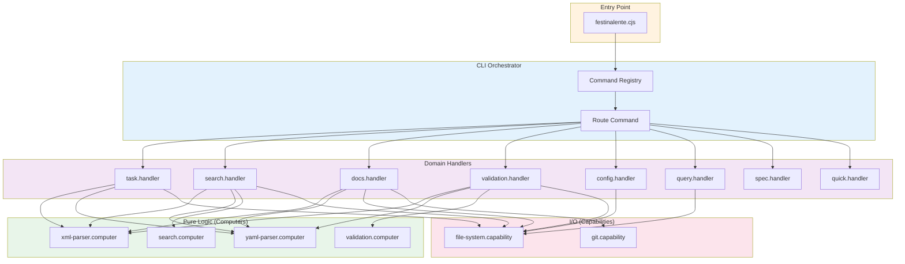
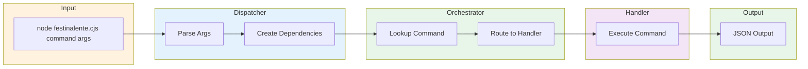

# CLI Script Engine

> **TL;DR:** Unified CLI dispatcher with 24 commands for task management, search, and validation

## Overview

The CLI Script Engine is a unified command dispatcher that routes CLI commands to specialized handlers. A single entry point (`festinalente.cjs`) receives commands and arguments, routes them through a command registry, and returns JSON results. The architecture follows the DAG pattern: computers (pure logic) → capabilities (I/O) → handlers → orchestrator (routing).

**Why it exists:** Provides clean separation between data operations and UI rendering. The unified dispatcher eliminates the need for 24+ separate script files and simplifies both build configuration and command invocation.

**Summary:** JSON-in/JSON-out CLI dispatcher for file-based task management.

## Architecture



## Components

### Entry Point

| Component | Purpose | File |
|-----------|---------|------|
| dispatcher | Parses argv, creates dependencies, invokes orchestrator | `apps/festinalente/src/cli/dispatcher.ts` |

### Orchestrator Layer

| Component | Purpose | File |
|-----------|---------|------|
| orchestrator | Routes commands to handlers, handles --help and unknown commands | `apps/festinalente/src/cli/orchestrator.ts` |
| registry | Command registration and lookup | `apps/festinalente/src/cli/registry.ts` |
| types | Shared types (CliResult, CliCommand) | `apps/festinalente/src/cli/types.ts` |

### Handler Layer

| Handler | Commands | File |
|---------|----------|------|
| task.handler | find-task, list-tasks, delete-task, next-id | `apps/festinalente/src/cli/handlers/task.handler.ts` |
| spec.handler | find-spec, find-plan | `apps/festinalente/src/cli/handlers/spec.handler.ts` |
| quick.handler | find-quick, next-quick-id | `apps/festinalente/src/cli/handlers/quick.handler.ts` |
| search.handler | search-product, search-engineering, search-hybrid | `apps/festinalente/src/cli/handlers/search.handler.ts` |
| docs.handler | list-product, list-engineering, check-product, check-engineering, check-freshness | `apps/festinalente/src/cli/handlers/docs.handler.ts` |
| validation.handler | validate-xml, validate-yaml, validate-docs, validate-directive | `apps/festinalente/src/cli/handlers/validation.handler.ts` |
| config.handler | get-skill-config, get-date-time | `apps/festinalente/src/cli/handlers/config.handler.ts` |
| query.handler | expand-query, select-context | `apps/festinalente/src/cli/handlers/query.handler.ts` |

### Computer Layer (Pure Logic)

| Computer | Purpose | File |
|----------|---------|------|
| xml-parser.computer | Parse task/spec/plan XML | `apps/festinalente/src/cli/computers/xml-parser.computer.ts` |
| yaml-parser.computer | Parse frontmatter and YAML files | `apps/festinalente/src/cli/computers/yaml-parser.computer.ts` |
| search.computer | Fuzzy search with Fuse.js | `apps/festinalente/src/cli/computers/search.computer.ts` |
| validation.computer | XML/YAML validation logic | `apps/festinalente/src/cli/computers/validation.computer.ts` |

### Capability Layer (I/O)

| Capability | Purpose | File |
|------------|---------|------|
| file-system.capability | Read/write files, directory listing | `apps/festinalente/src/cli/capabilities/file-system.capability.ts` |
| git.capability | Git operations (last commit date) | `apps/festinalente/src/cli/capabilities/git.capability.ts` |

**Summary:** Single dispatcher routes 24 commands through 8 domain handlers, backed by 4 computers (pure logic) and 2 capabilities (I/O).

## Key Patterns

This system follows these patterns:

- [tagged-union-errors](../patterns/tagged-union-errors.md) - All commands return `{ error: true, message }` or `{ data }` with success
- [factory-di](../patterns/factory-di.md) - All layers use factory functions for dependency injection
- [capability-computer](../patterns/capability-computer.md) - Pure logic in computers, I/O in capabilities

## Data Flow



## Usage

```bash
# Get help
node .festinalente/scripts/festinalente.cjs --help

# Task commands
node .festinalente/scripts/festinalente.cjs find-task 029
node .festinalente/scripts/festinalente.cjs list-tasks --status=planned
node .festinalente/scripts/festinalente.cjs next-id --title="New feature"

# Search commands
node .festinalente/scripts/festinalente.cjs search-product authentication
node .festinalente/scripts/festinalente.cjs search-engineering cache --min-score=0.3

# Validation commands
node .festinalente/scripts/festinalente.cjs validate-xml 029
node .festinalente/scripts/festinalente.cjs validate-docs

# Config commands
node .festinalente/scripts/festinalente.cjs get-date-time
node .festinalente/scripts/festinalente.cjs get-skill-config festina-finalize
```

## Interactions

| System | Relationship | Notes |
|--------|--------------|-------|
| [vscode-extension](../vscode-extension/_index.md) | Called via terminal | Extension sends commands, receives JSON |
| [storage](../storage/_index.md) | Reads/writes files | Task XML, config YAML, docs MD |
| [search](../search/_index.md) | Uses search.computer | Consolidated search logic in computer |

**Summary:** Dispatcher is invoked by VSCode extension via terminal, reading from and writing to the storage system.

## Boundaries

What this system does NOT handle:

- **Does NOT:** Render UI or handle user input → See [vscode-extension](../vscode-extension/_index.md)
- **Does NOT:** Manage file watching or change detection → See [vscode-extension](../vscode-extension/_index.md)
- **Does NOT:** Define file formats → See [storage](../storage/_index.md)

## Extension Points

### Adding a New Command

**Template:** Copy existing handler function from `handlers/task.handler.ts`

**Checklist:**
- [ ] Decide which handler domain the command belongs to (or create new handler)
- [ ] Add command function to handler (receives args array, returns CliResult)
- [ ] Register command in handler's return object with name, description, usage
- [ ] If new handler: wire into orchestrator via `createCliOrchestrator` deps

**Pitfalls:**
- Don't put I/O in computers (file reads belong in capabilities)
- Don't access process.argv directly (use args passed to handler)
- Always return CliResult type (success data or error with message)

### Adding a New Computer

**Template:** Copy `computers/validation.computer.ts`

**Checklist:**
- [ ] Create `{name}.computer.ts` in `src/cli/computers/`
- [ ] Export factory function `create{Name}Computer()`
- [ ] Keep all functions pure (no fs, no process, no side effects)
- [ ] Wire into handlers that need it via dependency injection

**Pitfalls:**
- Computers must have NO I/O imports (fs, path for reading, child_process)
- Use capabilities for any I/O operations

### Adding a New Capability

**Template:** Copy `capabilities/file-system.capability.ts`

**Checklist:**
- [ ] Create `{name}.capability.ts` in `src/cli/capabilities/`
- [ ] Export factory function `create{Name}Capability()`
- [ ] Wrap all I/O in try/catch, return Result types
- [ ] Wire into handlers that need it via dependency injection

**Pitfalls:**
- Use execFile with array args, not execSync with string interpolation
- Always return Result types for error handling

## Configuration

| Setting | Description | Default |
|---------|-------------|---------|
| `.festinalente/config.yaml` | Skill directives mapping | N/A |
| `.festinalente/glossary.yaml` | Term aliases for query expansion | N/A |
