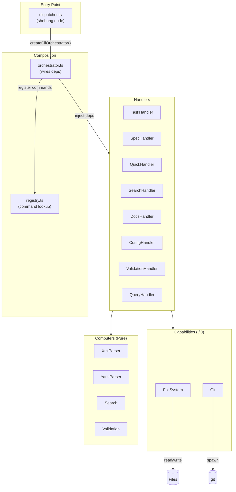
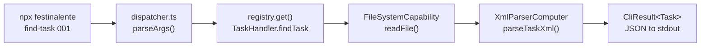

# CLI System

> **TL;DR:** Command dispatcher routing to handlers via registry pattern

## Overview

The CLI system provides a single entry point (`dispatcher.ts`) that routes commands through a registry to domain-specific handlers. Each handler composes capabilities (I/O) and computers (pure logic) following the DAG architecture.

**Why it exists:** AI agents (Claude, OpenCode) invoke CLI commands to manage tasks, search docs, and validate files. The registry pattern enables self-documenting commands and consistent JSON output.

**Summary:** Dispatcher → Registry → Handlers → (Capabilities + Computers)

## Components

| Component | Purpose | File |
|-----------|---------|------|
| Dispatcher | Entry point, parses args, executes command | `dispatcher.ts` |
| Orchestrator | Wires all components together | `orchestrator.ts` |
| Registry | Command registration and lookup | `registry.ts` |
| TaskHandler | Task CRUD operations | `handlers/task.handler.ts` |
| SpecHandler | Spec/plan operations | `handlers/spec.handler.ts` |
| QuickHandler | Quick task operations | `handlers/quick.handler.ts` |
| SearchHandler | Hybrid search across docs | `handlers/search.handler.ts` |
| DocsHandler | Documentation operations | `handlers/docs.handler.ts` |
| ConfigHandler | Configuration utilities | `handlers/config.handler.ts` |
| ValidationHandler | XML/YAML validation | `handlers/validation.handler.ts` |
| QueryHandler | Query operations | `handlers/query.handler.ts` |
| FileSystemCapability | File I/O operations | `capabilities/file-system.capability.ts` |
| GitCapability | Git operations | `capabilities/git.capability.ts` |
| XmlParserComputer | XML parsing | `computers/xml-parser.computer.ts` |
| YamlParserComputer | YAML parsing | `computers/yaml-parser.computer.ts` |
| SearchComputer | Fuzzy search with Fuse.js | `computers/search.computer.ts` |
| ValidationComputer | Schema validation | `computers/validation.computer.ts` |

**Summary:** 8 handlers, 2 capabilities, 4 computers wired by orchestrator.

## Key Patterns

This system follows these patterns from `patterns/`:

- [dag-architecture](../patterns/dag-architecture.md) - Orchestrator wires capabilities/computers with no cycles
- [factory-di](../patterns/factory-di.md) - Each component uses `create*()` factory with deps injection
- [command-registry](../patterns/command-registry.md) - Commands self-register via `getCommands()`
- [tagged-union-errors](../patterns/tagged-union-errors.md) - All handlers return `CliResult<T>`

## Architecture

The orchestrator creates all capabilities and computers, then injects them into handlers. Each handler registers its commands with the registry. The dispatcher looks up commands and executes them.

## Data Flow

1. User/AI invokes CLI command
2. Dispatcher parses args, looks up command in registry
3. Handler executes using capabilities (file I/O) and computers (parsing)
4. Result returned as JSON to stdout

## Interactions

| System | Relationship | Notes |
|--------|--------------|-------|
| [vscode-extension](../vscode-extension/_index.md) | Terminal spawns CLI | VSCode executes via `claude` or `opencode` runtime |
| [data-model](../data-model/_index.md) | Reads/writes files | Tasks, specs, plans, config stored as XML/YAML |

**Summary:** CLI is invoked by VSCode extension, operates on data-model files.

## Boundaries

What this system does NOT handle:

- **Does NOT:** Provide UI → See [vscode-extension](../vscode-extension/_index.md)
- **Does NOT:** Define file schemas → See [data-model](../data-model/_index.md)
- **Does NOT:** Handle templating → See [content-build](../content-build/_index.md)

## Configuration

| Setting | Description | Default |
|---------|-------------|---------|
| `--help` | Show command help | N/A |
| `--type` | Filter by type (list commands) | all |
| `--status` | Filter by status | all |

## Extension Points

How to extend this system with new commands:

### Adding a new Handler

**Template:** Copy `handlers/config.handler.ts` as starting point.

**Checklist:**
- [ ] Create `handlers/{name}.handler.ts` with `create{Name}Handler(deps)`
- [ ] Define `{Name}HandlerDeps` interface with required capabilities/computers
- [ ] Implement handler methods returning `CliResult<T>`
- [ ] Export `getCommands()` returning `CliCommand[]`
- [ ] Register in `orchestrator.ts`: add to handler creation and command registration loop

**Pitfalls:**
- Forgetting to register commands in orchestrator
- Not returning JSON-serializable results
- Missing error handling (always return `error()` not throw)
