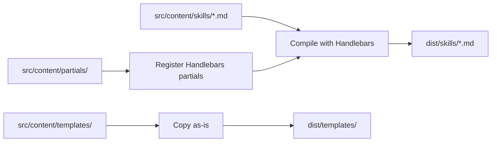

# Content Build System

> **TL;DR:** Compiles Handlebars skill templates with partials into distributable Markdown files

## Overview

The content build system compiles skill `.md` files from `src/content/skills/` using Handlebars templating. Partials in `src/content/partials/` provide reusable fragments (helper scripts, workflow loaders, directive loaders). The output is standalone `.md` files in `dist/skills/` ready for distribution.

**Why it exists:** Skills share common patterns (loading directives, searching docs, resolving tasks). Handlebars partials eliminate duplication across 14+ skill files while producing self-contained output that works without the build system.

**Summary:** Handlebars compilation turns templated skills + shared partials into standalone distributable Markdown.

<!-- Tier 2 boundary: content above this line is loaded at standard tier -->

## Components

| Component | Purpose | File |
|-----------|---------|------|
| Build Script | Orchestrates Handlebars compilation | `tools/build.ts` |
| Skills | 14+ templated Markdown files | `src/content/skills/*.md` |
| Partials | Reusable template fragments | `src/content/partials/*.md` |
| Templates | Document templates (copied as-is) | `src/content/templates/*.md` |

**Summary:** Build script registers partials, compiles skills, copies templates to dist.

## Data Flow

Build reads partials first, then compiles each skill file, resolving `{{> partial-name}}` references into inline content.

## Interactions

| System | Relationship | Notes |
|--------|--------------|-------|
| [Distribution](../systems/distribution/_index.md) | Compiled output included in npm package | `dist/` bundled for distribution |

**Summary:** Upstream of distribution — produces the skill files that get packaged.

## Boundaries

What this system does NOT handle:

- **Does NOT:** execute or load skills at runtime → Claude Code loads compiled `.md` directly
- **Does NOT:** validate skill content → validation happens in skills themselves
- **Does NOT:** bundle TypeScript code → See [Distribution](../systems/distribution/_index.md)
