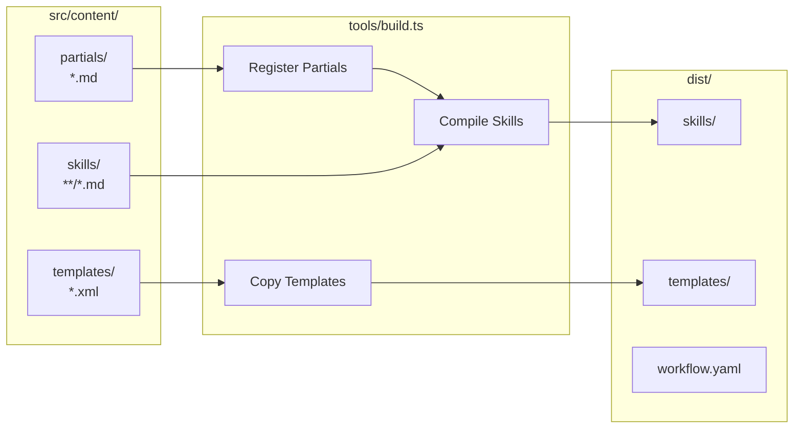
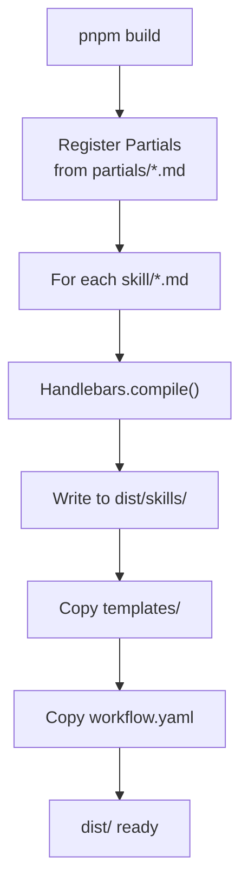

# Content Build System

> **TL;DR:** Handlebars compilation of skill definitions and templates

## Overview

The content build system compiles Handlebars-templated skill definitions from `src/content/` into distributable format in `dist/`. It registers partials, compiles skills, and copies static templates.

**Why it exists:** Skills use reusable partials (branch-verify, column-transition, scripts) that need to be compiled before distribution. This enables DRY skill definitions.

**Summary:** Partials → Handlebars → Compiled Skills → dist/

## Components

| Component | Purpose | File |
|-----------|---------|------|
| Build Script | Orchestrates compilation | `tools/build.ts` |
| Partials | Reusable Markdown snippets | `src/content/partials/*.md` |
| Skills | Skill definitions | `src/content/skills/**/*.md` |
| Templates | XML/YAML schemas | `src/content/templates/*.xml` |

**Summary:** Build script compiles partials into skills, copies templates.

## Architecture

## Build Pipeline

1. Register all partials from `partials/` directory
2. For each skill file, compile with Handlebars
3. Write compiled output to `dist/skills/`
4. Copy template files to `dist/templates/`
5. Copy static files (workflow.yaml)

## Key Partials

| Partial | Purpose |
|---------|---------|
| `branch-verify` | Git branch verification steps |
| `column-transition` | Task status transition rules |
| `directives` | Directive loading instructions |
| `scripts` | CLI script invocation helpers |
| `commit-format` | Commit message formatting |

## Interactions

| System | Relationship | Notes |
|--------|--------------|-------|
| [distribution](../distribution/_index.md) | Outputs to dist/ | Distribution publishes compiled content |
| [cli](../cli/_index.md) | CLI reads skills at runtime | Skills define handler prompts |

**Summary:** Build compiles content, distribution publishes it.

## Boundaries

What this system does NOT handle:

- **Does NOT:** Execute skills → AI runtimes do that
- **Does NOT:** Publish packages → See [distribution](../distribution/_index.md)
- **Does NOT:** Define CLI commands → See [cli](../cli/_index.md)

## Extension Points

### Adding a new Partial

**Checklist:**
- [ ] Create `src/content/partials/{name}.md`
- [ ] Partial auto-registers on build (filename without extension)
- [ ] Use in skills via `{{> name}}`

### Adding a new Skill

**Checklist:**
- [ ] Create `src/content/skills/{skill-name}/SKILL.md`
- [ ] Use partials via `{{> partial-name}}`
- [ ] Run `pnpm build` to compile
- [ ] Test by invoking via AI runtime

**Pitfalls:**
- Forgetting to rebuild after partial changes
- Invalid Handlebars syntax in skill files
