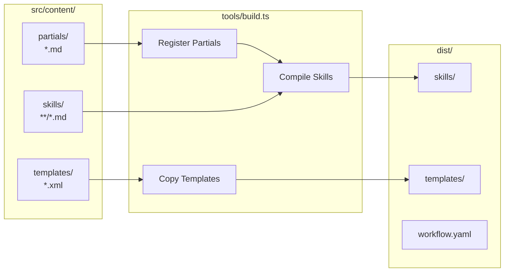
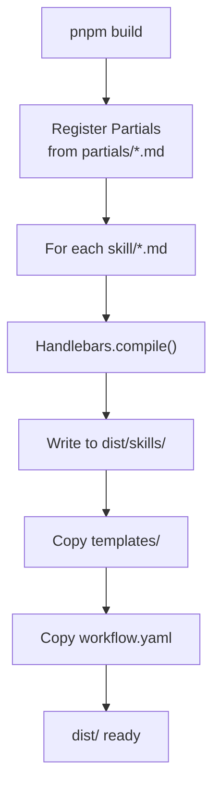

# Content Build System

> **TL;DR:** Handlebars compilation of skill definitions and templates

## Overview

The content build system compiles Handlebars-templated skill definitions from `src/content/` into distributable format in `dist/`. It registers partials, compiles skills, and copies static templates.

**Why it exists:** Skills use reusable partials (branch-verify, column-transition, scripts) that need to be compiled before distribution. This enables DRY skill definitions.

**Summary:** Partials → Handlebars → Compiled Skills → dist/

## Components

| Component | Purpose | File |
|-----------|---------|------|
| Build Script | Orchestrates compilation | `tools/build.ts` |
| Partials | Reusable Markdown snippets | `src/content/partials/*.md` |
| Skills | Skill definitions | `src/content/skills/**/*.md` |
| Templates | XML/YAML schemas | `src/content/templates/*.xml` |

**Summary:** Build script compiles partials into skills, copies templates.

## Architecture



## Build Pipeline



1. Register all partials from `partials/` directory
2. For each skill file, compile with Handlebars
3. Write compiled output to `dist/skills/`
4. Copy template files to `dist/templates/`
5. Copy static files (workflow.yaml)

## Key Partials

| Partial | Purpose |
|---------|---------|
| `column-transition` | Task status transition rules |
| `directive-compliance` | Directive compliance checking steps |
| `load-directives` | Directive loading instructions |
| `helper-scripts` | CLI script invocation helpers |
| `skill-complete` | Skill completion output and cleanup |
| `workflow-load` | Workflow YAML loading steps |
| `diagram-guidelines` | Mermaid/ASCII diagram conventions |
| `engineering-docs-scripts` | Engineering doc CLI commands |
| `product-docs-scripts` | Product doc CLI commands |
| `directory-reference` | Directory structure reference |

> **Note:** Skills are git-agnostic. All git operations (branching, committing, merging) are handled by the bundled `git.xml` directive, not by partials or skill process steps. Users can customize or remove the git directive as needed.

## Interactions

| System | Relationship | Notes |
|--------|--------------|-------|
| [distribution](../distribution/_index.md) | Outputs to dist/ | Distribution publishes compiled content |
| [cli](../cli/_index.md) | CLI reads skills at runtime | Skills define handler prompts |

**Summary:** Build compiles content, distribution publishes it.

## Boundaries

What this system does NOT handle:

- **Does NOT:** Execute skills → AI runtimes do that
- **Does NOT:** Publish packages → See [distribution](../distribution/_index.md)
- **Does NOT:** Define CLI commands → See [cli](../cli/_index.md)

## Extension Points

### Adding a new Partial

**Checklist:**
- [ ] Create `src/content/partials/{name}.md`
- [ ] Partial auto-registers on build (filename without extension)
- [ ] Use in skills via `{{> name}}`

### Adding a new Skill

**Checklist:**
- [ ] Create `src/content/skills/{skill-name}/SKILL.md`
- [ ] Use partials via `{{> partial-name}}`
- [ ] Run `pnpm build` to compile
- [ ] Test by invoking via AI runtime

**Pitfalls:**
- Forgetting to rebuild after partial changes
- Invalid Handlebars syntax in skill files

## Known Risks

### Silent Handlebars Fallback

**Location:** `tools/build.ts` lines 58–79

When Handlebars compilation fails for a skill file, the build script **does not fail**. Instead it:

1. Logs the error to console
2. Copies the raw source file (with uncompiled `{{> partial-name}}` syntax) to `dist/`

```typescript
// tools/build.ts — simplified
try {
  const template = Handlebars.compile(content, { strict: false });
  const output = template({});
  await fs.writeFile(distFile, output);
} catch (error) {
  console.error(`  Error compiling ${srcFile}:`, error);
  // Fall back to copying the file as-is
  await fs.copyFile(srcFile, distFile);
}
```

**Impact:** Raw Handlebars syntax (`{{> helper-scripts}}`) passes through to distributed files. AI runtimes consuming these skills will see literal partial references instead of compiled content.

**Trade-off:** This is intentional — the build should not crash on one bad skill. However, there is no post-build check to flag which skills fell back to raw copy, so failures are easy to miss.

### Build Validation Gap

Compiled output in `dist/` is **never validated** against doc quality standards. The validation system (`validation.computer.ts`) has 9 quality checks (tldr length, summary presence, keyword count, etc.) but these run **only at CLI runtime** — not during the build pipeline.

This means:
- Malformed skills compile and ship silently
- Quality issues are discovered only when users load the content
- No integration between `pnpm build:content` and `festinalente validate-docs`

## Skill-to-Partial Dependency Table

Which of the 18 skills depend on which of the 10 partials:

| Skill | dir-ref | helper | load-dir | dir-comp | skill-comp | wf-load | col-trans | prod-docs | eng-docs | diagram |
|-------|:-------:|:------:|:--------:|:--------:|:----------:|:-------:|:---------:|:---------:|:--------:|:-------:|
| festina-complete | ✓ | ✓ | ✓ | ✓ | ✓ | ✓ | ✓ | | | |
| festina-complete-project | ✓ | ✓ | ✓ | ✓ | ✓ | ✓ | ✓ | | | |
| festina-create | ✓ | ✓ | ✓ | ✓ | ✓ | ✓ | ✓ | ✓ | ✓ | |
| festina-create-project | ✓ | ✓ | ✓ | ✓ | ✓ | ✓ | ✓ | ✓ | ✓ | |
| festina-define | ✓ | ✓ | ✓ | ✓ | ✓ | ✓ | | ✓ | ✓ | |
| festina-delete | ✓ | ✓ | ✓ | ✓ | ✓ | ✓ | ✓ | | | |
| festina-directive | ✓ | ✓ | ✓ | ✓ | ✓ | | | ✓ | ✓ | |
| festina-discover | ✓ | ✓ | ✓ | ✓ | ✓ | | | ✓ | ✓ | |
| festina-finalize | ✓ | ✓ | ✓ | ✓ | ✓ | ✓ | ✓ | ✓ | ✓ | ✓ |
| festina-implement | ✓ | ✓ | ✓ | | ✓ | ✓ | ✓ | ✓ | ✓ | |
| festina-map-engineering | ✓ | ✓ | ✓ | ✓ | ✓ | ✓ | | | ✓ | ✓ |
| festina-map-product | ✓ | ✓ | ✓ | ✓ | ✓ | ✓ | | ✓ | | ✓ |
| festina-overview | ✓ | ✓ | ✓ | ✓ | ✓ | | | ✓ | ✓ | |
| festina-plan | ✓ | ✓ | ✓ | ✓ | ✓ | ✓ | ✓ | ✓ | ✓ | |
| festina-quick | ✓ | ✓ | ✓ | ✓ | | ✓ | | ✓ | ✓ | |
| festina-rework | ✓ | ✓ | ✓ | ✓ | ✓ | ✓ | | ✓ | ✓ | |
| festina-save | ✓ | ✓ | ✓ | ✓ | ✓ | ✓ | ✓ | ✓ | ✓ | |
| festina-scope | ✓ | ✓ | ✓ | ✓ | ✓ | ✓ | ✓ | ✓ | ✓ | |

**Legend:** dir-ref = directory-reference, helper = helper-scripts, load-dir = load-directives, dir-comp = directive-compliance, skill-comp = skill-complete, wf-load = workflow-load, col-trans = column-transition, prod-docs = product-docs-scripts, eng-docs = engineering-docs-scripts, diagram = diagram-guidelines

**Observations:**
- **Universal (18/18):** directory-reference, helper-scripts, load-directives
- **Near-universal (17/18):** directive-compliance, skill-complete
- **Most skills (15–16/18):** workflow-load, column-transition
- **Doc-aware skills (14/18):** product-docs-scripts, engineering-docs-scripts
- **Visual skills only (3/18):** diagram-guidelines (finalize, map-product, map-engineering)
