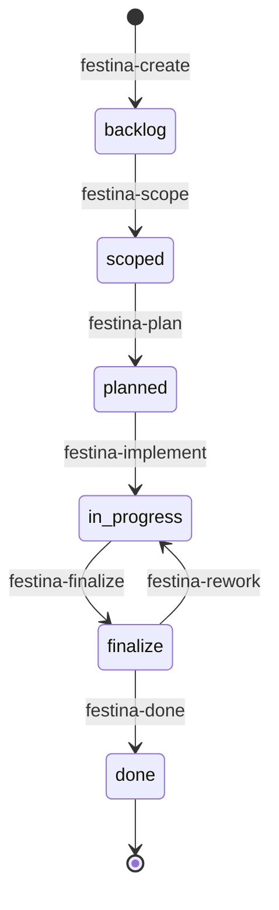

# Data Model & Storage

> **TL;DR:** File-based storage with XML tasks, YAML config, Markdown docs

## Overview

Festina Lente uses file-based storage in the `.festinalente/` directory. Tasks are XML, configuration is YAML, and documentation is Markdown with YAML frontmatter. No database required.

**Why it exists:** File-based storage enables version control, human readability, and no infrastructure dependencies. AI agents can read/write files directly.

**Summary:** XML for tasks, YAML for config, Markdown for docs.

## Directory Structure

```
.festinalente/
├── projects/
│   └── {id}/
│       └── project.xml    # Project metadata and task grouping
├── tasks/
│   └── {id}/
│       ├── task.xml       # Task metadata
│       ├── spec.xml       # Functional specification
│       └── plan.xml       # Implementation plan
├── quick/
│   └── {id}/
│       └── quick.xml      # Quick task (mini-task)
├── product/
│   └── docs/
│       ├── overview.md    # Product overview
│       └── features/      # Feature documentation
├── engineering/
│   ├── overview.md        # This file's parent
│   ├── systems/           # System documentation
│   ├── patterns/          # Pattern documentation
│   └── conventions/       # Convention documentation
├── directives/
│   └── {name}.xml         # LLM instruction sets
├── scripts/               # Build artifacts (festinalente.cjs)
├── templates/             # XML/YAML templates
├── config.yaml            # Project settings
├── workflow.yaml          # Workflow definitions (immutable)
├── glossary.yaml          # Domain terminology
└── manifest.json          # Installation metadata
```

## Task Lifecycle



## Core Schemas

### task.xml

```xml
<task
  id="001"
  status="backlog"
  priority="medium"
  title="Task title"
  labels="feature"
  created="2026-03-01"
  updated="2026-03-01">
  <problem>What problem this solves</problem>
  <value>Why it matters</value>
  <acceptance-criteria>
    - Criterion 1
    - Criterion 2
  </acceptance-criteria>
</task>
```

| Field | Type | Description |
|-------|------|-------------|
| id | string | Unique task ID (e.g., "001") |
| status | enum | backlog, scoped, planned, in-progress, finalize, done |
| priority | enum | critical, high, medium, low |
| title | string | Short task title |
| labels | string | Comma-separated labels (bug, feature, docs, refactor) |
| problem | text | Problem statement |
| value | text | Value proposition |
| acceptance-criteria | text | Markdown list of criteria |
| project-id | string | Optional. References parent project ID (e.g., "P001") |
| project-requirements | string | Optional. Comma-separated requirement IDs from parent project (e.g., "R1,R3") |

> **Project Grouping:** When a task belongs to a project, `project-id` links it to the parent `project.xml` and `project-requirements` maps which project requirements this task addresses. This creates a bidirectional relationship: `project.xml` lists tasks in its `<tasks>` element, and each task references the project via `project-id`.

### project.xml

```xml
<project
  id="001"
  status="open"
  created="2026-03-01"
  updated="2026-03-01">
  <title>Project title</title>
  <description>Project description</description>
  <problem>What problem this solves</problem>
  <value>Why it matters</value>
  <scope>
    <in-scope><item>Scope item</item></in-scope>
    <out-of-scope><item>Exclusion</item></out-of-scope>
  </scope>
  <requirements>
    <requirement id="R1">Requirement text</requirement>
  </requirements>
  <acceptance-criteria>
    <criterion>Given ... When ... Then ...</criterion>
  </acceptance-criteria>
  <tasks></tasks>
  <notes></notes>
  <affects></affects>
  <engineering></engineering>
</project>
```

| Field | Type | Description |
|-------|------|-------------|
| id | string | Unique project ID (e.g., "001") |
| status | enum | open, in-progress, done |
| title | text | Short project title |
| description | text | Project description |
| problem | text | Problem statement |
| value | text | Value proposition |
| scope | element | In-scope and out-of-scope items |
| requirements | element | Numbered requirements |
| acceptance-criteria | element | Given/When/Then criteria |
| tasks | text | References to child task IDs |

> **Note:** Project status can derive from child task progress. Use `get-project-progress` to compute completion percentage from task statuses.

### spec.xml

```xml
<spec id="001" status="draft" updated="2026-03-01">
  <scope>
    <in-scope>What's included</in-scope>
    <out-of-scope>What's excluded</out-of-scope>
  </scope>
  <delta>What changes from current state</delta>
  <boundaries>Hard constraints</boundaries>
  <contracts>
    <contract name="contract-name">
      <precondition>What must be true before</precondition>
      <postcondition>What must be true after</postcondition>
      <invariant>What must always remain true</invariant>
      <property>Verifiable property</property>
    </contract>
  </contracts>
  <requirements>
    <functional>...</functional>
    <non-functional>...</non-functional>
  </requirements>
  <files>
    <file path="src/foo.ts" action="create">Description</file>
  </files>
  <patterns>Patterns to use</patterns>
  <research>Research findings</research>
  <constraints>Technical constraints</constraints>
  <dependencies>External dependencies</dependencies>
  <risks>Risk assessment</risks>
  <open-questions>Unresolved questions</open-questions>
</spec>
```

> **Contracts** (added in task 007): Define preconditions, postconditions, invariants, and verifiable properties for the implementation. These flow into plan.xml as contract verification tests.

### plan.xml

```xml
<plan id="001" status="draft" updated="2026-03-01">
  <files>
    <file path="src/foo.ts" action="create">Description</file>
    <file path="src/bar.ts" action="modify">Description</file>
  </files>
  <tasks>
    <task id="1" title="Task title">
      <steps>
        <step>Step 1 description</step>
        <step>Step 2 description</step>
      </steps>
      <contract-verification>
        <result contract="contract-name" status="pass|fail">Verification notes</result>
      </contract-verification>
    </task>
  </tasks>
  <testing>
    <contract-test contract="contract-name">
      <test type="precondition">Test description</test>
      <test type="postcondition">Test description</test>
      <test type="invariant">Test description</test>
    </contract-test>
  </testing>
  <verify>
    <check>Verification step 1</check>
    <check>Verification step 2</check>
  </verify>
</plan>
```

> **Contract Testing** (added in task 007): The `<testing>` section includes `<contract-test>` elements that map to contracts defined in spec.xml. Each task's `<contract-verification>` records whether contracts pass or fail during implementation.

### config.yaml

```yaml
directives:
  festina-create: [git, design]
  festina-scope: [git, coding, design]
  festina-plan: [git, planning, coding]
  festina-implement: [git, coding]
  festina-save: [git]
  festina-finalize: [git, coding]
  festina-quick: [git, design, coding]
  festina-explore: []
  festina-overview: []
```

> **Note:** The `git` directive is auto-bundled but user-configurable. Skills are git-agnostic — all git operations (branching, committing, merging) are handled by the `git.xml` directive. Users can remove `git` from any skill's directive list to disable git operations, or replace with `github` for full GitHub integration (Issues, PRs, team review workflow).

### workflow.yaml (Immutable)

```yaml
columns:
  - id: backlog
    name: Backlog
  - id: scoped
    name: Scoped
  # ... etc

labels:
  - id: bug
    commit-type: fix
  - id: feature
    commit-type: feat
  # ... etc

transitions:
  backlog: [scoped]
  scoped: [planned]
  # ... etc
```

## Interactions

| System | Relationship | Notes |
|--------|--------------|-------|
| [cli](../cli/_index.md) | Reads/writes all files | Handlers use capabilities for I/O |
| [vscode-extension](../vscode-extension/_index.md) | Watches and reads files | FileWatchers detect changes |

**Summary:** Both CLI and extension read/write data model files.

## Boundaries

What this system does NOT handle:

- **Does NOT:** Enforce transitions → Skills validate status changes
- **Does NOT:** Execute commands → See [cli](../cli/_index.md)
- **Does NOT:** Render UI → See [vscode-extension](../vscode-extension/_index.md)

## Extension Points

### Adding a new Document Type

**Checklist:**
- [ ] Create XML/YAML schema in `templates/`
- [ ] Add parser in `computers/{name}-parser.computer.ts`
- [ ] Add handler in `handlers/{name}.handler.ts`
- [ ] Register commands in orchestrator
- [ ] Update TreeView if needed
