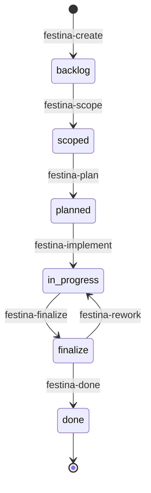

# Data Model & Storage

> **TL;DR:** File-based storage with XML tasks, YAML config, Markdown docs

## Overview

Festina Lente uses file-based storage in the `.festinalente/` directory. Tasks are XML, configuration is YAML, and documentation is Markdown with YAML frontmatter. No database required.

**Why it exists:** File-based storage enables version control, human readability, and no infrastructure dependencies. AI agents can read/write files directly.

**Summary:** XML for tasks, YAML for config, Markdown for docs.

## Directory Structure

```
.festinalente/
├── tasks/
│   └── {id}/
│       ├── task.xml       # Task metadata
│       ├── spec.xml       # Functional specification
│       └── plan.xml       # Implementation plan
├── quick/
│   └── {id}/
│       └── quick.xml      # Quick task (mini-task)
├── product/
│   └── docs/
│       ├── overview.md    # Product overview
│       └── features/      # Feature documentation
├── engineering/
│   ├── overview.md        # This file's parent
│   ├── systems/           # System documentation
│   ├── patterns/          # Pattern documentation
│   └── conventions/       # Convention documentation
├── directives/
│   └── {name}.xml         # LLM instruction sets
├── templates/             # XML/YAML templates
├── config.yaml            # Project settings
├── workflow.yaml          # Workflow definitions (immutable)
├── glossary.yaml          # Domain terminology
└── manifest.json          # Installation metadata
```

## Task Lifecycle



## Core Schemas

### task.xml

```xml
<task
  id="001"
  status="backlog"
  priority="medium"
  title="Task title"
  labels="feature"
  created="2026-03-01"
  updated="2026-03-01">
  <problem>What problem this solves</problem>
  <value>Why it matters</value>
  <acceptance-criteria>
    - Criterion 1
    - Criterion 2
  </acceptance-criteria>
</task>
```

| Field | Type | Description |
|-------|------|-------------|
| id | string | Unique task ID (e.g., "001") |
| status | enum | backlog, scoped, planned, in-progress, finalize, done |
| priority | enum | critical, high, medium, low |
| title | string | Short task title |
| labels | string | Comma-separated labels (bug, feature, docs, refactor) |
| problem | text | Problem statement |
| value | text | Value proposition |
| acceptance-criteria | text | Markdown list of criteria |

### spec.xml

```xml
<spec id="001" status="draft" updated="2026-03-01">
  <scope>
    <in-scope>What's included</in-scope>
    <out-of-scope>What's excluded</out-of-scope>
  </scope>
  <requirements>
    <functional>...</functional>
    <non-functional>...</non-functional>
  </requirements>
  <patterns>Patterns to use</patterns>
  <research>Research findings</research>
  <risks>Risk assessment</risks>
</spec>
```

### plan.xml

```xml
<plan id="001" status="draft" updated="2026-03-01">
  <files>
    <file path="src/foo.ts" action="create">Description</file>
    <file path="src/bar.ts" action="modify">Description</file>
  </files>
  <steps>
    <step>Step 1 description</step>
    <step>Step 2 description</step>
  </steps>
  <verify>
    <check>Verification step 1</check>
    <check>Verification step 2</check>
  </verify>
</plan>
```

### config.yaml

```yaml
directives:
  festina-create: [design]
  festina-scope: [design, planning]
  festina-plan: [planning, coding]
  festina-implement: [coding]
  festina-finalize: [coding, github]

settings:
  idPrefix: ""
  idPadding: 3
  archiveOnComplete: false
```

### workflow.yaml (Immutable)

```yaml
columns:
  - id: backlog
    name: Backlog
  - id: scoped
    name: Scoped
  # ... etc

labels:
  - id: bug
    commit-type: fix
  - id: feature
    commit-type: feat
  # ... etc

transitions:
  backlog: [scoped]
  scoped: [planned]
  # ... etc

commits:
  create: "docs({id}): create - {title}"
  finalize: "{commit-type}({id}): {title}"
  # ... etc
```

## Interactions

| System | Relationship | Notes |
|--------|--------------|-------|
| [cli](../cli/_index.md) | Reads/writes all files | Handlers use capabilities for I/O |
| [vscode-extension](../vscode-extension/_index.md) | Watches and reads files | FileWatchers detect changes |

**Summary:** Both CLI and extension read/write data model files.

## Boundaries

What this system does NOT handle:

- **Does NOT:** Enforce transitions → Skills validate status changes
- **Does NOT:** Execute commands → See [cli](../cli/_index.md)
- **Does NOT:** Render UI → See [vscode-extension](../vscode-extension/_index.md)

## Extension Points

### Adding a new Document Type

**Checklist:**
- [ ] Create XML/YAML schema in `templates/`
- [ ] Add parser in `computers/{name}-parser.computer.ts`
- [ ] Add handler in `handlers/{name}.handler.ts`
- [ ] Register commands in orchestrator
- [ ] Update TreeView if needed
