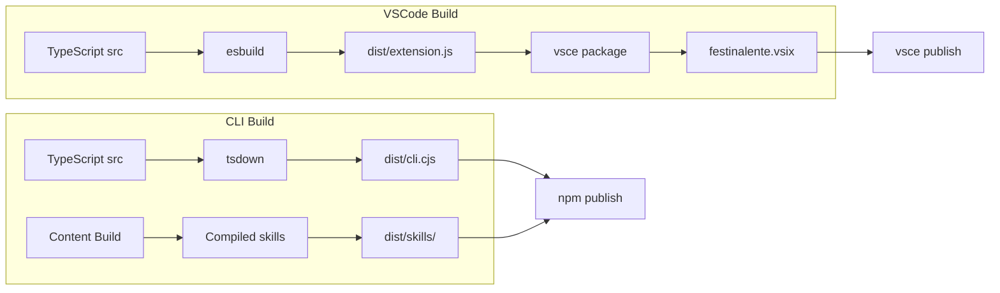

# Package Distribution

> **TL;DR:** Build, publish, and install workflow for CLI (npm) and VSCode extension (VSIX) packages

## Overview

The distribution system packages Festina Lente for end users. The CLI is bundled via tsdown into a self-contained CJS package published to GitHub Packages as `@mattfletcher94/festinalente`. The VSCode extension is bundled via esbuild into a VSIX published to GitHub Packages as `@mattfletcher94/festinalente-vscode`.

**Why it exists:** Users install Festina Lente in their projects without needing the monorepo. Bundling ensures all dependencies are included and the CLI works standalone.

**Summary:** Two distribution artifacts: npm package (CLI) and VSIX (VSCode extension), both via GitHub Packages.

<!-- Tier 2 boundary: content above this line is loaded at standard tier -->

## Build Artifacts

| Artifact | Build Tool | Package | Registry |
|----------|-----------|---------|----------|
| CLI | tsdown (CJS bundle) | `@mattfletcher94/festinalente` | GitHub Packages |
| VSCode Extension | esbuild (single file) | `@mattfletcher94/festinalente-vscode` | GitHub Packages |

## Build Pipeline

## Install Process

Both packages include `bin/install.cjs` scripts that run post-install to set up the `.festinalente/` directory structure, copy templates, and configure the workspace.

## Interactions

| System | Relationship | Notes |
|--------|--------------|-------|
| [Content Build](../systems/content-build/_index.md) | Compiled skills included in CLI package | Must build content before packaging |

**Summary:** Distribution depends on content build for compiled skills; produces installable packages.

## Boundaries

What this system does NOT handle:

- **Does NOT:** compile skill templates → See [Content Build](../systems/content-build/_index.md)
- **Does NOT:** manage CI/CD pipelines → manual publish workflow
- **Does NOT:** handle auto-updates → standard npm/VSCode extension update mechanisms
