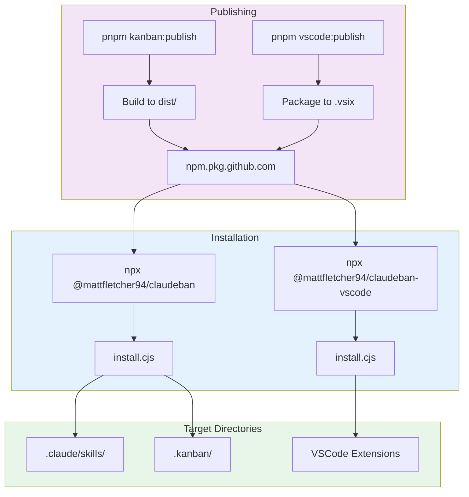

# Package Distribution System

> **TL;DR:** Private npm distribution via GitHub Packages for kanban CLI and VSCode extension

## Overview

The Package Distribution System enables claude-kanban tools to be installed via npx. Two packages are distributed:

- **Kanban CLI** (`@mattfletcher94/claudeban`) - Installs to any repository via `npx @mattfletcher94/claudeban`
- **VSCode Extension** (`@mattfletcher94/claudeban-vscode`) - Installs extension via `npx @mattfletcher94/claudeban-vscode`

Both use GitHub Packages as a private npm registry, leveraging existing GitHub authentication and repository permissions.

**Why it exists:** Allows distribution of kanban tooling without publishing to public npm. Users with repo access can install; others cannot.

**Summary:** Build pipeline + GitHub Packages registry + npx-compatible installers for CLI and VSCode extension.

## Components

### Kanban CLI Package

| Component | Purpose | File |
|-----------|---------|------|
| package.json | Package metadata and publishConfig | `apps/kanban/package.json` |
| install.cjs | CLI installer copying skills and kanban files | `apps/kanban/bin/install.cjs` |

### VSCode Extension Package

| Component | Purpose | File |
|-----------|---------|------|
| package.json | Package metadata, publishConfig, and bin entry | `apps/vscode/package.json` |
| install.cjs | Installer that runs `code --install-extension` with bundled .vsix | `apps/vscode/bin/install.cjs` |

### Monorepo Root

| Component | Purpose | File |
|-----------|---------|------|
| root package.json | Monorepo publish scripts | `package.json` |

**Summary:** Each package has its own installer; root coordinates publishing.

## Key Patterns

This system follows these patterns:

- **prepublishOnly hook** - Build runs automatically before publish
- **bin entry** - Package exposes CLI via `bin` field in package.json
- **Restricted access** - `publishConfig.access: "restricted"` keeps package private

## Data Flow



### Kanban CLI Flow

```
pnpm kanban:publish
       ↓
prepublishOnly → pnpm build
       ↓
Build tools, scripts, content to dist/
       ↓
Publish to npm.pkg.github.com
       ↓
User runs: npx @mattfletcher94/claudeban
       ↓
install.cjs copies:
  - dist/skills/ → .claude/skills/
  - dist/scripts/ → .kanban/scripts/
  - dist/templates/ → .kanban/templates/
  - dist/workflow.yaml → .kanban/workflow.yaml
```

### VSCode Extension Flow

```
pnpm vscode:publish
       ↓
prepublishOnly → pnpm package
       ↓
Build extension → bundle to .vsix file
       ↓
Publish to npm.pkg.github.com
       ↓
User runs: npx @mattfletcher94/claudeban-vscode
       ↓
install.cjs:
  1. Finds bundled .vsix file in package
  2. Runs: code --install-extension <vsix-path>
       ↓
Extension installed in VSCode
```

## Build Process

The build process creates a distributable `dist/` folder:

```bash
pnpm build
  ├── build:tools     # Compile tools/*.ts → dist/tools/
  ├── build:scripts   # Compile src/scripts/*.ts → dist/scripts/
  └── build:content   # Copy skills, templates, workflow → dist/
```

## Installer Behavior

### Kanban CLI Installer

The kanban installer (`apps/kanban/bin/install.cjs`) performs these steps:

1. **Install skills** - Copy `dist/skills/` to `.claude/skills/`
2. **Install kanban files** - Copy scripts, templates, workflow to `.kanban/`
3. **Setup config** - Create `config.yaml` and `glossary.yaml` if missing (won't overwrite)
4. **Save manifest** - Write `manifest.json` with version and install timestamp

#### Change Detection

The installer uses SHA-256 hashing to detect changes:
- Files with different hashes: logged as "Updated"
- New files: logged as "Added"
- Unchanged files: silently skipped

### VSCode Extension Installer

The VSCode extension installer (`apps/vscode/bin/install.cjs`) performs these steps:

1. **Find .vsix file** - Locates `claudeban-vscode.vsix` in package directory
2. **Run installation** - Executes `code --install-extension <vsix-path>` with inherited stdio
3. **Display next steps** - Shows instructions for using the extension

#### Error Handling

- If .vsix file not found: throws error with expected path
- If `code` command fails: error propagates naturally to user (e.g., "code not found in PATH")
- Uses ANSI colors for output following kanban patterns

## Interactions

| System | Relationship | Notes |
|--------|--------------|-------|
| [cli](../cli/_index.md) | Scripts distributed | dist/scripts/ contains compiled CLI scripts |
| [storage](../storage/_index.md) | Directory structure | Installer creates .kanban/ structure |
| [vscode-extension](../vscode-extension/_index.md) | Extension distributed | .vsix bundled in npm package |

**Summary:** Distribution system packages CLI scripts, creates storage structure, and distributes VSCode extension.

## Boundaries

What this system does NOT handle:

- **Does NOT:** Publish to public npm registry - uses GitHub Packages only
- **Does NOT:** Support Yarn/Bun directly - npx/npm only (may work but untested)
- **Does NOT:** Auto-update installed packages - users must re-run npx
- **Does NOT:** Publish VSCode extension to VS Marketplace - uses npm package with bundled .vsix

## Configuration

Both packages share the same configuration pattern:

| Setting | Description | Location |
|---------|-------------|----------|
| `publishConfig.registry` | Target registry URL | `apps/*/package.json` |
| `publishConfig.access` | Package visibility (restricted) | `apps/*/package.json` |
| `repository.url` | Links to GitHub repo | `apps/*/package.json` |

### VSCode Extension Specific

| Setting | Description | Location |
|---------|-------------|----------|
| `bin.claudeban-vscode` | CLI entry point | `apps/vscode/package.json` |
| `files` | Includes `bin` and `claudeban-vscode.vsix` | `apps/vscode/package.json` |

## User Setup

Users must configure npm to use GitHub Packages:

```bash
# Add to ~/.npmrc
@mattfletcher94:registry=https://npm.pkg.github.com
//npm.pkg.github.com/:_authToken=<GITHUB_PAT>
```

The PAT requires `read:packages` scope.

## Limitations

- GitHub Packages free tier: 500MB storage, 1GB bandwidth/month
- Users must have GitHub account with repository access
- No automatic updates - users re-run npx for new versions
