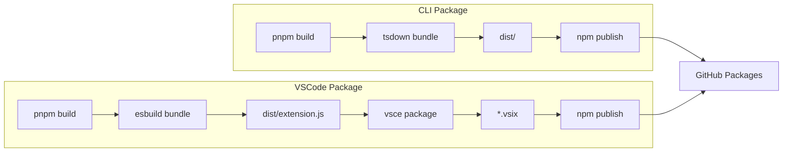

# Package Distribution

> **TL;DR:** NPM packages published to GitHub Package Registry

## Overview

Festina Lente distributes two packages via GitHub Package Registry: the CLI tool (`@mattfletcher94/festinalente`) and the VSCode extension (`@mattfletcher94/festinalente-vscode`).

**Why it exists:** Users install the CLI via `npx` and the extension via VSCode marketplace or VSIX. Publishing to GitHub Packages enables private distribution with authentication.

**Summary:** CLI + Extension → GitHub Packages → User Install

## Packages

| Package | Type | Registry | Version |
|---------|------|----------|---------|
| `@mattfletcher94/festinalente` | CLI | npm.pkg.github.com | 1.0.2 |
| `@mattfletcher94/festinalente-vscode` | VSCode Extension | npm.pkg.github.com | 1.0.2 |

## Build & Publish Flow



## CLI Build

```bash
# In apps/festinalente/
pnpm build           # Compiles content + CLI
pnpm publish         # Publishes to GitHub Packages
```

**Artifacts:**
- `bin/install.cjs` - NPM binary entry point
- `dist/cli/` - Compiled CLI code
- `dist/content/` - Compiled skills and templates

## VSCode Build

```bash
# In apps/vscode/
pnpm build           # esbuild bundles extension
pnpm package         # vsce creates .vsix
pnpm publish         # Publishes to GitHub Packages
```

**Artifacts:**
- `dist/extension.js` - Single bundled file
- `*.vsix` - VSCode extension package

## Installation

### CLI

```bash
# Configure npm for GitHub Packages
npm config set @mattfletcher94:registry https://npm.pkg.github.com

# Install globally or use npx
npx @mattfletcher94/festinalente init
```

### VSCode Extension

```bash
# Install from VSIX
code --install-extension festinalente-vscode-1.0.2.vsix
```

Or install from Marketplace (if published there).

## Monorepo Build

```bash
# Root level
pnpm build           # Turbo builds all packages
pnpm typecheck       # TypeScript type checking
pnpm clean           # Remove dist/ folders
```

**Turbo Configuration:**
- Parallel builds across workspaces
- Dependency-aware task ordering
- Build caching

## Interactions

| System | Relationship | Notes |
|--------|--------------|-------|
| [content-build](../content-build/_index.md) | Compiles before publish | Skills compiled to dist/ |
| [cli](../cli/_index.md) | Published as package | Users install via npm |
| [vscode-extension](../vscode-extension/_index.md) | Published as VSIX | Users install in VSCode |

**Summary:** Content build outputs to distribution, which publishes packages.

## Boundaries

What this system does NOT handle:

- **Does NOT:** Compile content → See [content-build](../content-build/_index.md)
- **Does NOT:** Define CLI commands → See [cli](../cli/_index.md)
- **Does NOT:** Define extension UI → See [vscode-extension](../vscode-extension/_index.md)
- **Does NOT:** Validate content before publishing
- **Does NOT:** Verify dist/ completeness after build

## Known Gaps

### No Pre-Publish Validation Gate

The `prepublishOnly` hook in both packages runs only the build step — no validation occurs before publishing:

- **CLI:** `prepublishOnly: "pnpm build"` — builds but does not run `festinalente validate-docs`
- **Extension:** `prepublishOnly: "npm run package"` — packages but does not verify content

This means malformed or incomplete content (including skills that fell back to raw Handlebars copy — see [content-build known risks](../content-build/_index.md#known-risks)) can ship to users.

### No dist/ Completeness Verification

After the build completes, nothing verifies that `dist/` contains all expected artifacts:

- `dist/cli/` — compiled CLI code
- `dist/content/skills/` — all 18 compiled skills
- `dist/content/templates/` — all XML/YAML templates
- `dist/content/workflow.yaml` — workflow schema

A partial build (e.g., content compilation fails silently) produces an incomplete package with no error.

### Missing Skill/Partial Dependency Manifest

There is no build-time manifest that records which skills depend on which partials. The existing `manifest.json` tracks installation metadata (version, installed date, runtime), not content dependencies.

**Current `manifest.json` structure:**
```json
{
  "_version": "1.0.2",
  "_installedAt": "2026-03-23T09:19:13.414Z",
  "runtimes": ["claude"],
  "skillsDirs": [".claude/skills"],
  "festinalenteDir": ".festinalente/"
}
```

A dependency manifest would enable:
- Detecting which skills are affected when a partial changes
- Verifying all partial references resolve after build
- Auditing distribution completeness

## Configuration

### package.json (CLI)

```json
{
  "name": "@mattfletcher94/festinalente",
  "publishConfig": {
    "registry": "https://npm.pkg.github.com"
  },
  "bin": {
    "festinalente": "./bin/install.cjs"
  }
}
```

### package.json (Extension)

```json
{
  "name": "@mattfletcher94/festinalente-vscode",
  "engines": {
    "vscode": "^1.85.0"
  }
}
```
