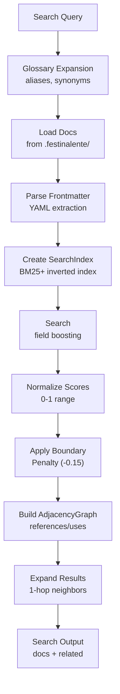

# Search & Discovery

> **TL;DR:** BM25+ full-text search with glossary expansion and 1-hop graph discovery across docs

## Overview

The search system indexes product and engineering documentation using MiniSearch (BM25+ algorithm). It provides field-boosted search with boundary penalties and expands results using a relationship graph built from doc `references` and `uses` fields. Glossary expansion adds synonyms and aliases to search queries.

**Why it exists:** Skills need to find relevant documentation when creating tasks, writing specs, and generating plans. Keyword search with graph expansion surfaces both direct matches and related context.

**Summary:** Index docs -> boost by field -> penalize cross-boundary -> expand via graph -> return normalized scores.

<!-- Tier 2 boundary: content above this line is loaded at standard tier -->

## Components

| Component | Purpose | File |
|-----------|---------|------|
| Search Handler | Orchestrates search operations | `handlers/search.handler.ts` |
| Search Computer | BM25+ index creation and querying | `computers/search.computer.ts` |
| Graph Computer | Adjacency list from doc relationships | `computers/graph.computer.ts` |
| Config Handler | Glossary expansion for query enrichment | `handlers/config.handler.ts` |

**Summary:** Search handler coordinates search computer (indexing), graph computer (expansion), and config handler (glossary).

## Architecture

## Search Configuration

| Parameter | Value | Purpose |
|-----------|-------|---------|
| Keywords boost | 3.0 | Frontmatter keywords weighted highest |
| Summary boost | 2.0 | Summary field weighted second |
| Body boost | 1.0 | Body text at base weight |
| Boundary penalty | -0.15 | Penalize results outside query boundary |
| Score normalization | 0-1 | Normalized for LLM consumption |
| Graph expansion | 1-hop | Follow references/uses one level deep |

## Interactions

| System | Relationship | Notes |
|--------|--------------|-------|
| [CLI](../systems/cli/_index.md) | Search handler exposed as CLI commands | `search-product`, `search-engineering` |
| [Data Model](../systems/data-model/_index.md) | Reads doc files for indexing | Markdown + YAML frontmatter |

**Summary:** Search indexes data model docs and is consumed by CLI commands and skills.

## Boundaries

What this system does NOT handle:

- **Does NOT:** search code files → only Markdown documentation
- **Does NOT:** persist indexes → rebuilt on each query
- **Does NOT:** provide fuzzy/typo-tolerant search → exact BM25+ matching only
