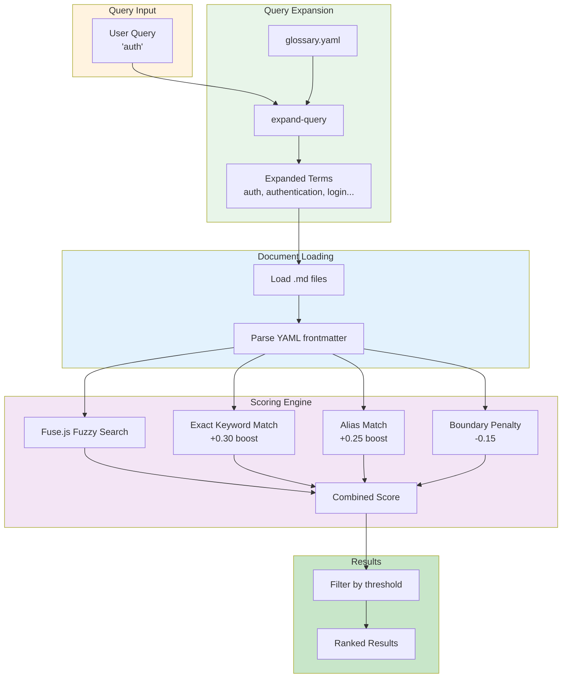

# Hybrid Search Engine

> **TL;DR:** Multi-algorithm search combining exact matching and fuzzy scoring

## Overview

The search engine provides intelligent document discovery across product and engineering documentation. It combines multiple matching strategies: exact keyword matching, glossary alias expansion, and Fuse.js fuzzy search with weighted fields. Results include match attribution explaining why each result matched.

**Why it exists:** Simple keyword search misses synonyms and typos. Fuzzy-only search has poor precision. Hybrid approach balances recall and precision.

**Summary:** Layered search algorithm with query expansion, exact matching, and fuzzy fallback.

## Components

| Component | Purpose | File |
|-----------|---------|------|
| search-hybrid | Main hybrid search algorithm | `apps/kanban/src/scripts/search-hybrid.ts` |
| search-product | Product documentation search | `apps/kanban/src/scripts/search-product.ts` |
| search-engineering | Engineering documentation search | `apps/kanban/src/scripts/search-engineering.ts` |
| expand-query | Query expansion using glossary | `apps/kanban/src/scripts/expand-query.ts` |

**Summary:** Four scripts implementing search across different document types.

## Algorithm

The hybrid search algorithm scores documents using multiple signals:

| Signal | Boost | Description |
|--------|-------|-------------|
| Exact keyword match | +0.30 | Query matches document keywords |
| Exact alias match | +0.25 | Query matches document aliases |
| Fuzzy title match | 0.20 weight | Fuse.js fuzzy match on title |
| Fuzzy tldr match | 0.15 weight | Fuse.js fuzzy match on tldr |
| Fuzzy body match | 0.10 weight | Fuse.js fuzzy match on body |
| Boundary penalty | -0.15 | Query matches document boundary (exclusion) |

**Threshold:** Default 0.3 (configurable via `--min-score`)

## Key Patterns

This system follows these patterns:

- Query expansion via glossary.yaml aliases
- Weighted field matching via Fuse.js configuration
- Boundary penalty for explicit exclusions
- Match attribution in results

## Data Flow



```
User Query ("auth")
  ↓
expand-query loads glossary.yaml
  ↓
Expands to ["auth", "authentication", "login", ...]
  ↓
search-hybrid loads all docs from directory
  ↓
Parse YAML frontmatter (keywords, aliases, boundary)
  ↓
Run 3 Fuse.js searches (title, tldr, body)
  ↓
Calculate combined scores with boosts/penalties
  ↓
Filter by threshold (default 0.3)
  ↓
Return ranked results with match attribution
```

## Fuse.js Configuration

```typescript
const fuse = new Fuse(docs, {
  keys: [
    { name: 'keywords', weight: 0.35 },
    { name: 'aliases', weight: 0.35 },
    { name: 'title', weight: 0.25 },
    { name: 'tldr', weight: 0.25 },
    { name: 'id', weight: 0.2 },
    { name: 'summary', weight: 0.15 },
    { name: 'domain', weight: 0.1 },
    { name: 'body', weight: 0.05 }
  ],
  threshold: 0.35,
  includeScore: true,
  ignoreLocation: true,
  useExtendedSearch: true,
  findAllMatches: true
});
```

## Interactions

| System | Relationship | Notes |
|--------|--------------|-------|
| [cli](../cli/_index.md) | Part of CLI | Search scripts are CLI commands |
| [storage](../storage/_index.md) | Reads docs | Scans product/ and engineering/ directories |

**Summary:** Search reads from storage, provides results to CLI callers.

## Boundaries

What this system does NOT handle:

- **Does NOT:** Index or cache documents (reads fresh each search)
- **Does NOT:** Handle real-time updates (no file watching)
- **Does NOT:** Search task content (only product/engineering docs)

## Configuration

| Setting | Description | Default |
|---------|-------------|---------|
| `--min-score` | Minimum score threshold | 0.3 |
| `--limit` | Maximum results to return | 10 |
| `glossary.yaml` | Term aliases for expansion | N/A |

## Known Issues

| Severity | Issue | Location |
|----------|-------|----------|
| MEDIUM | Code duplication across search scripts | search-*.ts |
| MEDIUM | No depth limits on recursive scan | `scanRecursive()` |
| LOW | No symlink loop detection | `scanRecursive()` |
