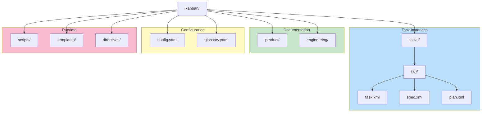
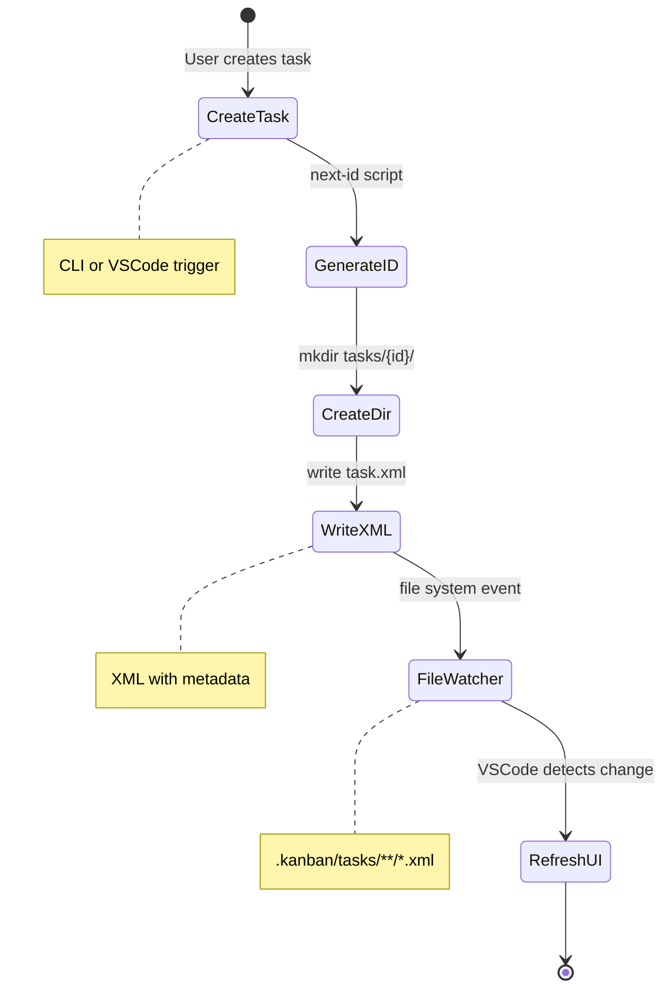

# File-Based Storage

> **TL;DR:** XML/YAML/Markdown file storage in .kanban/ directory structure

## Overview

Claude Kanban uses a file-based storage model with no database. Tasks are stored as XML files, documentation as Markdown with YAML frontmatter, and configuration as YAML. This allows version control, easy inspection, and portability.

**Why it exists:** File-based storage integrates naturally with git, allows human-readable inspection, and requires no database setup.

**Summary:** Structured file storage using XML for tasks, YAML/Markdown for docs.

## Directory Structure



```
.kanban/
├── tasks/                    # Task instances
│   └── {id}/
│       ├── task.xml         # Task metadata and status
│       ├── spec.xml         # Optional: Requirements specification
│       └── plan.xml         # Optional: Implementation plan
├── product/                  # Product documentation
│   ├── overview.md          # Product overview
│   ├── features/            # Feature documentation
│   └── personas/            # User persona docs
├── engineering/              # Engineering documentation
│   ├── overview.md          # Engineering overview
│   ├── systems/             # System documentation
│   ├── patterns/            # Pattern documentation
│   └── conventions/         # Convention documentation
├── directives/               # Skill directive XML files
├── templates/                # Document templates
├── scripts/                  # Runtime scripts (CJS)
├── config.yaml               # Global configuration
├── glossary.yaml             # Term aliases and domains
└── manifest.json             # Installation metadata
```

**Summary:** Hierarchical directory structure with clear separation by content type.

## File Formats

### Task XML (task.xml)

```xml
<task>
  <id>001</id>
  <title>Implement user login</title>
  <status>in-progress</status>
  <priority>high</priority>
  <label>feature</label>
  <created>2026-02-20</created>
  <updated>2026-02-20</updated>
</task>
```

### Documentation Markdown (*.md)

```markdown
---
id: "feature-name"
title: "Feature Title"
type: feature
tldr: "Single sentence summary"
summary: "Brief description"
keywords: [keyword1, keyword2]
aliases: [alias1, alias2]
boundary: "What this does NOT cover"
related: [other-doc-id]
paths: [src/path/to/code]
updated: 2026-02-20
verified: 2026-02-20
code_refs: [file.ts:line]
---

# Feature Title

Content here...
```

### Configuration YAML (config.yaml)

```yaml
skills:
  scope:
    directives:
      - product-context
      - engineering-context
```

### Glossary YAML (glossary.yaml)

```yaml
version: 1
terms:
  - term: "authentication"
    aliases: ["auth", "login", "sign-in"]
    domain: security
    definition: "User identity verification"
```

**Summary:** XML for structured task data, YAML frontmatter + Markdown for documentation.

## Key Patterns

This system follows these patterns:

- YAML frontmatter for document metadata (gray-matter library)
- XML for task structure (fast-xml-parser library)
- Directory-as-namespace for organization
- Git-friendly file formats

## Data Flow



```
Task Creation
  ↓
Generate unique ID via next-id.cjs
  ↓
Create .kanban/tasks/{id}/ directory
  ↓
Write task.xml with metadata
  ↓
VSCode detects change via file watcher
  ↓
Refresh UI
```

## Interactions

| System | Relationship | Notes |
|--------|--------------|-------|
| [cli](../cli/_index.md) | Reads/writes | Scripts operate on files |
| [vscode-extension](../vscode-extension/_index.md) | Reads/monitors | Watches for file changes |
| [search](../search/_index.md) | Reads | Scans docs for search |

**Summary:** Storage is the central data layer accessed by all other systems.

## Boundaries

What this system does NOT handle:

- **Does NOT:** Watch for file changes → See [vscode-extension](../vscode-extension/_index.md)
- **Does NOT:** Parse or validate files → See [cli](../cli/_index.md)
- **Does NOT:** Provide querying → See [search](../search/_index.md)

## Validation

Files are validated by CLI scripts:

| Validator | Format | File |
|-----------|--------|------|
| validate-xml.cjs | XML structure | `validate-xml.ts` |
| validate-yaml.cjs | YAML frontmatter | `validate-yaml.ts` |
| validate-docs.cjs | Documentation quality | `validate-docs.ts` |

## Known Issues

| Severity | Issue | Location |
|----------|-------|----------|
| MEDIUM | No schema validation for XML | Task XML parsing |
| MEDIUM | No referential integrity checks | Related field resolution |
| LOW | No file locking for concurrent access | All file writes |
