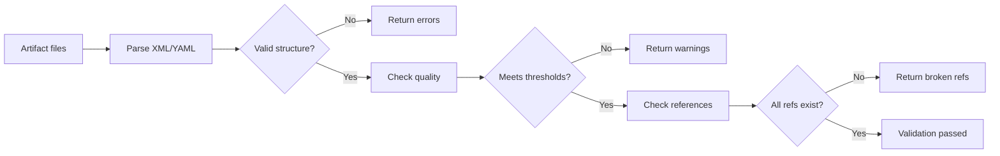

# Validation System

> **TL;DR:** Validates XML schemas, doc quality, and reference integrity across all project artifacts

## Overview

The validation system provides structural and content validation for all Festina Lente artifacts. It checks XML structure (task, spec, plan, quick, directive files), documentation quality (required frontmatter fields, content thresholds), and cross-reference integrity (broken references between docs).

**Why it exists:** AI agents generate structured files that must conform to schemas. Validation catches malformed output before it propagates through the workflow, preventing cascading errors in downstream phases.

**Summary:** Three validation layers: structural (XML/YAML parsing), quality (frontmatter completeness), and relational (reference integrity).

<!-- Tier 2 boundary: content above this line is loaded at standard tier -->

## Components

| Component | Purpose | File |
|-----------|---------|------|
| Validation Handler | Orchestrates validation operations | `handlers/validation.handler.ts` |
| Validation Computer | Pure validation logic | `computers/validation.computer.ts` |

**Summary:** Handler delegates to computer for pure validation logic.

## Validation Layers

| Layer | What It Checks | When It Runs |
|-------|---------------|-------------|
| XML Schema | task.xml, spec.xml, plan.xml, quick.xml structure | On read/parse |
| Directive Schema | `<context>`, `<process>`, `<rule>`, `<check>` elements | On directive load |
| Doc Quality | Required frontmatter: tldr, summary, keywords, title, type | festina-finalize |
| Reference Integrity | `references` and `uses` fields point to existing docs | festina-finalize |
| Broken Refs | Orphan docs, missing referenced docs | On demand |

## Data Flow

## Interactions

| System | Relationship | Notes |
|--------|--------------|-------|
| [CLI](../systems/cli/_index.md) | Validation handler exposed as CLI commands | `validate-xml`, `check-doc-quality`, etc. |
| [Data Model](../systems/data-model/_index.md) | Validates data model file formats | Schema enforcement |

**Summary:** Validation is invoked by CLI commands and skills during finalization.

## Boundaries

What this system does NOT handle:

- **Does NOT:** enforce directives at runtime → skills handle directive compliance
- **Does NOT:** fix validation errors → reports them for skills/users to fix
- **Does NOT:** validate code correctness → only validates Festina Lente artifacts
