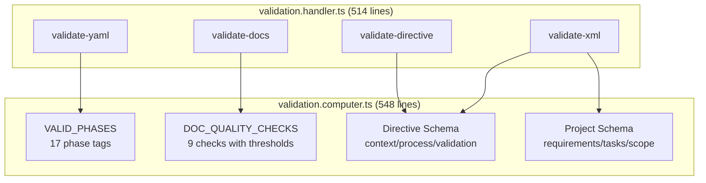
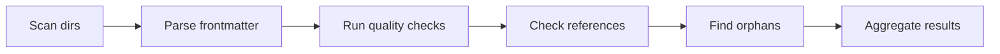

# Validation System

> **TL;DR:** Schema validation for XML artifacts and quality checks for documentation

## Overview

<!-- Each section must be self-contained: open with a context sentence, no back-references -->

The validation system is the largest subsystem (548 + 514 lines) providing two categories of validation:

1. **XML Schema Validation** — structural checks for directive, project, and task XML artifacts
2. **Documentation Quality Checks** — frontmatter and content checks for product and engineering docs

**Why it exists:** XML artifacts (directives, tasks, projects) have complex schemas that cannot be expressed through TypeScript types alone. Documentation needs consistent quality thresholds to remain discoverable and useful.

**Summary:** Pure validation logic (computer) + CLI command handlers = runtime validation for all structured content.

<!-- Tier 2 boundary: content above this line is loaded at standard tier -->

## Components

| Component | Purpose | File |
|-----------|---------|------|
| ValidationComputer | Pure validation logic — phases, quality checks, XML schemas | `computers/validation.computer.ts` |
| ValidationHandler | CLI command handlers — user-facing validation commands | `handlers/validation.handler.ts` |

**Summary:** Computer holds rules, handler exposes CLI commands.

## Key Patterns

This system follows these patterns from `patterns/`:

- [Factory DI](../../patterns/factory-di.md) — ValidationHandler created via factory with injected deps (fs, yamlParser, validation, taskResolver)
- [Tagged Union Errors](../../patterns/tagged-union-errors.md) — All validation returns `ValidationResult` with `valid`, `errors[]`, `warnings[]`

## Architecture



## CLI Commands

| Command | Usage | Purpose |
|---------|-------|---------|
| `validate-xml` | `validate-xml [taskId\|projectId]` | Validate task or project XML files |
| `validate-yaml` | `validate-yaml` | Validate YAML frontmatter in markdown files |
| `validate-directive` | `validate-directive <name>` | Validate a directive XML file |
| `validate-docs` | `validate-docs [--type=product\|engineering]` | Run quality checks on documentation |

## Valid Phases

17 directive phases defined in `validation.computer.ts:22–40`:

| Phase | Category | Purpose |
|-------|----------|---------|
| `check` | Validation | Verify implementation |
| `complete` | Completion | Complete a task (merge PR) |
| `complete-project` | Project Ops | Project completion |
| `create` | Artifact | Create files/resources |
| `create-project` | Project Ops | Project creation |
| `define` | Product Ops | Product/engineering definition |
| `delete` | Cleanup | Remove artifacts |
| `directive` | Meta | Directive-specific logic |
| `finalize` | Completion | Final cleanup/verification |
| `implement` | Execution | Write code/changes |
| `map-engineering` | Engineering | Engineering mapping |
| `map-product` | Product Ops | Product mapping |
| `plan` | Planning | Create technical plan |
| `quick` | Quick Tasks | Quick task execution |
| `rework` | Iteration | Refine based on check results |
| `save` | Persistence | Persist state |
| `scope` | Planning | Define problem boundaries |

Phases are **tags, not a state machine**. Directive rules can reference multiple phases via comma separation (e.g., `phase="plan,implement"`).

## Documentation Quality Checks

9 checks defined in `validation.computer.ts:65–125`:

| Check | Severity | Threshold | Message |
|-------|----------|-----------|---------|
| `has-tldr` | ERROR | `tldr.length > 10` | Missing or too short tldr |
| `has-summary` | ERROR | `summary.length > 50` | Missing or too short summary |
| `has-keywords` | WARNING | `keywords.length >= 2` | Need at least 2 keywords for search |
| `has-overview` | ERROR | Body contains `## Overview` or `## What is this` | Missing Overview section |
| `has-examples` | WARNING | Body contains `` ``` `` or `## Examples` | No code examples found |
| `has-boundaries` | WARNING | `boundary` field OR body has `## Boundaries` or `Does NOT` | No boundaries defined |
| `not-too-short` | WARNING | `body.length > 300` | Content too short — may lack detail |
| `not-too-long` | WARNING | `body.length < 5000` | Content too long — consider splitting |
| `has-intent` | WARNING | `intent` is `reference`, `procedural`, or `conceptual` | Missing or invalid intent field |

**Result status logic:**
- `pass` — no errors and no warnings
- `warning` — has warnings but no errors
- `error` — at least one error-severity check failed

## Directive XML Schema Validation

160+ lines of schema logic (`validation.computer.ts:218–372`):

### Root Element

```xml
<directive name="..." version="..." created="YYYY-MM-DD" updated="YYYY-MM-DD">
```

| Attribute | Required | Validation |
|-----------|----------|------------|
| `name` | Yes | Must match filename |
| `version` | Yes | Any string |
| `created` | Yes | `^\d{4}-\d{2}-\d{2}$` regex |
| `updated` | Yes | `^\d{4}-\d{2}-\d{2}$` regex |

### Context Section (optional)

```xml
<context>
  <principle id="P1" keywords="...">Text content</principle>
</context>
```

- Each `<principle>` requires an `id` attribute

### Process Section (optional)

```xml
<process>
  <rule id="R1" phase="plan,implement">Text content</rule>
</process>
```

- Each `<rule>` requires `id` and `phase` attributes
- Phase values are comma-separated and validated against VALID_PHASES

### Validation Section (optional)

```xml
<validation>
  <check id="V1" type="command|pattern|checklist" severity="error|warning|info">
    <!-- type-specific children -->
  </check>
</validation>
```

| Check Type | Required Children | Notes |
|------------|-------------------|-------|
| `command` | `<run>`, `<expect>` | Command to execute + expected result |
| `pattern` | `<forbidden>`, `<reason>` | Regex pattern matching for forbidden patterns; `files` attribute recommended |
| `checklist` | `<item>` (1+) | Self-assessment items |

### Cross-Cutting Rules

- All `id` attributes across sections must be unique (duplicate detection at lines 264–277)
- At least one section (context, process, or validation) must exist
- Empty directive triggers a warning

## Project XML Schema Validation

`validation.computer.ts:379–501`:

### Root Element

```xml
<project id="P..." status="open|in-progress|done" created="YYYY-MM-DD" updated="YYYY-MM-DD">
```

- `id` must start with `P` prefix
- `status` must be one of: `open`, `in-progress`, `done`

### Required Children

All must exist: `<title>`, `<description>`, `<problem>`, `<value>`, `<scope>`, `<requirements>`, `<acceptance-criteria>`, `<tasks>`

### Scope Structure

```xml
<scope>
  <in-scope>...</in-scope>
  <out-of-scope>...</out-of-scope>
</scope>
```

### Requirements

```xml
<requirements>
  <requirement id="R1">...</requirement>
</requirements>
```

- Requirement IDs must match `^R\d+$` (e.g., R1, R2)
- All IDs must be unique

### Tasks

```xml
<tasks>
  <task ref="task-id"/>
</tasks>
```

## Documentation Validation Pipeline

The `validate-docs` command (`validation.handler.ts:386–481`) performs:

1. **Directory scan** — reads `.festinalente/product/` and/or `.festinalente/engineering/`
2. **Frontmatter parse** — extracts YAML frontmatter from each `.md` file
3. **Quality checks** — runs 9 DOC_QUALITY_CHECKS against each doc
4. **Broken reference detection** — validates `references[]` and `uses[]` fields resolve to existing doc IDs
5. **Orphan detection** — finds docs with no incoming references (excludes overview docs)



## Verification Strategy

The validation system uses **type safety as its primary verification strategy** with zero test files:

- **Branded types** — `TaskId`, `QuickId`, `ProjectId`, `DocId` prevent mixing identifiers
- **Readonly properties** — immutable result objects throughout
- **Discriminated unions** — `ValidationResult`, `CheckResult`, `DocValidationResult` encode all possible states
- **Zod schemas** — argument parsing validated at CLI boundary (`types.ts:153–178`)

This approach relies on the TypeScript compiler catching structural errors at build time rather than runtime test suites.

## Key Types

```typescript
interface ValidationResult {
  readonly valid: boolean;
  readonly errors: readonly string[];
  readonly warnings: readonly string[];
}

interface CheckResult {
  readonly name: string;
  readonly passed: boolean;
  readonly severity: 'error' | 'warning';
  readonly message?: string;
}

interface DocValidationResult {
  readonly id: string;
  readonly path: string;
  readonly status: 'pass' | 'warning' | 'error';
  readonly checks: readonly CheckResult[];
}
```

## Interactions

| System | Relationship | Notes |
|--------|--------------|-------|
| [data-model](../data-model/_index.md) | Validates XML schemas | Task, project, directive XML |
| [content-build](../content-build/_index.md) | Not integrated | Quality checks run at CLI runtime, not build-time |
| [cli](../cli/_index.md) | Exposes 4 commands | validate-xml, validate-yaml, validate-directive, validate-docs |

**Summary:** Validates data-model artifacts and documentation but is not integrated into the build pipeline.

## Boundaries

What this system does NOT handle:

- **Does NOT:** Validate at build-time → See [content-build](../content-build/_index.md)
- **Does NOT:** Fix validation errors → Reports only, user must fix
- **Does NOT:** Validate skill Markdown content → Only product/engineering docs
- **Does NOT:** Run automated tests → Type safety is the verification strategy

## Extension Points

### Adding a new Quality Check

**Checklist:**
- [ ] Add check object to `DOC_QUALITY_CHECKS` array in `validation.computer.ts`
- [ ] Set `name`, `severity` (`error` or `warning`), and check function
- [ ] Check function receives `{ frontmatter, body }` and returns `{ passed, message? }`
- [ ] Run `festinalente validate-docs` to verify

### Adding a new XML Schema

**Checklist:**
- [ ] Add validation function in `validation.computer.ts` (follow `validateDirective` pattern)
- [ ] Add handler method in `validation.handler.ts`
- [ ] Register command in handler's `getCommands()` method
- [ ] Wire into orchestrator

### Adding a new Phase

**Checklist:**
- [ ] Add phase string to `VALID_PHASES` array in `validation.computer.ts:22–40`
- [ ] Add the same phase to `VALID_PHASES` in `apps/vscode/src/computers/directive-validator.computer.ts` (keep in sync)
- [ ] Existing directives can immediately reference the new phase in `<rule phase="...">`
