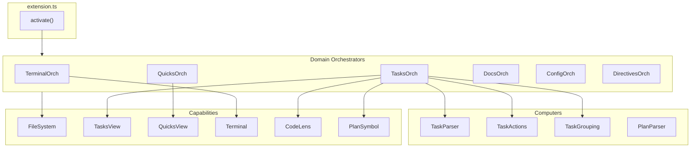
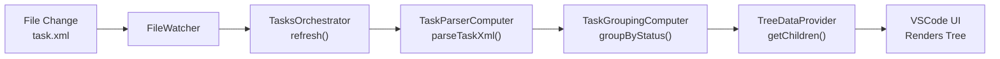
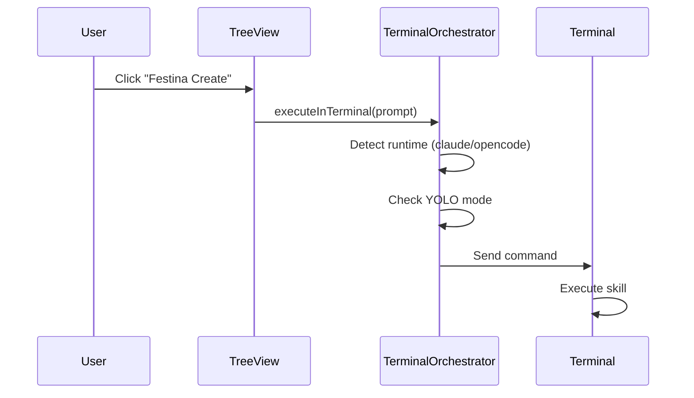

# VSCode Extension

> **TL;DR:** IDE integration with tree views, file watchers, and terminal execution

## Overview

The VSCode extension provides a visual interface for Festina Lente task management. It uses 6 domain orchestrators (tasks, quicks, docs, config, directives, terminal) that compose capabilities and computers following the DAG architecture.

**Why it exists:** Developers need visual task management within their IDE. The extension provides tree views, CodeLens, and one-click command execution without leaving VSCode.

**Summary:** Extension → Orchestrators → Capabilities/Computers → TreeViews + Terminal

## Components

| Component | Purpose | File |
|-----------|---------|------|
| Extension | Entry point, wires orchestrators | `extension.ts` |
| TerminalOrchestrator | Runtime selection, command execution | `orchestrators/terminal.orchestrator.ts` |
| TasksOrchestrator | Task view, refresh, actions | `orchestrators/tasks.orchestrator.ts` |
| QuicksOrchestrator | Quick task view | `orchestrators/quicks.orchestrator.ts` |
| DocsOrchestrator | Product/engineering docs view | `orchestrators/docs.orchestrator.ts` |
| ConfigOrchestrator | Config panel | `orchestrators/config.orchestrator.ts` |
| DirectivesOrchestrator | Directives view | `orchestrators/directives.orchestrator.ts` |
| TasksViewCapability | TreeDataProvider for tasks | `capabilities/tasks-view.capability.ts` |
| FileSystemCapability | File I/O (VSCode API) | `capabilities/file-system.capability.ts` |
| TerminalCapability | Terminal execution | `capabilities/terminal.capability.ts` |
| CodeLensCapability | CodeLens for task.xml | `capabilities/codelens.capability.ts` |
| PlanSymbolCapability | DocumentSymbolProvider for plan.xml | `capabilities/plan-symbol.capability.ts` |
| TaskParserComputer | Parse XML to Task objects | `computers/task-parser.computer.ts` |
| TaskActionsComputer | Generate available actions | `computers/task-actions.computer.ts` |
| TaskGroupingComputer | Group tasks by status | `computers/task-grouping.computer.ts` |
| PlanParserComputer | Parse plan.xml | `computers/plan-parser.computer.ts` |

**Summary:** 6 orchestrators, 5+ capabilities, 4+ computers.

## Key Patterns

This system follows these patterns from `patterns/`:

- [dag-architecture](../patterns/dag-architecture.md) - Orchestrators compose capabilities/computers
- [factory-di](../patterns/factory-di.md) - Each orchestrator uses `create*Orchestrator(deps)`
- [treeview-provider](../patterns/treeview-provider.md) - TreeDataProvider pattern for views

## Architecture

The extension activates, finds `.festinalente/` folder, creates orchestrators with shared capabilities, and registers TreeViews, commands, and file watchers.

## Data Flow

1. File change detected by watcher
2. Orchestrator triggers refresh
3. Computers parse and group tasks
4. TreeDataProvider returns tree items
5. VSCode re-renders the view

## Terminal Execution Flow

## Interactions

| System | Relationship | Notes |
|--------|--------------|-------|
| [cli](../cli/_index.md) | Spawns via terminal | Terminal executes `claude` or `opencode` commands |
| [data-model](../data-model/_index.md) | Watches and reads files | Monitors `.festinalente/` for changes |

**Summary:** Extension watches data-model files, spawns CLI for mutations.

## Boundaries

What this system does NOT handle:

- **Does NOT:** Execute CLI logic directly → Spawns terminal
- **Does NOT:** Define workflow → See [data-model](../data-model/_index.md)
- **Does NOT:** Parse skill definitions → See [content-build](../content-build/_index.md)

## Configuration

| Setting | Description | Default |
|---------|-------------|---------|
| `festinalente.runtime` | AI runtime selection | claude |

Settings in `claude.json`:
| Setting | Description | Default |
|---------|-------------|---------|
| `dangerouslyAllowYolo` | Enable --dangerously-skip-permissions | false |

## Extension Points

### Adding a new TreeView

**Template:** Copy `orchestrators/quicks.orchestrator.ts` as starting point.

**Checklist:**
- [ ] Create `orchestrators/{name}.orchestrator.ts`
- [ ] Create `capabilities/{name}-view.capability.ts` implementing TreeDataProvider
- [ ] Create `computers/{name}-parser.computer.ts` if needed
- [ ] Register TreeView in `extension.ts` with `vscode.window.createTreeView()`
- [ ] Add view to `package.json` contributes.views

**Pitfalls:**
- Forgetting to dispose file watchers
- Not refreshing view on file changes
- Missing view registration in package.json
