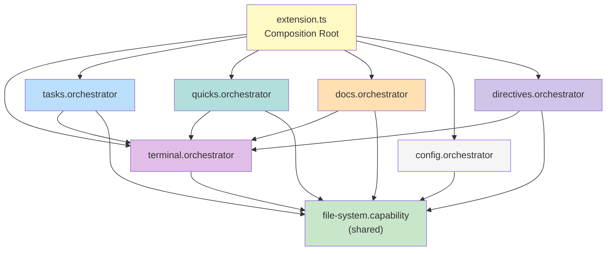
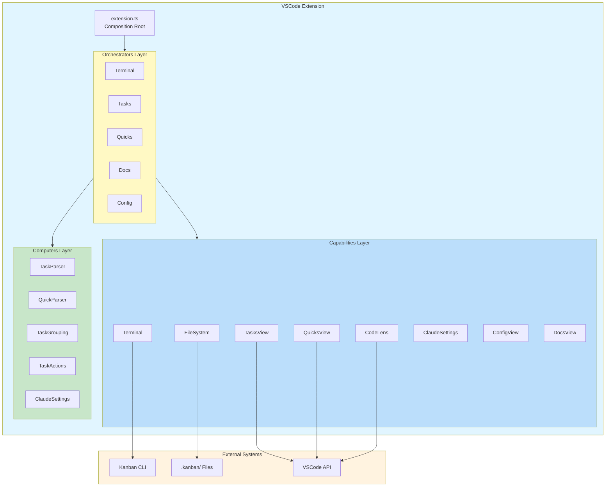
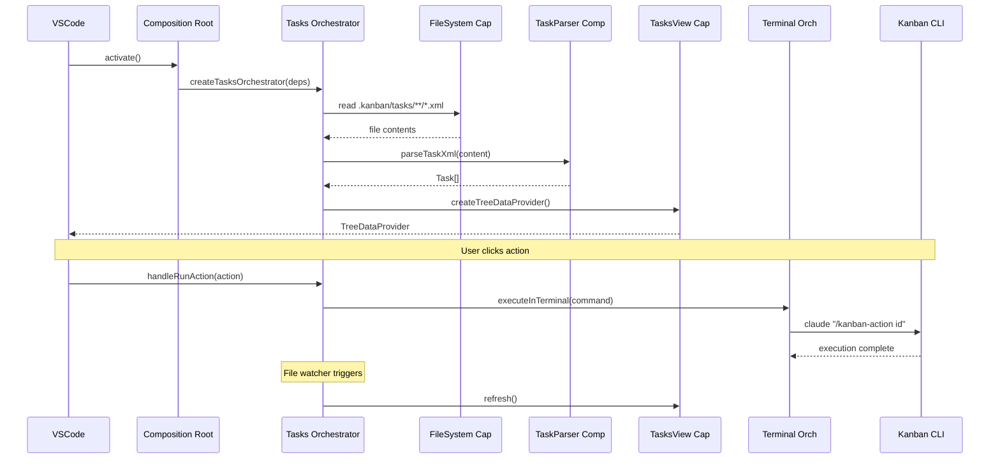

# VSCode Extension

> **TL;DR:** Visual task management UI with TreeView, CodeLens, and terminal integration

## Overview

The VSCode extension provides a visual interface for Claude Kanban. It renders tasks in a TreeView panel, adds CodeLens actions to task files, and executes kanban commands via integrated terminal. The extension follows a four-layer architecture: Composition Root, Domain Orchestrators, Capabilities, and Computers.

**Why it exists:** Provides a visual UI for task management while delegating data operations to CLI scripts, maintaining clean separation of concerns.

**Summary:** Visual interface layer that renders data and triggers CLI commands.

## Directory Structure

```
apps/vscode/src/
├── extension.ts                         # Composition root (thin entry point)
├── orchestrators/
│   ├── terminal.orchestrator.ts         # Runtime/execution policy (86 lines)
│   ├── tasks.orchestrator.ts            # Task domain policy (279 lines)
│   ├── quicks.orchestrator.ts           # Quick task domain policy (178 lines)
│   ├── docs.orchestrator.ts             # Documentation domain policy (136 lines)
│   ├── config.orchestrator.ts           # Config domain policy (109 lines)
│   └── directives.orchestrator.ts       # Directives domain policy
├── capabilities/
│   ├── file-system.capability.ts        # File I/O wrapper
│   ├── terminal.capability.ts           # Terminal lifecycle
│   ├── claude-settings.capability.ts    # Claude settings I/O
│   ├── tasks-view.capability.ts         # Tasks TreeView
│   ├── quicks-view.capability.ts        # Quicks TreeView
│   ├── docs-view.capability.ts          # Docs TreeViews
│   ├── config-view.capability.ts        # Config TreeView
│   ├── directives-view.capability.ts    # Directives TreeView
│   └── codelens.capability.ts           # CodeLens provider
├── computers/
│   ├── task-parser.computer.ts          # XML parsing for tasks
│   ├── task-actions.computer.ts         # Task action generation
│   ├── task-grouping.computer.ts        # Task grouping by status
│   ├── quick-parser.computer.ts         # XML parsing for quicks
│   ├── directives-config.computer.ts    # YAML parsing for directives
│   └── claude-settings.computer.ts      # YOLO mode detection
└── types/
    ├── task-types.ts                    # Task domain types
    ├── quick-types.ts                   # Quick domain types
    └── directives-types.ts              # Directive domain types
```

## Architecture Layers

### Layer 1: Composition Root (`extension.ts`)

The entry point is a thin composition root (~178 lines) that:
- Finds the `.kanban` folder in workspace
- Creates shared capabilities (file system)
- Instantiates domain orchestrators with dependencies
- Registers TreeViews and CodeLens with VSCode
- Delegates all domain logic to orchestrators

**File:** `apps/vscode/src/extension.ts`

See [orchestrator pattern](../patterns/orchestrator.md) for the composition root pattern.

### Layer 2: Domain Orchestrators

Each domain has its own orchestrator handling policy decisions (when/whether to act).

| Orchestrator | Responsibility | File |
|--------------|----------------|------|
| terminal | Runtime selection (claude/opencode), YOLO mode, command building | `orchestrators/terminal.orchestrator.ts` |
| tasks | Task loading, parsing, actions, codelens, task commands, file watching | `orchestrators/tasks.orchestrator.ts` |
| quicks | Quick loading, parsing, quick commands, file watching | `orchestrators/quicks.orchestrator.ts` |
| docs | Product/engineering docs providers, global actions, file watching | `orchestrators/docs.orchestrator.ts` |
| config | Config existence checking, config view, file watching | `orchestrators/config.orchestrator.ts` |
| directives | Directive-workflow mappings from config.yaml, create directive command, file watching | `orchestrators/directives.orchestrator.ts` |

#### Orchestrator Dependencies



**Key rule:** Orchestrators don't import each other. The terminal orchestrator is injected as a dependency into other orchestrators via the composition root.

### Layer 3: Capabilities (Mechanism/How)

Capabilities handle I/O and side effects. They wrap VSCode APIs and file system operations.

| Component | Purpose | File |
|-----------|---------|------|
| file-system | File I/O wrapper (read, write, exists, readDir) | `capabilities/file-system.capability.ts` |
| terminal | Terminal lifecycle (create, show, send command) | `capabilities/terminal.capability.ts` |
| claude-settings | Read Claude settings from project/global paths | `capabilities/claude-settings.capability.ts` |
| tasks-view | TreeView rendering and management for tasks | `capabilities/tasks-view.capability.ts` |
| quicks-view | TreeView for quick tasks list | `capabilities/quicks-view.capability.ts` |
| docs-view | TreeViews for product/engineering docs | `capabilities/docs-view.capability.ts` |
| config-view | TreeView for config.yaml access | `capabilities/config-view.capability.ts` |
| directives-view | TreeView for workflow/directive mappings | `capabilities/directives-view.capability.ts` |
| codelens | CodeLens provider for task.xml files | `capabilities/codelens.capability.ts` |

#### TreeItem Types in tasks-view

| TreeItem | Parent | Purpose |
|----------|--------|---------|
| StatusGroupItem | root | Column header (e.g., "Backlog", "In Progress") |
| TaskItem | StatusGroupItem | Task entry with ID, title, priority, label |
| ActionItem | TaskItem | Workflow action (primary: green play, secondary: orange reply) |
| FileItem | TaskItem | Task file (task.xml, spec.xml, plan.xml) |

#### TreeItem Types in quicks-view

| TreeItem | Parent | Purpose |
|----------|--------|---------|
| QuickItem | root | Quick task entry with ID, title, status icon |

Status icons: blue play circle for `in-progress`, green checkmark for `completed`.

#### TreeItem Types in docs-view

| TreeItem | Parent | Purpose |
|----------|--------|---------|
| DocsActionItem | root (first child) | Map docs action with green play icon |
| DocsFolderItem | root or DocsFolderItem | Collapsible folder in docs hierarchy |
| DocsFileItem | DocsFolderItem | Clickable markdown file |

### Layer 4: Computers (Pure Functions)

Computers contain pure functions with no side effects.

| Component | Purpose | File |
|-----------|---------|------|
| task-parser | Parses XML task files using fast-xml-parser | `computers/task-parser.computer.ts` |
| task-actions | Generates available actions per task status | `computers/task-actions.computer.ts` |
| task-grouping | Groups tasks by status, defines columns | `computers/task-grouping.computer.ts` |
| quick-parser | Parses quick.xml files using fast-xml-parser | `computers/quick-parser.computer.ts` |
| directives-config | Parses config.yaml directives section using js-yaml | `computers/directives-config.computer.ts` |
| claude-settings | YOLO mode detection from Claude settings | `computers/claude-settings.computer.ts` |

### Types Layer

| Component | Purpose | File |
|-----------|---------|------|
| task-types | Task, TaskStatus, TaskPriority, TaskAction interfaces | `types/task-types.ts` |
| quick-types | Quick, QuickStatus interfaces | `types/quick-types.ts` |
| directives-types | Workflow, Directive, WorkflowId, DirectiveId interfaces | `types/directives-types.ts` |

## Architecture Diagram



## Key Patterns

This system follows these patterns:

- [orchestrator](../patterns/orchestrator.md) - Domain orchestrators with thin composition root
- [capability-computer](../patterns/capability-computer.md) - Strict separation of I/O from pure functions
- [factory-di](../patterns/factory-di.md) - All components use factory functions for dependency injection

## Data Flow



## Commands by Orchestrator

### Tasks Orchestrator Commands

| Command | Behavior |
|---------|----------|
| `kanban.refresh` | Refresh tasks TreeView and CodeLens |
| `kanban.createTask` | Prompt for title, run `/kanban-create` |
| `kanban.runAction` | Execute task action in terminal |
| `kanban.runNextAction` | Execute primary action from inline button |
| `kanban.openTaskFolder` | Reveal task folder in explorer |
| `kanban.findTask` | QuickPick search for tasks |

### Quicks Orchestrator Commands

| Command | Behavior |
|---------|----------|
| `kanban.createQuick` | Prompt for title, run `/kanban-quick` |
| `kanban.refreshQuicks` | Refresh quicks TreeView |
| `kanban.findQuick` | QuickPick search for quicks |

### Docs Orchestrator Commands

| Command | Behavior |
|---------|----------|
| `kanban.runGlobalAction` | Execute global action (docs mapping) |

### Directives Orchestrator Commands

| Command | Behavior |
|---------|----------|
| `festinalente.createDirective` | Run `/festina-directive` in terminal |

### Shared Commands (Composition Root)

| Command | Behavior |
|---------|----------|
| `kanban.openFile` | Open file in editor |

## YOLO Mode Detection

The terminal orchestrator handles YOLO mode detection and command building.

### Settings Locations

| Location | Priority | Example Path |
|----------|----------|--------------|
| Project | Higher | `.claude/settings.json` |
| Global | Lower | `~/.claude/settings.json` |

### Detection Logic

YOLO mode is enabled when either condition is true:
- `"dangerously-skip-permissions": true`
- `"defaultMode": "bypassPermissions"`

### Implementation

| Layer | Component | Responsibility |
|-------|-----------|----------------|
| Capability | `claude-settings.capability.ts` | I/O: Read settings files from disk |
| Computer | `claude-settings.computer.ts` | Pure: Determine YOLO status from settings |
| Orchestrator | `terminal.orchestrator.ts` | Policy: Build command with/without flag |

### Command Format

```typescript
// YOLO enabled:
`claude --dangerously-skip-permissions "/kanban-{action} {id}"`

// YOLO disabled:
`claude "/kanban-{action} {id}"`
```

## File Watchers by Orchestrator

| Orchestrator | Watch Pattern | On Change |
|--------------|---------------|-----------|
| tasks | `tasks/**/*.xml` | Refresh tasks view + codelens |
| quicks | `quick/**/*.xml` | Refresh quicks view |
| docs | `product/**/*.md` | Refresh product docs view |
| docs | `engineering/**/*.md` | Refresh engineering docs view |
| config | `config.yaml` | Refresh config view, update context |
| directives | `config.yaml`, `directives/**/*.xml` | Refresh directives view |

## Distribution

The extension is distributed via GitHub Packages as an npm package containing the bundled .vsix file.

### Installation

```bash
npx @mattfletcher94/claudeban-vscode
```

### Package Structure

```
@mattfletcher94/claudeban-vscode
├── bin/
│   └── install.cjs      # CLI installer
├── claudeban-vscode.vsix  # Bundled extension
└── package.json         # npm package with bin entry
```

See [distribution](../distribution/_index.md) for full publishing workflow.

## Interactions

| System | Relationship | Notes |
|--------|--------------|-------|
| [cli](../cli/_index.md) | Executes commands | Runs `claude "/kanban-{action} {id}"` via terminal |
| [storage](../storage/_index.md) | Reads files | Monitors `.kanban/tasks/**/*.xml` |
| [distribution](../distribution/_index.md) | Distributed via | Published to GitHub Packages |

## Boundaries

What this system does NOT handle:

- **Does NOT:** Implement search algorithms - See [search](../search/_index.md)
- **Does NOT:** Validate or transform data - Delegates to CLI scripts
- **Does NOT:** Persist data - See [storage](../storage/_index.md)

## Configuration

| Setting | Description | Default |
|---------|-------------|---------|
| `kanban.runtime` | CLI runtime to use (claude/opencode) | claude |
| `kanban.showInactiveColumns` | Show columns with no tasks | false |
