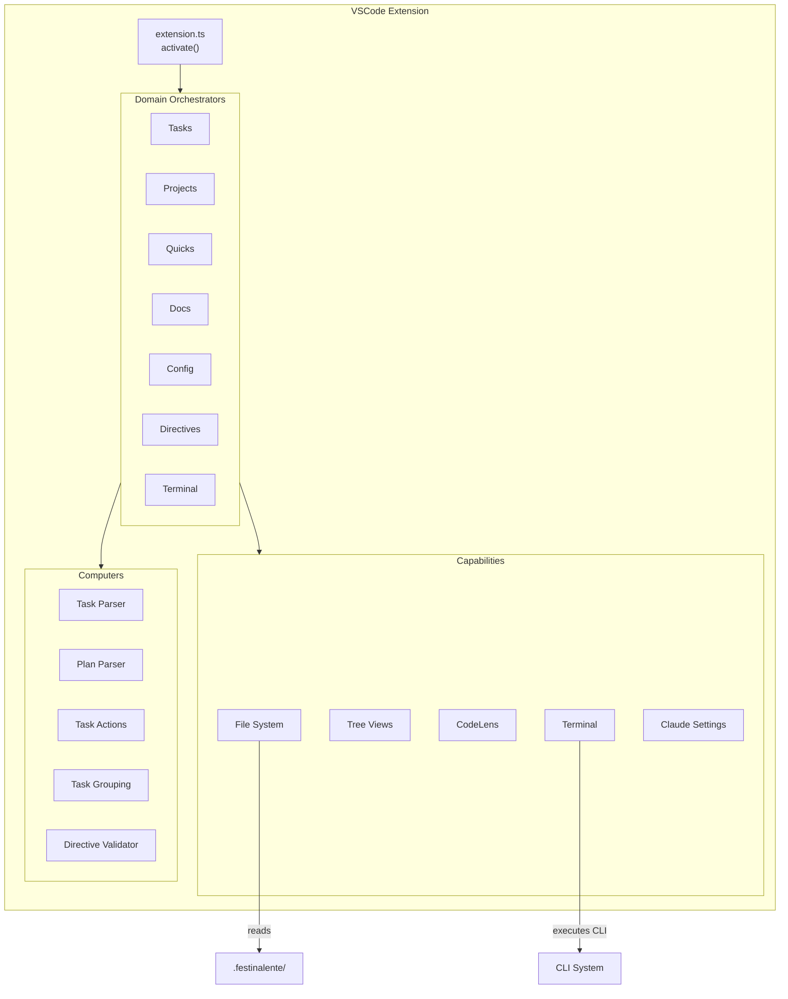
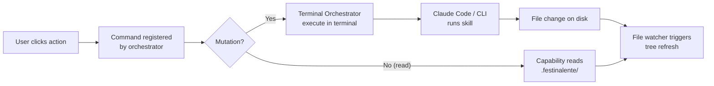

# VSCode Extension

> **TL;DR:** Visual interface for task management with 7 domain orchestrators, tree providers, and terminal integration

## Overview

The VSCode extension provides the graphical interface for Festina Lente. It activates on startup, discovers the `.festinalente/` folder, initializes domain orchestrators, and registers tree views, commands, and file watchers. It delegates all operations to the CLI system via terminal execution.

**Why it exists:** Developers need visual navigation and one-click actions for task workflows without leaving the IDE. The extension bridges the gap between CLI-driven agent workflows and visual task management.

**Summary:** Thin UI layer that reads `.festinalente/` directly for display but delegates mutations to the CLI via terminal commands.

<!-- Tier 2 boundary: content above this line is loaded at standard tier -->

## Components

| Component | Purpose | File |
|-----------|---------|------|
| Extension Entry | Activation, folder discovery, orchestrator init | `extension.ts` |
| Tasks Orchestrator | Task loading, parsing, grouping, status tree | `orchestrators/tasks.orchestrator.ts` |
| Projects Orchestrator | Project parsing, task collection tree | `orchestrators/projects.orchestrator.ts` |
| Quicks Orchestrator | Quick task management tree | `orchestrators/quicks.orchestrator.ts` |
| Docs Orchestrator | Product & engineering doc trees | `orchestrators/docs.orchestrator.ts` |
| Config Orchestrator | config.yaml tree view | `orchestrators/config.orchestrator.ts` |
| Directives Orchestrator | Directive validation, diagnostics tree | `orchestrators/directives.orchestrator.ts` |
| Terminal Orchestrator | Command execution with runtime selection | `orchestrators/terminal.orchestrator.ts` |
| File System Capability | Sync file read/write/directory operations | `capabilities/file-system.capability.ts` |
| Tasks View Capability | TreeDataProvider for tasks | `capabilities/tasks-view.capability.ts` |
| CodeLens Capability | Inline actions on task.xml files | `capabilities/codelens.capability.ts` |
| Plan Symbol Capability | Document symbols for plan.xml | `capabilities/plan-symbol.capability.ts` |
| Terminal Capability | VSCode terminal creation and command dispatch | `capabilities/terminal.capability.ts` |
| Claude Settings Capability | Read .claude/settings.json for runtime detection | `capabilities/claude-settings.capability.ts` |
| Task Parser Computer | Parse task.xml -> Task object | `computers/task-parser.computer.ts` |
| Plan Parser Computer | Parse plan.xml -> Plan steps | `computers/plan-parser.computer.ts` |
| Task Actions Computer | Compute available actions per status | `computers/task-actions.computer.ts` |
| Task Grouping Computer | Group tasks by status column | `computers/task-grouping.computer.ts` |
| Directive Validator Computer | Validate directive.xml schemas | `computers/directive-validator.computer.ts` |

**Summary:** 7 orchestrators coordinate capabilities (I/O/UI) and computers (pure logic) per domain.

## Key Patterns

This system follows these patterns from `patterns/`:

- [DAG Architecture](../patterns/dag-architecture.md) - Orchestrators compose capabilities and computers, no upward imports
- [Factory DI](../patterns/factory-di.md) - Each orchestrator creates its own dependencies

## Architecture

Each orchestrator follows the same pattern: create computers, create capabilities, register tree data provider, register commands, create file watchers.

## Data Flow

The extension reads files directly for display but routes all mutations through terminal -> Claude Code -> skill -> CLI.

## Interactions

| System | Relationship | Notes |
|--------|--------------|-------|
| [CLI](../systems/cli/_index.md) | Executes CLI commands via terminal | Detects runtime (claude/opencode) from settings |
| [Data Model](../systems/data-model/_index.md) | Reads task artifacts directly for tree display | Sync file operations |

**Summary:** UI layer that reads directly, writes via CLI terminal delegation.

## Boundaries

What this system does NOT handle:

- **Does NOT:** contain business logic for task operations → See [CLI](../systems/cli/_index.md)
- **Does NOT:** perform git operations → handled by directives
- **Does NOT:** validate or search documents → delegates to CLI

## Configuration

| Setting | Description | Default |
|---------|-------------|---------|
| `festinalente.runtime` | Agent runtime: "claude" or "opencode" | Auto-detected |

## Extension Points

### Adding a new Domain Orchestrator

**Template:** Copy `config.orchestrator.ts` as starting point (simplest orchestrator).

**Checklist:**
- [ ] Create `orchestrators/{domain}.orchestrator.ts`
- [ ] Create matching computer and capability files
- [ ] Register in `extension.ts` activation
- [ ] Add tree view to `package.json` contributes.views

**Pitfalls:**
- File watchers must be disposed in deactivate
- Tree data providers must handle missing `.festinalente/` folder gracefully
