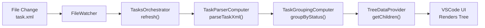
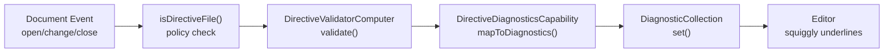
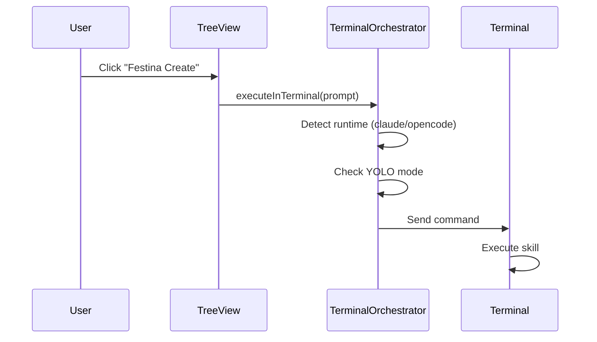

# VSCode Extension

> **TL;DR:** IDE integration with tree views, file watchers, diagnostics, and terminal execution

## Overview

The VSCode extension provides a visual interface for Festina Lente task management. It uses 7 domain orchestrators (tasks, quicks, projects, docs, config, directives, terminal) that compose capabilities and computers following the DAG architecture.

**Why it exists:** Developers need visual task management within their IDE. The extension provides tree views, CodeLens, directive diagnostics, and one-click command execution without leaving VSCode.

**Summary:** Extension → Orchestrators → Capabilities/Computers → TreeViews + Terminal + Diagnostics

## Components

| Component | Purpose | File |
|-----------|---------|------|
| Extension | Entry point, wires orchestrators | `extension.ts` |
| TerminalOrchestrator | Runtime selection, command execution | `orchestrators/terminal.orchestrator.ts` |
| TasksOrchestrator | Task view, refresh, actions | `orchestrators/tasks.orchestrator.ts` |
| QuicksOrchestrator | Quick task view | `orchestrators/quicks.orchestrator.ts` |
| DocsOrchestrator | Product/engineering docs view | `orchestrators/docs.orchestrator.ts` |
| ConfigOrchestrator | Config panel | `orchestrators/config.orchestrator.ts` |
| DirectivesOrchestrator | Directives view + diagnostics | `orchestrators/directives.orchestrator.ts` |
| ProjectsOrchestrator | Projects view | `orchestrators/projects.orchestrator.ts` |
| TasksViewCapability | TreeDataProvider for tasks | `capabilities/tasks-view.capability.ts` |
| QuicksViewCapability | TreeDataProvider for quick tasks | `capabilities/quicks-view.capability.ts` |
| DocsViewCapability | TreeDataProvider for docs | `capabilities/docs-view.capability.ts` |
| ConfigViewCapability | TreeDataProvider for config | `capabilities/config-view.capability.ts` |
| DirectivesViewCapability | TreeDataProvider for directives | `capabilities/directives-view.capability.ts` |
| ProjectsViewCapability | TreeDataProvider for projects | `capabilities/projects-view.capability.ts` |
| FileSystemCapability | File I/O (VSCode API) | `capabilities/file-system.capability.ts` |
| TerminalCapability | Terminal execution | `capabilities/terminal.capability.ts` |
| CodeLensCapability | CodeLens for task.xml | `capabilities/codelens.capability.ts` |
| PlanSymbolCapability | DocumentSymbolProvider for plan.xml | `capabilities/plan-symbol.capability.ts` |
| DirectiveDiagnosticsCapability | Maps validation errors to editor diagnostics | `capabilities/directive-diagnostics.capability.ts` |
| ClaudeSettingsCapability | Claude settings integration | `capabilities/claude-settings.capability.ts` |
| TaskParserComputer | Parse XML to Task objects | `computers/task-parser.computer.ts` |
| TaskActionsComputer | Generate available actions | `computers/task-actions.computer.ts` |
| TaskGroupingComputer | Group tasks by status | `computers/task-grouping.computer.ts` |
| QuickParserComputer | Parse quick.xml files | `computers/quick-parser.computer.ts` |
| PlanParserComputer | Parse plan.xml | `computers/plan-parser.computer.ts` |
| DirectiveValidatorComputer | Validate directive XML, return errors with element context | `computers/directive-validator.computer.ts` |
| DirectivesConfigComputer | Parse directives configuration | `computers/directives-config.computer.ts` |
| ClaudeSettingsComputer | Parse Claude settings files | `computers/claude-settings.computer.ts` |
| ProjectParserComputer | Parse project.xml files | `computers/project-parser.computer.ts` |

**Summary:** 7 orchestrators, 12 capabilities, 9 computers.

## Key Patterns

This system follows these patterns from `patterns/`:

- [dag-architecture](../patterns/dag-architecture.md) - Orchestrators compose capabilities/computers
- [factory-di](../patterns/factory-di.md) - Each orchestrator uses `create*Orchestrator(deps)`

## Architecture

```mermaid
flowchart TB
    subgraph Extension["extension.ts"]
        ACT["activate()"]
    end

    subgraph Orchestrators["Domain Orchestrators"]
        TERM["TerminalOrch"]
        TASKS["TasksOrch"]
        QUICKS["QuicksOrch"]
        PROJS["ProjectsOrch"]
        DOCS["DocsOrch"]
        CONFIG["ConfigOrch"]
        DIRS["DirectivesOrch"]
    end

    subgraph Capabilities["Capabilities"]
        FS["FileSystem"]
        TV["TasksView"]
        QV["QuicksView"]
        PV["ProjectsView"]
        DOV["DocsView"]
        COV["ConfigView"]
        DIV["DirectivesView"]
        TER["Terminal"]
        CL["CodeLens"]
        PS["PlanSymbol"]
        DD["DirectiveDiagnostics"]
        CS["ClaudeSettings"]
    end

    subgraph Computers["Computers"]
        TP["TaskParser"]
        TA["TaskActions"]
        TG["TaskGrouping"]
        QP["QuickParser"]
        PRP["ProjectParser"]
        PP["PlanParser"]
        DV["DirectiveValidator"]
        DC["DirectivesConfig"]
        CSC["ClaudeSettingsComp"]
    end

    ACT --> Orchestrators
    TASKS --> TV
    TASKS --> TP
    TASKS --> TA
    TASKS --> TG
    TASKS --> CL
    TASKS --> PS
    QUICKS --> QV
    QUICKS --> QP
    PROJS --> PV
    PROJS --> PRP
    DOCS --> DOV
    CONFIG --> COV
    CONFIG --> CS
    CONFIG --> CSC
    TERM --> TER
    DIRS --> DIV
    DIRS --> DV
    DIRS --> DD
    DIRS --> DC
    Orchestrators --> FS
```

The extension activates, finds `.festinalente/` folder, creates orchestrators with shared capabilities, and registers TreeViews, commands, file watchers, and diagnostic collections.

## Data Flow

1. File change detected by watcher
2. Orchestrator triggers refresh
3. Computers parse and group tasks
4. TreeDataProvider returns tree items
5. VSCode re-renders the view

## Directive Diagnostics Flow

1. Document open, change, or close event fires
2. `isDirectiveFile()` filters to directive XML files only
3. DirectiveValidatorComputer validates XML structure (missing attributes, invalid phases, duplicate IDs, etc.)
4. DirectiveDiagnosticsCapability maps errors to `vscode.Diagnostic[]` with line-level positioning via `findLineForElement()`
5. DiagnosticCollection updates editor with inline warnings/errors
6. Document close clears diagnostics for that file

Events are debounced at 300ms. Open directive files are validated on orchestrator creation.

## Terminal Execution Flow

## Interactions

| System | Relationship | Notes |
|--------|--------------|-------|
| [cli](../cli/_index.md) | Spawns via terminal | Terminal executes `claude` or `opencode` commands |
| [data-model](../data-model/_index.md) | Watches and reads files | Monitors `.festinalente/` for changes |

**Summary:** Extension watches data-model files, spawns CLI for mutations.

## Boundaries

What this system does NOT handle:

- **Does NOT:** Execute CLI logic directly → Spawns terminal
- **Does NOT:** Define workflow → See [data-model](../data-model/_index.md)
- **Does NOT:** Parse skill definitions → See [content-build](../content-build/_index.md)

## Configuration

| Setting | Description | Default |
|---------|-------------|---------|
| `festinalente.runtime` | AI runtime selection | claude |

Settings in `claude.json`:
| Setting | Description | Default |
|---------|-------------|---------|
| `dangerouslyAllowYolo` | Enable --dangerously-skip-permissions | false |

## Extension Points

### Adding a new TreeView

**Template:** Copy `orchestrators/quicks.orchestrator.ts` as starting point.

**Checklist:**
- [ ] Create `orchestrators/{name}.orchestrator.ts`
- [ ] Create `capabilities/{name}-view.capability.ts` implementing TreeDataProvider
- [ ] Create `computers/{name}-parser.computer.ts` if needed
- [ ] Register TreeView in `extension.ts` with `vscode.window.createTreeView()`
- [ ] Add view to `package.json` contributes.views

**Pitfalls:**
- Forgetting to dispose file watchers
- Not refreshing view on file changes
- Missing view registration in package.json
