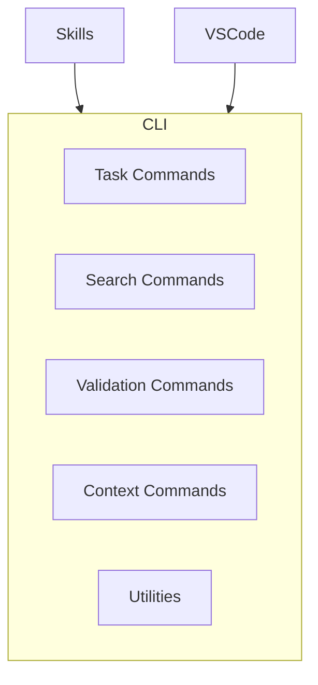

# CLI

> **TL;DR:** Node.js command-line utilities for task management, search, and validation

## Overview

The CLI domain provides `node .festinalente/scripts/festinalente.cjs` - the core utility script that powers all Festina Lente operations. Skills and VSCode invoke these commands for consistent task/doc handling.

**Why it exists:** Centralized, reliable file operations that skills can call without guessing paths.

**Summary:** CLI provides the infrastructure that skills and VSCode build upon.

## Command Categories

## Boundaries

This domain does NOT include AI-assisted workflows. For that, see [skills](../skills/_index.md).

- **Does NOT:** Make decisions or ask questions (pure utilities)
- **Does NOT:** Provide UI (see vscode domain)
- **See instead:** [skills/_index](../skills/_index.md) for interactive workflows

## Command Groups

| Group | Commands | Purpose |
|-------|----------|---------|
| Tasks | list-tasks, find-task, next-id, delete-task | Task CRUD operations |
| Specs/Plans | find-spec, find-plan, get-plan-task | Spec and plan retrieval |
| Quicks | find-quick, next-quick-id | Quick task operations |
| Search | search-product, search-engineering, search-hybrid | Documentation discovery |
| Validation | validate-xml, validate-yaml, validate-directive, validate-docs | Quality checks |
| Context | select-context, expand-query | Smart context selection |
| Config | get-skill-config, get-date-time | Configuration access |

**Summary:** CLI provides ~20 commands across 7 functional groups.

## Key Concepts

- **JSON Output**: All commands return structured JSON for easy parsing
- **ID Resolution**: Commands handle ID-to-path mapping (e.g., `auth/login` → `.festinalente/product/auth/login.md`)
- **Prefix Resolution**: Task commands accept numeric prefixes (e.g., `001`) and resolve them to the matching full task folder ID, so callers don't need to know the full directory name
- **Hybrid Search**: Combines exact keyword matching with fuzzy search and boundary penalties

## Relationships

| Related Domain | Relationship |
|----------------|--------------|
| [skills](../skills/_index.md) | Skills invoke CLI commands for all persistence |
| [vscode](../vscode/_index.md) | VSCode invokes CLI for tree view data |

**Summary:** CLI is the foundation layer that all other domains depend on.
