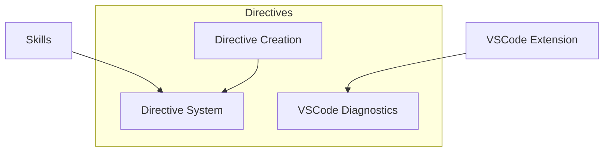

# Directives

> **TL;DR:** User-defined rules that customize skill behavior per workflow phase

## Overview

The Directives domain provides a system for defining custom rules that modify how skills behave. Each directive is an XML file containing context principles, phase-specific process rules, validation checks, and examples. Directives are loaded dynamically by skills and enforced during execution.

**Why it exists:** Different projects have different standards. Directives let you codify your team's conventions without modifying skill source code.

**Summary:** Directives are the configuration layer between your project's standards and Festina Lente's workflows.

## Domain Structure

## Boundaries

This domain does NOT include the skill workflow logic. For that, see [skills](../skills/_index.md).

- **Does NOT:** Define the skill process steps (only modifies them)
- **Does NOT:** Replace CLI commands (see cli domain)
- **See instead:** [skills/_index](../skills/_index.md) for workflow details

## Features

| Feature | Description | Status |
|---------|-------------|--------|
| [system](./system.md) | Directive XML format, loading, and enforcement | stable |
| [creation](./creation.md) | /festina-directive skill for creating directives | stable |
| [diagnostics](./diagnostics.md) | Real-time VSCode validation of directive files | stable |

**Summary:** This domain contains 3 features covering directive authoring, enforcement, and IDE support.

## Key Concepts

- **Context Principles**: Ongoing mindset rules the LLM maintains throughout a phase
- **Process Rules**: Phase-specific requirements (e.g., `phase="implement"` rules only apply during implementation)
- **Validation Checks**: Automated checks (commands, patterns, checklists) run per-task during implementation and during final directive compliance
- **Overrides**: Directives can skip and replace skill steps entirely
- **Skill Mapping**: Directives are linked to skills via `.festinalente/config.yaml`

## Relationships

| Related Domain | Relationship |
|----------------|--------------|
| [skills](../skills/_index.md) | Skills load and enforce directives during execution |
| [cli](../cli/_index.md) | CLI provides validate-directive and get-skill-config commands |
| [vscode](../vscode/_index.md) | VSCode shows directive tree and provides real-time diagnostics |

**Summary:** Directives are authored, enforced by skills, validated by CLI, and visualized in VSCode.
