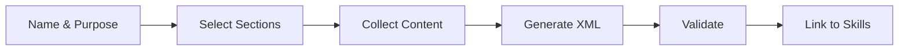

# Create Directive

> **TL;DR:** Conversational Q&A skill to define rules, validation, and examples as XML

## Overview

The `/festina-directive` skill creates a new directive through structured Q&A. It walks you through defining the directive's purpose, selecting sections (context, process, validation, examples), collecting content for each section, generating valid XML, and linking the directive to skills via config.yaml.

**Why it exists:** Writing directive XML manually is tedious and error-prone. This skill ensures valid, well-structured output.

**Summary:** Interactive directive authoring with automatic validation and skill linking.

## How It Works



1. **Name** the directive (lowercase, hyphenated)
2. **Understand purpose** — what problem it solves, which phases apply
3. **Select sections** — context, process, validation, examples (multi-select)
4. **Collect content** — Q&A for each selected section with principles, rules, checks, examples
5. **Generate XML** — Write to `.festinalente/directives/{name}.xml`
6. **Validate** — Run `validate-directive` CLI command
7. **Link to skills** — Update `.festinalente/config.yaml`

**Summary:** From conversation to validated, linked directive in one workflow.

## Examples

### Creating a Code Style Directive

```
/festina-directive code-style

What is this directive for?
> Enforce consistent code formatting and naming conventions

Which phases? > implement, check

Which sections?
[x] Context  [x] Validation  [x] Examples

What principles should the LLM keep in mind?
> Use descriptive variable names, prefer const over let

What checks should run?
> pnpm lint (command), no unnecessary let (pattern)

Directive created: .festinalente/directives/code-style.xml
Linked to: festina-implement, festina-check
```

## Boundaries

What this skill does NOT do:

- **Does NOT:** Edit existing directives (edit the XML directly)
- **Does NOT:** Auto-detect what rules you need
- **Does NOT:** Remove directives from config.yaml

## Interactions

- **Directive System**: Creates files that the system loads
- **CLI**: Uses `validate-directive` to verify XML structure
- **Config**: Updates `config.yaml` to link directive to skills

## Limitations

- Cannot overwrite existing directives (must delete first)
- Directive name must be lowercase alphanumeric with hyphens
