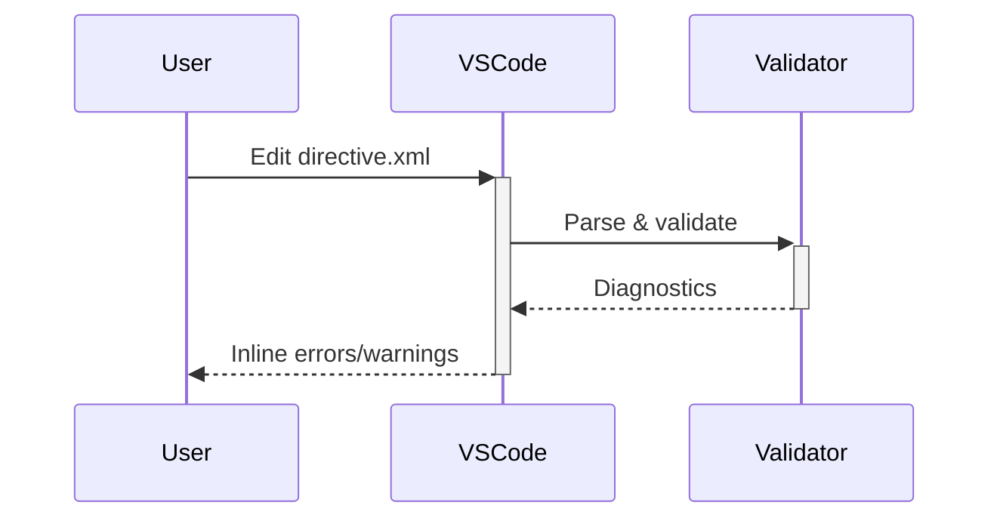

# Directive Diagnostics

> **TL;DR:** Real-time VSCode validation of directive XML files with inline error highlighting

## Overview

The VSCode extension provides real-time diagnostics for directive XML files in `.festinalente/directives/`. As you edit a directive, the extension validates its structure and shows errors/warnings inline — similar to how TypeScript shows type errors.

**Why it exists:** Catch directive errors immediately in the editor rather than at skill runtime.

**Summary:** IDE-level feedback for directive authoring.

## How It Works



1. **File watcher** monitors `.festinalente/directives/*.xml`
2. **On change**, the directive validator computer parses the XML
3. **Diagnostics** are generated for structural issues
4. **Inline display** shows errors/warnings at the relevant lines

**Summary:** Automatic validation on every save with inline feedback.

### What Gets Validated

- XML well-formedness
- Required attributes (id, phase on rules; id, type, severity on checks)
- Valid phase values in process rules
- Directive structure (description, valid section names)

## Examples

### Error: Missing Phase Attribute

```xml
<!-- Red underline on this line -->
<rule id="P1">Must specify a phase</rule>
```

Diagnostic: `Rule P1 is missing required 'phase' attribute`

## Boundaries

What this feature does NOT do:

- **Does NOT:** Validate regex patterns in `<forbidden>` elements
- **Does NOT:** Test that validation commands actually pass
- **Does NOT:** Check config.yaml mapping

## Interactions

- **Directive System**: Validates the same XML format that skills consume
- **VSCode Extension**: Integrated into the extension's diagnostics infrastructure
- **Directives TreeView**: Shows directives in the sidebar alongside diagnostics

## Limitations

- Only validates `.festinalente/directives/*.xml` files
- Structural validation only — cannot detect semantic errors
