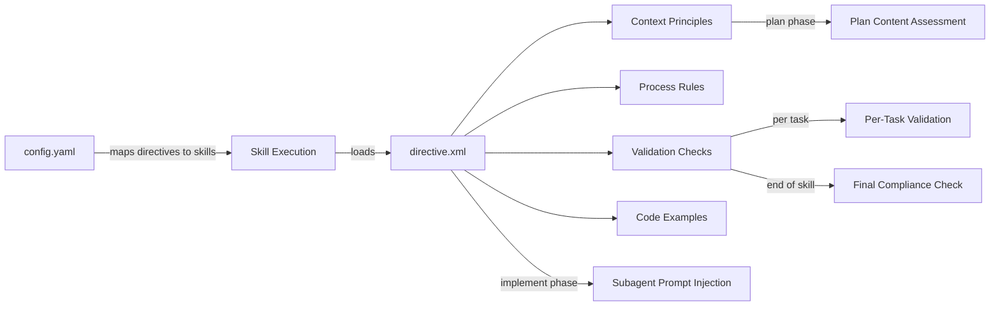

# Directive System

> **TL;DR:** XML-based rule sets loaded by skills to enforce project-specific standards

## Overview

The directive system lets you define project-specific rules as XML files in `.festinalente/directives/`. Skills load relevant directives during their `load_directives` step and enforce them throughout execution. Each directive has four optional sections: context, process, validation, and examples.

**Why it exists:** To codify project conventions (architecture, testing, security) so the LLM follows them consistently.

**Summary:** Directives are the bridge between your project standards and AI-assisted workflows.

## How It Works



1. Skill calls `get-skill-config {skill-name}` to discover mapped directives
2. For each directive, skill reads the XML file
3. Context principles are maintained as ongoing mindset
4. Process rules are applied when the phase matches
5. **Plan content assessment** - During `validate_plan`, task actions/patterns/rationale are checked against `phase="plan"` directive principles. Violations are flagged as WARNINGs
6. **Subagent prompt injection** - During implementation, full directive XML is included in each subagent's prompt so subagents have directive context
7. **Per-task validation** - After each subagent completes, validation checks (commands, patterns, checklists) run scoped to the current task's files before marking the task complete. Violations prompt the user with Fix now / Continue anyway
8. **Final compliance** - Validation checks run during the `directive_compliance` step at end of skill
9. Examples are shown when violations are found

**Summary:** Skills dynamically load and enforce directives based on config mapping.

### Directive XML Structure

```xml
<?xml version="1.0" encoding="UTF-8"?>
<directive name="coding" version="1"
           created="2026-01-01" updated="2026-01-15">
  <description>Brief purpose</description>

  <context>
    <principle id="C1" keywords="naming,style">
      Rule the LLM keeps in mind
    </principle>
  </context>

  <process>
    <rule id="P1" phase="implement">
      Phase-specific requirement
    </rule>
  </process>

  <validation>
    <check id="V1" type="command" severity="error">
      <run>pnpm build</run>
      <expect>Exit code 0</expect>
    </check>
    <check id="V2" type="pattern" severity="error" files="**/*.ts">
      <forbidden>: any\b</forbidden>
      <reason>Use unknown and narrow</reason>
    </check>
  </validation>

  <examples>
    <example ref="C1" type="combined">
      <code><![CDATA[// WRONG - ...
// CORRECT - ...]]></code>
    </example>
  </examples>
</directive>
```

### Skill Mapping

Directives are linked to skills in `.festinalente/config.yaml`:

```yaml
directives:
  festina-scope: [coding]
  festina-plan: [coding]
  festina-implement: [coding, git]
  festina-finalize: [coding, git, github]
  festina-map-product: [github]
  festina-map-engineering: [github]
```

### Phase Matching

Process rules use a `phase` attribute that can be comma-separated:

```xml
<rule id="P1" phase="plan,implement">Applies to both phases</rule>
```

### Overrides

Directives can replace entire skill steps:

```xml
<override phase="finalize" reason="Custom git workflow">
  <skip>commit_changes</skip>
  <instead>
    <rule>Use conventional commits format</rule>
  </instead>
</override>
```

## Boundaries

What this feature does NOT do:

- **Does NOT:** Define the skill process (only modifies it)
- **Does NOT:** Run automatically without being mapped in config.yaml
- **Does NOT:** Override other directives (they compose additively)

## Configuration

| Setting | Description | Default |
|---------|-------------|---------|
| Directive path | `.festinalente/directives/{name}.xml` | N/A |
| Config mapping | `.festinalente/config.yaml` `directives:` section | Empty |

## Interactions

- **Skills**: Load directives during `load_directives` step, enforce via plan content assessment, per-task validation, and final `directive_compliance`
- **CLI**: `validate-directive` checks XML structure; `get-skill-config` returns mapped directives
- **VSCode**: Shows directives in sidebar TreeView; provides real-time diagnostics

## Limitations

- Directives only apply to skills they're mapped to in config.yaml
- Process rules only fire when the current phase matches
- Per-task validation is scoped to the current task's files, not the full project
