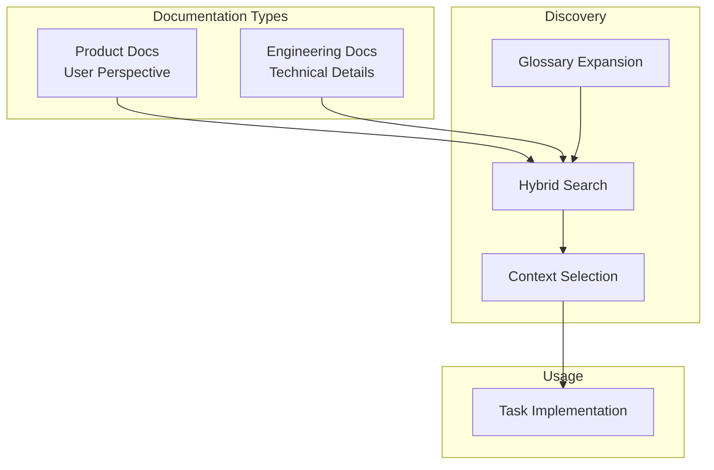

# Documentation

> **TL;DR:** Product and engineering documentation with smart search for Claude context

## Overview

The Documentation domain manages two types of docs that provide context for Claude during task implementation:

- **Product docs** (.kanban/product/): User-facing feature documentation—what features do, how they work, boundaries
- **Engineering docs** (.kanban/engineering/): Technical patterns, systems, and conventions—how to build things correctly

The primary purpose is providing context for Claude, enabling accurate implementation that follows established patterns.

**Why it exists:** Claude needs to understand existing features and patterns before implementing tasks.

**Summary:** This domain provides structured documentation and smart search for AI-assisted development.

## Boundaries

This domain does NOT manage task files or workflow states. For that, see [tasks](../tasks/_index.md).

- **Does NOT:** Create or manage task.xml, spec.xml, plan.xml
- **Does NOT:** Run code validation (that's validation domain)
- **Does NOT:** Render documentation in a UI
- **See instead:** [tasks](../tasks/_index.md) for task management

## Features

| Feature | Description | Status |
|---------|-------------|--------|
| [product](./product.md) | User-facing feature documentation | stable |
| [engineering](./engineering.md) | Technical patterns and systems | stable |
| [search](./search.md) | Fuzzy search with glossary expansion | stable |
| [context-selection](./context-selection.md) | Tiered context loading for tasks | stable |
| [freshness](./freshness.md) | Staleness detection for outdated docs | stable |

**Summary:** This domain contains 5 features covering documentation and discovery.

## Key Concepts

- **Product doc**: Markdown with frontmatter describing a feature from user perspective
- **Engineering doc**: Markdown with frontmatter describing a pattern/system from technical perspective
- **Boundary**: What a doc does NOT cover—prevents false search matches
- **Glossary**: Project-specific terms and aliases for better search

## Relationships

| Related Domain | Relationship |
|----------------|--------------|
| [tasks](../tasks/_index.md) | Tasks link to docs via `affects` and `engineering` fields |
| [validation](../validation/_index.md) | Doc quality validated by validate-docs script |

**Summary:** This domain primarily provides context to the tasks domain.
