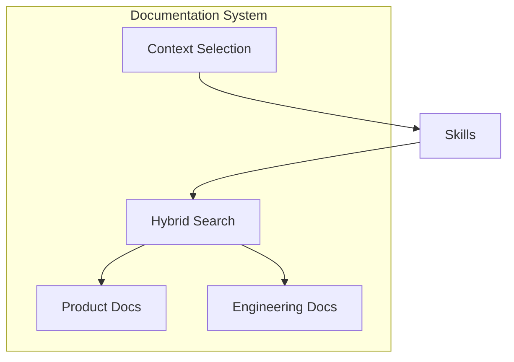

# Documentation System

> **TL;DR:** Product and engineering docs with smart search and context selection

## Overview

The docs domain provides two parallel documentation systems: product docs (user-facing features) and engineering docs (technical patterns/systems). Both use YAML frontmatter for metadata and support hybrid search with boundary-aware scoring.

**Why it exists:** Give AI context about the codebase without overwhelming token budgets.

**Summary:** Docs enable smart context selection so skills know what they're working with.

## Documentation Architecture



## Boundaries

This domain does NOT include task management. For that, see [skills](../skills/_index.md).

- **Does NOT:** Manage task.xml, spec.xml, or plan.xml files
- **Does NOT:** Handle glossary updates (done by finalize skill)
- **See instead:** [skills/_index](../skills/_index.md) for task workflows

## Documentation Types

| Type | Location | Purpose |
|------|----------|---------|
| Product | `.festinalente/product/` | User-facing feature documentation |
| Engineering | `.festinalente/engineering/` | Technical patterns, systems, conventions |
| Glossary | `.festinalente/glossary.yaml` | Project terminology for search expansion |

**Summary:** Two doc types plus glossary for comprehensive coverage.

## Key Concepts

- **Frontmatter**: YAML header with id, title, tldr, summary, keywords, boundary, related
- **Boundary Field**: Documents what a doc does NOT cover to reduce false search matches
- **Hybrid Search**: Exact keyword (0.3 weight) + fuzzy title/body (configurable) - boundary penalty (0.15)
- **Context Tiers**: minimal (~50 tokens), standard (~200 tokens), full (~500-1000 tokens)

## Frontmatter Example

```yaml
---
id: auth/login
title: "User Login"
type: feature
tldr: "JWT-based authentication with email/password"
summary: "Login flow validates credentials and returns JWT tokens"
keywords: [auth, login, jwt, authentication]
boundary: "Does not cover registration or password reset"
references: []
uses: []
updated: 2026-03-01
---
```

## Relationships

| Related Domain | Relationship |
|----------------|--------------|
| [cli](../cli/_index.md) | Search and context selection via CLI commands |
| [skills](../skills/_index.md) | Skills use docs for task context |

**Summary:** Docs provide the knowledge base that skills consume during implementation.
