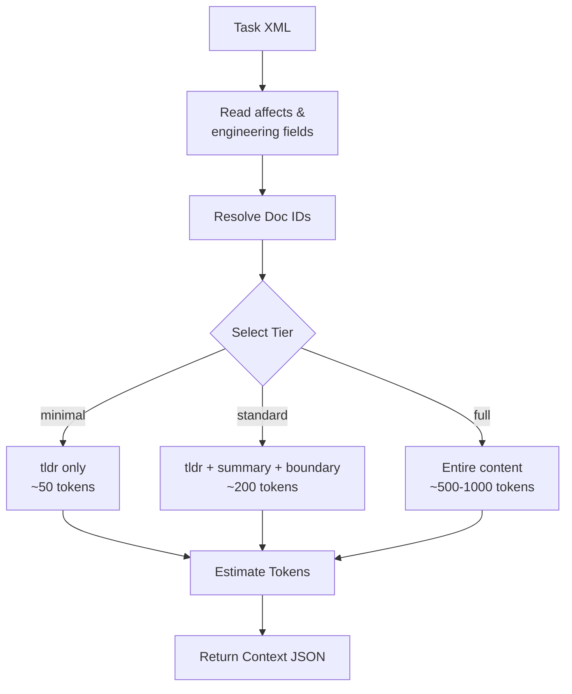

# Context Selection

> **TL;DR:** Tiered loading of relevant docs for task implementation

## Overview

Context Selection provides Claude with relevant documentation during task implementation. Instead of loading entire docs (which wastes tokens), it uses a tiered approach: minimal (tldr only), standard (tldr + summary + boundary), or full (entire content). Docs are selected based on task's `affects` and `engineering` fields plus related doc discovery.

**Summary:** Token-efficient context loading for AI implementation.

## How It Works



1. Read task's `affects` and `engineering` fields
2. Resolve doc IDs to file paths
3. Load docs at requested tier:
   - **Minimal** (~50 tokens): Only `tldr` field
   - **Standard** (~200 tokens): `tldr` + `summary` + `boundary`
   - **Full** (~500-1000 tokens): Entire doc content
4. Return docs with token estimates
5. Claude uses context during implementation

### Key Workflows

**Implementation context:**
```bash
node .festinalente/scripts/select-context.cjs 001 --tier=standard --max=5
```
- Loads up to 5 docs at standard tier
- Returns JSON with doc content and token estimates

**Complex task context:**
- Start with standard tier for all docs
- Upgrade to full tier for most relevant 2 docs

**Summary:** Tiered loading with configurable limits.

## Task-Level Context Blocks

Plan.xml tasks can include explicit `<context>` blocks that specify files needed for that task:

```xml
<task id="1">
  <name>Add validation to auth routes</name>
  <context>
    <file path="src/routes/auth.ts" />
    <file path="src/utils/validation.ts" />
  </context>
  <action>Add input validation</action>
</task>
```

When subagents execute tasks, the `<context>` block provides:
- **Explicit file paths** the subagent should read
- **Focused scope** so subagent loads only relevant code
- **Token efficiency** by avoiding broad codebase scanning

The orchestrator parses these context blocks and passes them to subagents, ensuring each subagent starts with exactly the files it needs rather than searching the codebase.

**Summary:** Task-level context enables precise file loading for subagent execution.

## Examples

### Typical Usage

```bash
# Standard context for task 001
node .festinalente/scripts/select-context.cjs 001 --tier=standard --max=5

# Output:
# {
#   "task": "001",
#   "tier": "standard",
#   "docs": [
#     {
#       "id": "auth/login",
#       "type": "product",
#       "content": "**TL;DR:** Email/password auth...\n**Summary:** Handles login...\n**Boundary:** Does NOT handle...",
#       "tokens": 180
#     }
#   ],
#   "totalTokens": 450
# }
```

**Summary:** JSON output with content and token estimates.

## Boundaries

What this feature does NOT do:

- **Does NOT:** Always load full docs (uses tiers for efficiency)
- **Does NOT:** Search for docs (uses task's linked docs)
- **Does NOT:** Modify docs (read-only)

## Configuration

| Setting | Description | Default |
|---------|-------------|---------|
| --tier | Context detail level | standard |
| --max | Maximum docs to load | 5 |

## Interactions

- **Tasks**: Reads `affects` and `engineering` fields
- **Implementation**: Provides context during coding
- **Subagents**: Context blocks passed to spawned subagents
- **Freshness**: Can be combined with freshness check

## Limitations

- Token estimates are approximate (~1 token per 4 chars)
- Full tier can use significant context window
- Docs not linked in task won't be loaded
