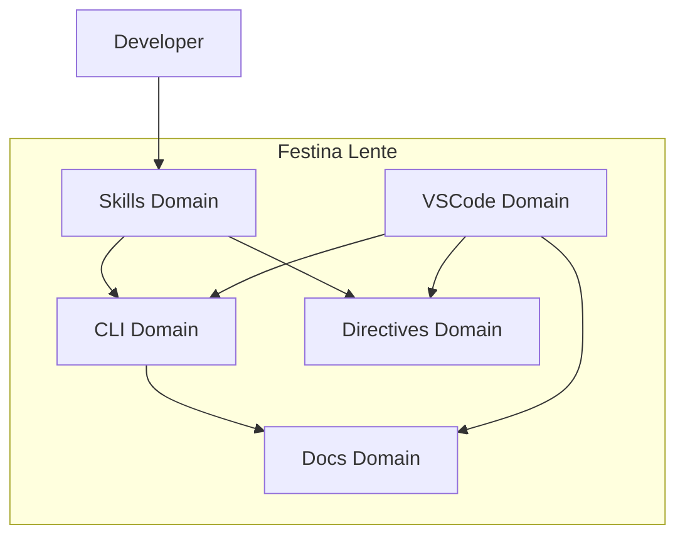

# Festina Lente

> **TL;DR:** Structured AI-assisted development - make haste slowly with LLMs

## What is this?

Festina Lente ("Make Haste Slowly") is a spec-driven task management system that brings deliberate structure to LLM-assisted development. It helps developers harness AI speed while maintaining code quality through structured workflows, functional specifications, and implementation plans.

**Summary:** Festina Lente ensures AI-generated code is thoughtful and well-structured, not "AI slop."

## Key Capabilities

- **Skills**: AI-assisted workflows that guide you through task creation, scoping, planning, and implementation
- **CLI**: Node.js commands for task management, documentation search, and validation
- **VSCode Extension**: Visual kanban board with inline actions and documentation navigation
- **Documentation System**: Product and engineering docs with smart search and context selection
- **Directives**: User-defined rules that customize skill behavior per workflow phase

**Summary:** The product provides 5 core capability domains for structured AI development.

## Product Architecture

## Target Users

- **Developers using Claude Code**: Primary users who want structured AI-assisted development
- **Teams adopting AI tooling**: Groups wanting consistent quality from LLM-generated code

**Summary:** Primary users are developers who want AI speed without sacrificing code quality.

## Boundaries

What this product does NOT cover:

- **Does NOT:** Replace your IDE or editor setup
- **Does NOT:** Manage git workflows outside the task lifecycle
- **Does NOT:** Provide general coding best practices
- **See instead:** Your team's engineering conventions
