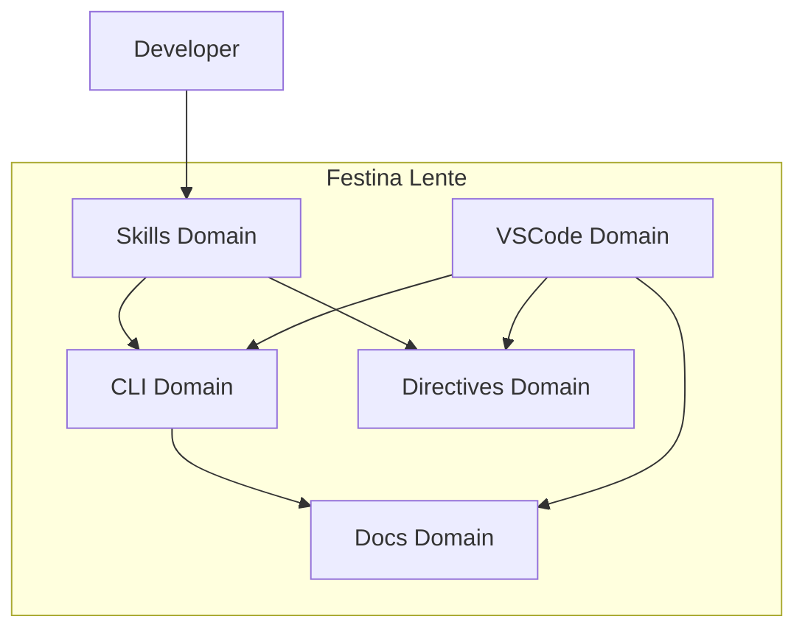
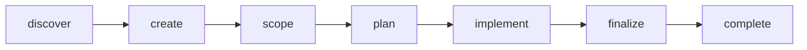

# Festina Lente

> **TL;DR:** Structured AI-assisted development - make haste slowly with LLMs

## What is this?

Festina Lente ("Make Haste Slowly") is a spec-driven task management system that brings deliberate structure to LLM-assisted development. It helps developers harness AI speed while maintaining code quality through structured workflows, functional specifications, and implementation plans.

**Summary:** Festina Lente ensures AI-generated code is thoughtful and well-structured, not "AI slop."

## Key Capabilities

- **Skills**: AI-assisted workflows that guide you through task creation, scoping, planning, and implementation
- **Projects**: Lightweight grouping layer that decomposes multi-task work into vertically-sliced tasks with requirement traceability
- **CLI**: Node.js commands for task management, documentation search, and validation
- **VSCode Extension**: Visual kanban board with project progress tracking, inline actions, and documentation navigation
- **Documentation System**: Product and engineering docs with smart search and context selection
- **Directives**: User-defined rules that customize skill behavior per workflow phase

**Summary:** The product provides 5 core capability domains for structured AI development, with Projects as a cross-cutting grouping concept.

## Product Architecture



## Target Users

- **Developers using Claude Code**: Primary users who want structured AI-assisted development
- **Teams adopting AI tooling**: Groups wanting consistent quality from LLM-generated code

**Summary:** Primary users are developers who want AI speed without sacrificing code quality.

## Getting Started: Full Task Lifecycle

Here's a complete example of taking a task from discovery through completion. Each step shows the skill invocation, key input/output, and what happens next.



### 1. Discover an opportunity

```
/festina-discover

Launching 4 lens agents...
[User Lens] Analyzing user-facing pain points...
[Product Lens] Finding documentation gaps...
[Engineering Lens] Detecting tech debt...
[Backlog Lens] Checking existing task coverage...

Synthesized opportunities:
1. ⭐ Login error messages are generic "Invalid credentials" — users can't tell
   if it's wrong email or wrong password
   Source: User + Product lenses | Confidence: High

Create a task from this? > Yes, opportunity #1
```

### 2. Create the task

```
/festina-create Improve login error messages

Auto-detected label: feature
Related product docs: auth/login (score: 0.72)

I understand the problem as: Login currently shows a generic error
for all failure cases. Users need specific feedback to fix their input.
Is this accurate? > Yes

Acceptance criteria (5-category probing):
✓ Happy path: Valid login still works normally
✓ Error states: Wrong email → "No account found", Wrong password → "Incorrect password"
✓ Edge cases: Empty fields → inline validation before submit
✓ Backwards compat: API response shape unchanged (new error codes only)
✓ Integration: Rate limiting still applies to failed attempts

Task 005 created in Backlog
Next: /festina-scope 005
```

### 3. Scope the task

```
/festina-scope 005

Running reconnaissance...
Read: product/auth/login.md, engineering/patterns/error-handling.md
Focus: Single module, clear patterns → Quick research

Researching...
Found: src/auth/login.ts, src/auth/errors.ts

Pitfalls (FYI): Specific error messages can leak account existence.
Mitigation: Rate-limit enumeration attempts. > Acknowledged

Functional requirements:
FR1: Wrong email returns "No account found with that email"
FR2: Wrong password returns "Incorrect password"
FR3: Empty fields show inline validation errors
FR4: API response includes error_code field alongside message

Gap validation... ✓ No issues
Self-critique... ✓ All requirements testable
Leakage check... ✓ No implementation prescriptions

Spec created: .festinalente/tasks/005/spec.xml
Task 005 moved to Scoped
Next: /festina-plan 005
```

### 4. Plan the implementation

```
/festina-plan 005

Reading spec: 4 functional requirements, 2 files affected
Complexity: simple

Plan created: .festinalente/tasks/005/plan.xml
- 3 implementation steps:
  1. Add error code enum to src/auth/errors.ts
  2. Update login handler to return specific errors
  3. Add client-side field validation

Task 005 moved to Planned
Next: /festina-implement 005
```

### 5. Implement the plan

```
/festina-implement 005

Reading plan: 3 tasks, 0 completed

[1/3] Add error code enum ✓
[2/3] Update login handler ✓
[3/3] Add field validation ✓

Quality checks:
✓ Anti-pattern scan: No TODOs or FIXMEs
✓ Requirement trace: All FRs implemented
✓ Wiring: New enum imported in handler

All tasks complete. Task 005 moved to Finalize
Next: /festina-finalize 005
```

### 6. Finalize the task

```
/festina-finalize 005

PHASE 1: VALIDATE
Running check: TypeScript... PASS
Running check: Oxlint... PASS
Spec compliance review... ✓ All FRs addressed
Goal verification:
  AC1: Wrong email shows specific message > YES ✓
  AC2: Wrong password shows specific message > YES ✓
  AC3: Empty fields validate inline > YES ✓

PHASE 2: DOCUMENTATION
Product Docs: Will UPDATE auth/login
✓ Product Docs Agent completed

PHASE 3: TRANSITION
Committed: feat(#42): improve login error messages
PR #43 created
Task 005 moved to Awaiting Completion

Next: /festina-complete 005 (after PR approval)
```

### 7. Complete the task

```
/festina-complete 005

PR #43: approved, mergeable
Merge now? > Yes

Squash merged via GitHub
Issue #42 auto-closed
Local branch cleaned up

Task 005 done! ✓
```

### Quick Path Alternative

For simple fixes (typos, config changes), skip the full workflow:

```
/festina-quick Fix typo in README header

What's the problem? > "Conifguration" should be "Configuration"
What does done look like? > The word is spelled correctly

Fixing... ✓
PR #44 created and merged

Done! ✓
```

## Boundaries

What this product does NOT cover:

- **Does NOT:** Replace your IDE or editor setup
- **Does NOT:** Manage git workflows outside the task lifecycle
- **Does NOT:** Provide general coding best practices
- **See instead:** Your team's engineering conventions
