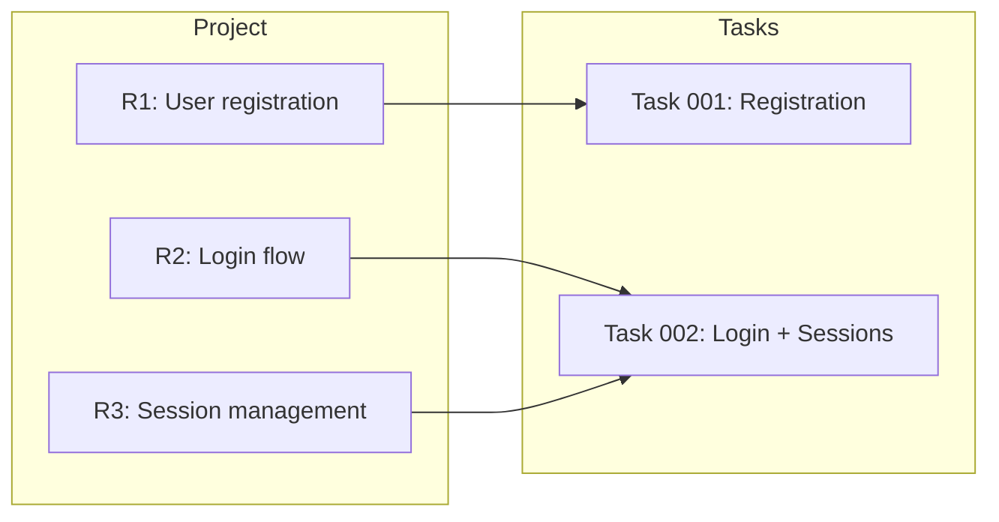

# Requirement Traceability

> **TL;DR:** R1-Rn requirements map from project to tasks ensuring full coverage

## Overview

When a project is decomposed into tasks, each requirement (R1-Rn) must map to at least one task. This traceability ensures nothing falls through the cracks — every requirement has an owner, and every task knows which requirements it's responsible for.

**Why it exists:** Without traceability, decomposition creates orphaned requirements — work that was identified as necessary but never assigned to anyone. The mapping makes coverage gaps visible immediately.

**Summary:** Requirement traceability links project-level "what" to task-level "how."

## How It Works



### Requirement Format

Requirements are numbered sequentially in `project.xml`:

```xml
<requirements>
  <requirement id="R1">Users can register with email and password</requirement>
  <requirement id="R2">Users can log in with valid credentials</requirement>
  <requirement id="R3">Sessions persist across browser refreshes</requirement>
</requirements>
```

Each requirement must be:
- **Independently testable** — can be verified in isolation
- **User-facing** — describes observable behavior, not implementation
- **Specific** — no ambiguity about what "done" means

### Task-to-Requirement Mapping

Each decomposed task carries two attributes linking it back to the project:

```xml
<task id="001-add-registration" status="backlog"
      project-id="P001-user-auth"
      project-requirements="R1">
```

- `project-id` — Which project this task belongs to
- `project-requirements` — Comma-separated list of R-ids this task covers (e.g., `"R1,R3"`)

### Coverage Rules

| Rule | Description |
|------|-------------|
| Every requirement must be mapped | No R-id can be left without a task |
| Tasks may share requirements | R1 can appear in multiple tasks if the work spans them |
| No scope overlap | Two tasks should not cover the same requirement unless explicitly justified |
| Coverage verified at creation | `/festina-create-project` shows a coverage matrix before confirming |
| Coverage verified at completion | `/festina-complete-project` checks all requirements are satisfied |

### Coverage Matrix

During project creation, the skill displays a coverage matrix:

```
Requirement Coverage:
- R1: Task #1 ✓    - R4: Task #1 ✓
- R2: Task #2 ✓    - R5: Task #2 ✓
- R3: Task #2 ✓
All requirements covered.
```

## Examples

### Querying Requirement Coverage

```bash
# Get tasks with their requirement mappings
node .festinalente/scripts/festinalente.cjs get-project-tasks P001
# → { "count": 2, "tasks": [
#     { "id": "001-registration", "requirements": ["R1"] },
#     { "id": "002-login-sessions", "requirements": ["R2", "R3"] }
#   ] }

# Get sibling tasks (from a task's perspective)
node .festinalente/scripts/festinalente.cjs get-project-siblings 001
# → { "projectTitle": "User Auth", "siblings": [
#     { "id": "002-login-sessions", "status": "backlog", "description": "..." }
#   ] }
```

### Sibling Context

During scoping, each task can see its siblings via `get-project-siblings`. This prevents tasks from accidentally overlapping or missing shared concerns. The scope skill uses this context to set clear boundaries between sibling tasks.

## Boundaries

- **Does NOT:** Enforce requirement quality — the create-project skill validates during Q&A
- **Does NOT:** Track requirement changes after creation — requirements are fixed once the project is created
- **Does NOT:** Replace task-level acceptance criteria — tasks have their own AC scoped to their specific work
