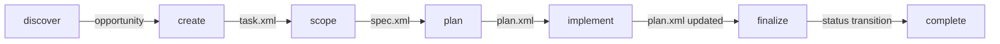

# Skills

> **TL;DR:** AI-assisted workflows that guide developers through structured task lifecycles

## Overview

The Skills domain provides the core AI-assisted workflows for Festina Lente. Each skill is a slash command (`/festina-*`) that guides developers through a specific phase of the task lifecycle using conversational Q&A, structured research, and subagent orchestration.

**Why it exists:** To bring deliberate structure to LLM-assisted development - making haste slowly.

**Summary:** Skills transform AI speed into quality output through structured workflows.

<!-- Tier 2 boundary: content above this line is loaded at standard tier -->

## Domain Structure

```mermaid
flowchart LR
    subgraph "Full Workflow"
        create[/festina-create] --> scope[/festina-scope]
        scope --> plan[/festina-plan]
        plan --> implement[/festina-implement]
        implement --> finalize[/festina-finalize]
        finalize --> complete[/festina-complete]
    end

    subgraph "Support"
        save[/festina-save]
        rework[/festina-rework]
        delete[/festina-delete]
        quick[/festina-quick]
    end

    subgraph "Project Workflow"
        createProject[/festina-create-project] --> scope
        completeProject[/festina-complete-project]
    end

    subgraph "Discovery & Documentation"
        discover[/festina-discover]
        overview[/festina-overview]
        mapProduct[/festina-map-product]
        mapEngineering[/festina-map-engineering]
        directive[/festina-directive]
    end

    implement -.-> save
    finalize -.-> rework
    rework -.-> implement
```

## Boundaries

This domain does NOT cover CLI helper commands (use `node .festinalente/scripts/festinalente.cjs`). For that, see [cli](../cli/_index.md).

- **Does NOT:** Execute shell commands directly (uses CLI scripts)
- **Does NOT:** Provide VSCode UI features (see vscode domain)
- **See instead:** [cli/_index](../cli/_index.md) for helper scripts

## Features

| Feature | Description | Status |
|---------|-------------|--------|
| [create](./create.md) | Create tasks through conversational Q&A | stable |
| [scope](./scope.md) | Research codebase and create functional specs | stable |
| [plan](./plan.md) | Transform specs into implementation plans | stable |
| [implement](./implement.md) | Execute plans with subagent orchestration | stable |
| [finalize](./finalize.md) | Validate, document, and transition to awaiting-completion | stable |
| [complete](./complete.md) | Move task from awaiting-completion to done | stable |
| [quick](./quick.md) | Fast path for simple fixes | stable |
| [discover](./discover.md) | Discover opportunities through multi-perspective lens agents | stable |
| [overview](./overview.md) | View board status and task details | stable |
| [save](./save.md) | Persist partial progress when interrupted | stable |
| [rework](./rework.md) | Return task to in-progress with issue report | stable |
| [delete](./delete.md) | Remove backlog tasks permanently | stable |
| [map-product](./map-product.md) | Discover and document product features from code | stable |
| [map-engineering](./map-engineering.md) | Discover and document engineering patterns from code | stable |
| [directive](./directive.md) | Create directives via Q&A (see [directives domain](../directives/_index.md)) | stable |
| [create-project](./create-project.md) | Create projects through Q&A with auto-decomposition into tasks | stable |
| [complete-project](./complete-project.md) | Verify all tasks done, evaluate project acceptance criteria | stable |

**Summary:** This domain contains 17 skills: 6 core workflow, 2 project workflow, 3 support, and 6 discovery/documentation.

## Skill Handoff & Context Flow

Data flows between skills through XML artifacts. Each skill reads from the previous skill's output and writes its own artifact for the next skill.



| From → To | Artifact | Key Data Carried Forward |
|-----------|----------|--------------------------|
| discover → create | Conversation context | Opportunity title, problem, value, evidence |
| create → scope | `task.xml` | Problem, value, acceptance criteria, affects, engineering doc refs (scope may add to affects/engineering based on research) |
| scope → plan | `spec.xml` | Functional requirements (FRs), affected files, patterns, risks, contracts (optional), boundaries (optional) |
| plan → implement | `plan.xml` | Ordered tasks with context files, verification commands, contract-tests, done criteria |
| implement → finalize | `plan.xml` (updated) | All tasks marked `completed="true"`, contract-verification results |
| finalize → complete | `task.xml` (status updated) | Status = `awaiting-completion`, PR reference (directive-set) |

### Key XML Elements

| Element | Created By | Read By | Purpose |
|---------|-----------|---------|---------|
| `<acceptance-criteria>` | create | scope, finalize | Gherkin-format done criteria |
| `<affects>` / `<engineering>` | create, scope | scope, finalize | Doc IDs to update (scope auto-adds docs discovered during research) |
| `<contracts>` | scope | plan, implement | Behavioral specifications (precondition, postcondition, invariant, property) |
| `<contract-verification>` | implement | finalize | Pass/fail results with evidence |
| `<boundaries>` | scope | implement | Always/ask-first/never rules for the implementation agent |
| `project-id` / `project-requirements` | create | scope, finalize | Project context and requirement traceability |

## Key Concepts

- **Conversational Q&A**: Skills ask questions one at a time, proposing understanding for user validation
- **Parallel Research**: Skills spawn multiple exploration agents simultaneously for faster discovery
- **Subagent Orchestration**: Implementation executes plan tasks via fresh subagents with explicit file context
- **Directives**: User-defined rules that modify skill behavior per phase

## Relationships

| Related Domain | Relationship |
|----------------|--------------|
| [cli](../cli/_index.md) | Skills invoke CLI scripts for task/doc operations |
| [docs](../docs/_index.md) | Skills use doc search for context selection |

**Summary:** Skills primarily depend on CLI for persistence and docs for context.
