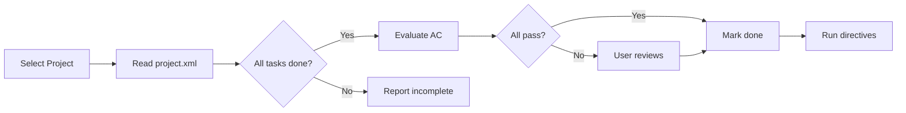

# Complete Project

> **TL;DR:** Verify all tasks are done and evaluate project-level acceptance criteria

## Overview

The `/festina-complete-project` skill closes a project by verifying that all decomposed tasks have reached `done` status and that the project-level acceptance criteria are satisfied. It evaluates each Gherkin criterion against the implemented state and provides evidence for each pass/fail result.

**Why it exists:** Projects aren't done just because tasks are done — the original acceptance criteria must be verified to confirm the project goal was actually achieved.

**Summary:** Complete Project validates that the sum of completed tasks satisfies the project's original intent.

## How It Works



### Key Workflow

1. **Select project** — From argument or interactive selection of open/in-progress projects
2. **Read project.xml** — Load requirements, acceptance criteria, and task references
3. **Check task completion** — Verify all child tasks have status `done` via `get-project-progress`
4. **Evaluate acceptance criteria** — For each Gherkin criterion, assess against implemented state with evidence
5. **User confirmation** — Present evaluation results for review
6. **Update status** — Set project status to `done` with completion date
7. **Run directives** — Execute `phase="complete-project"` rules (e.g., GitHub issue close)

**Summary:** Complete Project provides a structured verification gate before marking a project as done.

## Examples

### Successful Completion

```
/festina-complete-project P001

Reading project: P001-user-authentication-system
All 2 tasks are complete. ✓

Project Acceptance Criteria Evaluation:

- Criterion 1: PASS
  "Given valid credentials, When user submits login, Then session is created"
  Evidence: POST /login handler creates JWT session in src/auth/login.ts:34

- Criterion 2: PASS
  "Given expired session, When user makes request, Then 401 is returned"
  Evidence: Auth middleware checks expiry in src/middleware/auth.ts:22

All criteria passed. ✓
Mark project as done? > Yes

Project P001 completed (done)
GitHub Issue #42 closed
```

### Incomplete Tasks

```
/festina-complete-project P001

Reading project: P001-user-authentication-system

Incomplete tasks:
- 002-login-sessions: Add login and session management (status: in-progress)

These tasks must be completed before the project can be closed.
Exit or force-complete? > Exit

Next: Complete the remaining tasks
- /festina-implement 002 (currently in-progress)
```

### Acceptance Criteria Failure

```
/festina-complete-project P001

All 2 tasks are complete. ✓

Project Acceptance Criteria Evaluation:

- Criterion 1: PASS
  "Given valid credentials, When user submits login, Then session is created"
  Evidence: Verified in src/auth/login.ts

- Criterion 2: FAIL
  "Given expired session, When user makes request, Then 401 is returned"
  Evidence: Auth middleware returns 403 instead of 401

1 of 2 criteria failed.
Proceed anyway or address the failure? > Address it

Consider running /festina-rework on the relevant task to fix the issue.
```

## Boundaries

- **Does NOT:** Complete individual tasks → See [complete](./complete.md)
- **Does NOT:** Create projects → See [create-project](./create-project.md)
- **Does NOT:** Skip acceptance criteria evaluation — this is mandatory

## Interactions

- **Project Progress**: Uses `get-project-progress` and `get-project-tasks` CLI commands
- **Acceptance Criteria**: Reads and evaluates Gherkin criteria from project.xml
- **Directives**: Applies `phase="complete-project"` rules (GitHub issue close, git commit)

## Limitations

- Project must exist and not already be in `done` status
- Requires at least one task and one requirement defined in project.xml
- Force-complete option exists for edge cases but is not recommended
