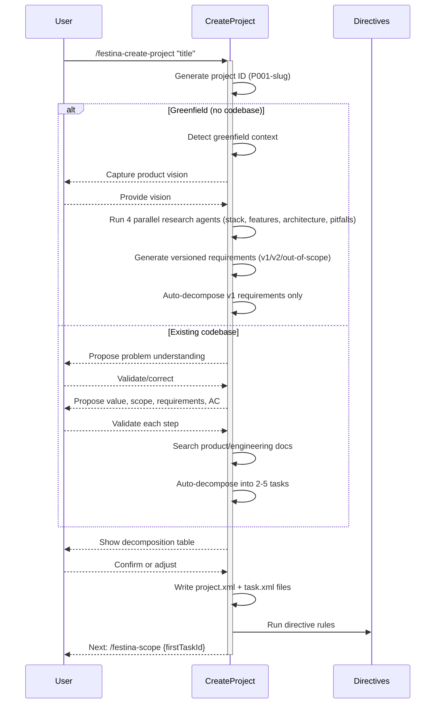

# Create Project

> **TL;DR:** Create a project through conversational Q&A with auto-decomposition into vertically-sliced tasks

## Overview

The `/festina-create-project` skill creates a project - a mini-PRD that groups related work under a single goal. It guides the user through Socratic Q&A to capture the problem, value, scope boundaries, numbered requirements (R1-Rn), and project-level acceptance criteria in Gherkin format. Once confirmed, the skill auto-decomposes the project into 2-5 vertically-sliced tasks with full requirement traceability. For greenfield projects (no existing codebase), the skill detects the greenfield context, captures a product vision, and runs 4 parallel research agents (stack, features, architecture, pitfalls) before generating versioned requirements (v1/v2/out-of-scope) with v1-only decomposition.

**Why it exists:** Some work is too large for a single task but doesn't need a full project management tool. Projects provide a lightweight grouping layer that keeps related tasks aligned on a shared goal while preserving the task-level workflow.

**Summary:** Create Project captures the "what and why" at the project level, then breaks it into individually scoped, plannable, and implementable tasks.

<!-- Tier 2 boundary: content above this line is loaded at standard tier -->

## How It Works



### Key Workflow

1. **Title capture** - From argument or Q&A
2. **Greenfield detection** - Check whether a codebase exists; greenfield projects skip Socratic Q&A and instead get vision capture + 4 parallel research agents
3. **Socratic Q&A** (existing codebase) - Propose-then-validate dialogue for problem, value, scope, requirements, and acceptance criteria
4. **Doc search** - Find related product/engineering docs, create stubs if new feature
5. **Requirement validation** - Ensure each R1-Rn is independently testable, user-facing, and specific
6. **Auto-decomposition** - Break requirements into 2-5 vertically-sliced tasks (greenfield: v1 requirements only)
7. **User confirmation** - Show decomposition table with requirement coverage matrix
8. **File creation** - Write project.xml and all task.xml files with traceability attributes
9. **Directive rules** - Git commit, issue sync, etc. (directive-driven)

**Summary:** Create Project follows the same propose-then-validate pattern as task creation, extended to cover project-level concerns and task decomposition.

### Project XML Structure

Projects are stored as `project.xml` in `.festinalente/projects/{projectId}/` and contain:

- **Problem** and **Value** statements
- **Scope** with explicit in-scope and out-of-scope items
- **Requirements** numbered R1-Rn, each independently testable
- **Acceptance criteria** in Gherkin format (project-level, not task-level)
- **Task references** linking to decomposed tasks with requirement mappings
- **Research** (greenfield only) with `<stack>`, `<features>`, `<architecture>`, and `<pitfalls>` subsections capturing parallel agent findings

### Task Decomposition

The skill reasons about all tasks simultaneously to guarantee no overlap. Each decomposed task receives:

- A `project-id` attribute linking it to the parent project
- A `project-requirements` attribute listing which R-ids it covers (e.g., "R1,R3")
- Sibling context in its description explaining how it fits with other project tasks
- Boundary notes clarifying what it does NOT cover (handled by sibling tasks)
- Explicit doc-to-task assignment: project-level `affects`/`engineering` docs are assigned to specific tasks, guaranteeing every doc is covered by at least one task
- Acceptance criteria scoped to that task only (not duplicating project-level criteria)

| Constraint | Rule |
|------------|------|
| Task count | 2-5 recommended; warns if 6+ and offers to split or reduce scope |
| Requirement coverage | Every R1-Rn must map to at least one task |
| Doc coverage | Every project-level doc assigned to >= 1 task |
| Overlap | No two tasks may cover the same scope |
| Slicing | Vertical slices preferred (each task delivers end-to-end value) |

## Examples

### Creating a Project

```
/festina-create-project User authentication system

Creating project...

I understand the problem as: The application currently has no way to
identify or authenticate users. Is this accurate?
> Yes

The value I see is: Users can securely identify themselves, enabling
personalized experiences and access control. Does this capture it?
> Yes

In scope: Login/logout flows, password auth, session management.
What's explicitly OUT of scope?
> Social login, 2FA, password recovery

Requirements:
R1: Users can register with email and password
R2: Users can log in with valid credentials
R3: Users can log out and have their session invalidated
R4: Invalid credentials show a clear error message
R5: Sessions persist across browser refreshes
Correct? > Yes

Decomposing into tasks...

| # | Task Title                        | Requirements | Dependencies |
|---|----------------------------------|-------------|-------------|
| 1 | Add user registration flow       | R1, R4       | None         |
| 2 | Add login and session management | R2, R3, R5   | After #1     |

Requirement Coverage:
- R1: Task #1    - R4: Task #1
- R2: Task #2    - R5: Task #2
- R3: Task #2

Does this look correct? > Yes, create tasks

Project P001-user-authentication-system created
- Status: open
- Tasks: 2
- Requirements: 5 (R1-R5)

Next: /festina-scope 004-add-user-registration-flow
```

### Adjusting Decomposition

```
/festina-create-project Notification system

...Q&A completes...

Decomposing into tasks...

| # | Task Title              | Requirements | Dependencies |
|---|------------------------|-------------|-------------|
| 1 | Add email notifications | R1, R2       | None         |
| 2 | Add push notifications  | R3, R4       | None         |
| 3 | Add notification prefs  | R5           | After #1,#2  |

Does this look correct? > Adjust - merge 1 and 2 into a single task

Updated decomposition:

| # | Task Title                        | Requirements | Dependencies |
|---|----------------------------------|-------------|-------------|
| 1 | Add email and push notifications | R1-R4        | None         |
| 2 | Add notification preferences     | R5           | After #1     |

Does this look correct? > Yes, create tasks
```

**Summary:** Users can adjust, re-decompose, or provide guidance before any tasks are created.

## Boundaries

What this skill does NOT do:

- **Does NOT:** Research the codebase for technical approach -> See [scope](./scope.md)
- **Does NOT:** Create implementation plans -> See [plan](./plan.md)
- **Does NOT:** Complete or close projects -> See [complete-project](./complete-project.md)
- **Does NOT:** Create standalone tasks (use [create](./create.md) for that)

## Configuration

| Setting | Description | Default |
|---------|-------------|---------|
| Task count | Recommended tasks per project | 2-5 |
| Requirement format | Numbering scheme | R1-Rn |
| Acceptance criteria | Format for project-level criteria | Gherkin |

## Interactions

- **Product Docs**: Searches for related docs, creates stubs if new feature detected
- **Engineering Docs**: Searches for related patterns, creates stubs if needed
- **Create Skill**: Decomposed tasks follow the same task.xml format as `/festina-create`
- **Scope Skill**: Next step after project creation; loads project context for each task
- **Directives**: Applies any `phase="create-project"` directive rules

## Limitations

- Requires `.festinalente/` to be initialized
- Maximum recommended decomposition is 5 tasks; warns at 6+
- Branch requirements are enforced by the `git.xml` directive, not the skill
